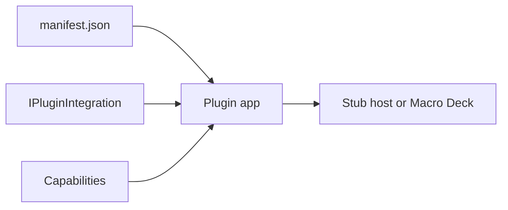

# Get started

Pages of docs.macro-deck.app merged into one file by `scripts/sync_docs.py`. Each page is an `## <Page title>` section with its source URL. Grep for a type or heading to jump to it.

Contents:

- Your first action: https://docs.macro-deck.app/introduction/first-action/
- Project setup: https://docs.macro-deck.app/introduction/manual-setup/
- Quickstart: https://docs.macro-deck.app/introduction/quickstart/
- Samples and template: https://docs.macro-deck.app/introduction/samples-and-template/

## Your first action

> Source: https://docs.macro-deck.app/introduction/first-action/
>
> Add an action with a parameter to the template plugin, trigger it, and show its state on the button.

This continues the [Quickstart](https://docs.macro-deck.app/introduction/quickstart/) project, `Acme.LightControl`. You add a
**Set brightness** action with a 0-100 slider, trigger it, and then make the button show whether the
light is on.

### 1. Add the strings

Every user-facing string lives in `src/Acme.LightControl/Localization/Strings.resx`. Add these entries
before `</root>`:

```xml
<data name="Actions.SetBrightness.Name" xml:space="preserve">
  <value>Set brightness</value>
</data>
<data name="Actions.SetBrightness.Description" xml:space="preserve">
  <value>Sets the light to a brightness between 0 and 100.</value>
</data>
<data name="Actions.SetBrightness.Brightness.Label" xml:space="preserve">
  <value>Brightness</value>
</data>
```

The build turns each key into a method on the generated `Strings` class, for example
`Strings.Actions.SetBrightness.Name()`. See [Localization](https://docs.macro-deck.app/features/localization/).

### 2. Add the action

Create `src/Acme.LightControl/SetBrightnessAction.cs`:

```csharp
using System.Globalization;
using MacroDeck.Localization;
using MacroDeck.Sdk.Actions;
using Serilog;

namespace Acme.LightControl;

public sealed class SetBrightnessAction(ILogger logger) : IActionDefinition
{
	private double _brightness;

	public string Id => "set-brightness";

	public LocalizedText Name => Strings.Actions.SetBrightness.Name();

	public LocalizedText Description => Strings.Actions.SetBrightness.Description();

	public IReadOnlyList<ActionParameter> Parameters { get; } =
	[
		ActionParameter.Slider("brightness", 0, 100,
			label: Strings.Actions.SetBrightness.Brightness.Label(),
			defaultValue: 100),
	];

	public IActionExecutor CreateExecutor() => new Executor(this, logger);

	private sealed class Executor(SetBrightnessAction action, ILogger logger) : IActionExecutor
	{
		public Task<ActionResult> ExecuteAsync(ActionExecutionContext context)
		{
			var brightness = Convert.ToDouble(
				context.Parameters.GetValueOrDefault("brightness")?.ToString() ?? "100",
				CultureInfo.InvariantCulture);

			action._brightness = brightness;
			logger.Information("Brightness set to {Brightness}", brightness);
			return ActionResult.SucceededTask;
		}
	}
}
```

- `Id` is stored in users' profiles. Never rename it once released.
- The executor reads the parameter by name from `context.Parameters`.

### 3. Register it

In `src/Acme.LightControl/PluginIntegration.cs`:

```diff
- Actions = [new LogMessageAction(logger)];
+ Actions = [new LogMessageAction(logger), new SetBrightnessAction(logger)];
```

```bash
dotnet build
```

### 4. Trigger it from a test

Add to `tests/Acme.LightControl.Tests/PluginIntegrationTests.cs`, inside `PluginIntegrationTests`:

```csharp
[Test]
public async Task Set_brightness_logs_the_new_value()
{
	await using var harness = CreateHarness();
	await harness.InitializeIntegrationsAsync();

	var outcome = await harness.Actions.ExecuteAsync(
		"set-brightness",
		new Dictionary<string, object?> { ["brightness"] = 40 });

	Assert.That(outcome.Succeeded, Is.True);
	Assert.That(harness.Logs.Events.Any(e => e.Message.Contains("Brightness set to 40")), Is.True);
}
```

```bash
dotnet test
```

```text
Passed!  - Failed:     0, Passed:     8, Skipped:     0, Total:     8
```

The harness runs your action through the same capability handler the host calls. See
[Testing plugins](https://docs.macro-deck.app/features/testing/).

### 5. Trigger it from a button

Run the plugin against Macro Deck - press F5 in your IDE or run it with the CLI, see
[Debugging plugins](https://docs.macro-deck.app/guides/debugging/):

```bash
macrodeck-plugin run --project src/Acme.LightControl
```

Put **Set brightness** on a button, pick a value, lock the deck and press the button. The plugin output
shows:

```text
[plugin]       Brightness set to 40
```

Restart the plugin after changing its `Actions` so the host receives the new list.

### 6. Optional: show the state on the button

Implement `IStateProviderActionDefinition` so a button can follow the light:

```diff
- public sealed class SetBrightnessAction(ILogger logger) : IActionDefinition
+ public sealed class SetBrightnessAction(ILogger logger) : IActionDefinition, IStateProviderActionDefinition
```

```csharp
public Task<ActionStateSnapshot?> GetActionStateAsync(
	IReadOnlyDictionary<string, object?> parameters,
	CancellationToken cancellationToken)
{
	ActionStateDefinition[] states =
	[
		new("off", MacroDeckStrings.States.Off()),
		new("on", MacroDeckStrings.States.On()),
	];
	return Task.FromResult<ActionStateSnapshot?>(new(states, _brightness > 0 ? "on" : "off"));
}
```

Check it in the test:

```csharp
var state = await harness.Actions.GetActionStateAsync("set-brightness");
Assert.That(state.Data!.Value.GetProperty("activeStateId").GetString(), Is.EqualTo("on"));
```

And against the conformance suite, which now checks the state snapshots too:

```bash
macrodeck-plugin test --project src/Acme.LightControl
```

```text
Passed: 27, Failed: 0, Skipped: 22
Conformant: yes
...
[PASS] MDC0309 Every state-provider action's state operation returns a well-formed snapshot (Required)
[PASS] MDC0310 Every state a state-provider action returns has an id that is a valid declared-kind identifier (Required)
```

In Macro Deck, a button running **Set brightness** can now show "On" or "Off". See
[Button states](https://docs.macro-deck.app/features/button-states/).

### Next steps

- [Actions](https://docs.macro-deck.app/features/actions/) - parameter types, failures, long-running work.
- [Button states](https://docs.macro-deck.app/features/button-states/) - default appearances, polling, expected states.
- [Features](https://docs.macro-deck.app/features/) - everything else a plugin can offer.

## Project setup

> Source: https://docs.macro-deck.app/introduction/manual-setup/
>
> Every file of a Macro Deck plugin project, written by hand - the project file, manifest, entrypoint, integration and build recipe - and how to run it.

A plugin is a .NET 10 console project with a `manifest.json` beside it; this page builds one by hand, or
explains what [`macrodeck-plugin new`](https://docs.macro-deck.app/cli/new/) generated for you.

### The files

```text
MyPlugin/
├── Assets/
│   └── icon.svg            the plugin icon, referenced by manifest.json
├── MyIntegration.cs        your capabilities
├── MyPlugin.csproj         a console project with the Macro Deck packages
├── Program.cs              starts the plugin
├── macrodeck-build.json    how macrodeck-plugin build builds each platform
└── manifest.json           who the plugin is
```

`new` generates the same project under `src/MyPlugin/`, plus a solution, a test project, a
`Localization/` resource set and central package versions.

### Project file

```xml
<Project Sdk="Microsoft.NET.Sdk">

  <PropertyGroup>
    <OutputType>Exe</OutputType>
    <TargetFramework>net10.0</TargetFramework>
    <ImplicitUsings>enable</ImplicitUsings>
    <Nullable>enable</Nullable>
  </PropertyGroup>

  <ItemGroup>
    <FrameworkReference Include="Microsoft.AspNetCore.App" />
    <PackageReference Include="MacroDeck.Plugin.Hosting" Version="3.0.0-*" />
    <PackageReference Include="MacroDeck.Plugin.Serilog" Version="3.0.0-*" />
    <PackageReference Include="MacroDeck.Plugin.Analyzers" Version="3.0.0-*" PrivateAssets="all" />
  </ItemGroup>

  <ItemGroup>
    <Content Include="manifest.json" CopyToOutputDirectory="PreserveNewest" />
    <Content Include="Assets/icon.svg" CopyToOutputDirectory="PreserveNewest" />
  </ItemGroup>

</Project>
```

- **`Microsoft.NET.Sdk` plus the ASP.NET Core framework reference**, not `Microsoft.NET.Sdk.Web`: the
  hosting package builds on ASP.NET Core, but a plugin is a headless process.
- **`3.0.0-*`** picks the newest Macro Deck 3 preview. Pin an exact version for reproducible builds.
- **`MacroDeck.Plugin.Analyzers`** is optional but recommended: it reports invalid declarations at
  build time. See [Analyzers](https://docs.macro-deck.app/reference/analyzers/).
- **Both `Content` items are required.** The SDK reads `manifest.json` from the content root at startup
  and resolves the icon against it.

### manifest.json

```json
{
  "$schema": "https://schemas.macro-deck.app/plugin-manifest-v1.schema.json",
  "manifestVersion": 1,
  "id": "com.example.my-plugin",
  "name": "My Plugin",
  "version": "1.0.0",
  "description": "What the plugin does.",
  "icon": "Assets/icon.svg",
  "entrypoints": {
    "win-x64": {
      "executable": "runtimes/win-x64/MyPlugin.dll",
      "runtime": { "kind": "FrameworkDependent", "dotnetVersion": "10.0" }
    },
    "osx-arm64": {
      "executable": "runtimes/osx-arm64/MyPlugin.dll",
      "runtime": { "kind": "FrameworkDependent", "dotnetVersion": "10.0" }
    },
    "linux-x64": {
      "executable": "runtimes/linux-x64/MyPlugin.dll",
      "runtime": { "kind": "FrameworkDependent", "dotnetVersion": "10.0" }
    }
  }
}
```

| Field | Rule |
| --- | --- |
| `manifestVersion` | Always `1`. |
| `id` | Reverse-domain, lowercase, at least two segments: `com.example.my-plugin`. |
| `name` | Display name, 1-128 characters. |
| `version` | SemVer 2.0. |
| `entrypoints` | One entry per runtime identifier you have tested; `executable` is relative to the package root. |

Identity lives only here - the hosting builder has no `WithId`, `WithName` or `WithVersion`. The
`runtimes/<rid>/` paths are where [`build`](https://docs.macro-deck.app/cli/build/) stages each platform's publish. The entrypoints
are framework-dependent: Macro Deck runs them on the .NET runtime it ships, so the package stays small
(see [Runtime](https://docs.macro-deck.app/reference/manifest/#runtime), including when to publish self-contained instead). Before
publishing you also need `publisher`, `license`, `repository` and `compatibility`; `build` warns about
each one that is missing. Every field is in the [manifest reference](https://docs.macro-deck.app/reference/manifest/).

### Program.cs

```csharp
using MacroDeck.Plugin.Hosting;
using MacroDeck.Plugin.Serilog;

var plugin = MacroDeckPlugin.CreatePlugin(args)
    .UseMacroDeckLogging()
    .RegisterIntegration<MyIntegration>()
    .Build();

await plugin.RunAsync();
```

- `RegisterIntegration<T>()` registers the integration and every capability interface it implements.
- `Build()` checks the manifest identity, duplicate capability ids, reserved routes and the DI graph,
  and reports every problem at once.
- `UseMacroDeckLogging()` forwards the plugin's logs to the Macro Deck log viewer - see
  [Logging](https://docs.macro-deck.app/features/logging/).

### The integration class

```csharp
using MacroDeck.Sdk;
using MacroDeck.Sdk.Actions;

public sealed class MyIntegration : IPluginIntegration
{
    public IReadOnlyList<IActionDefinition> Actions { get; } = [];

    public Task InitializeAsync(IIntegrationContext context) => Task.CompletedTask;

    public Task ShutdownAsync() => Task.CompletedTask;
}
```

The host reads `Actions` (and every other capability list) before `InitializeAsync` runs, so build them
in the constructor without I/O. Connect to devices or services in `InitializeAsync`, release them in
`ShutdownAsync`. Fill `Actions` in with [Your first action](https://docs.macro-deck.app/introduction/first-action/).

### Build recipe

`macrodeck-build.json`, beside the manifest - one target per entrypoint:

```json
{
  "version": 1,
  "targets": {
    "win-x64": {
      "executable": "dotnet",
      "arguments": ["publish", "MyPlugin.csproj", "-c", "Release", "-r", "win-x64",
                    "--self-contained", "false", "-p:UseAppHost=false",
                    "-o", "bin/publish/win-x64"],
      "output": "bin/publish/win-x64"
    },
    "osx-arm64": {
      "executable": "dotnet",
      "arguments": ["publish", "MyPlugin.csproj", "-c", "Release", "-r", "osx-arm64",
                    "--self-contained", "false", "-p:UseAppHost=false",
                    "-o", "bin/publish/osx-arm64"],
      "output": "bin/publish/osx-arm64"
    },
    "linux-x64": {
      "executable": "dotnet",
      "arguments": ["publish", "MyPlugin.csproj", "-c", "Release", "-r", "linux-x64",
                    "--self-contained", "false", "-p:UseAppHost=false",
                    "-o", "bin/publish/linux-x64"],
      "output": "bin/publish/linux-x64"
    }
  }
}
```

A manifest platform without a target fails the build. The format is in [`build`](https://docs.macro-deck.app/cli/build/).
`-r <rid>` keeps each publish to that platform's native assets; `-p:UseAppHost=false` skips the native
launcher a framework-dependent entrypoint does not use.

### Services and configuration

The builder exposes the usual ASP.NET Core `Services`, `Configuration`, `Logging` and `Environment`.
Register services before `Build()`, then take them in the integration's constructor:

```csharp
using MacroDeck.Plugin.Hosting;
using MacroDeck.Plugin.Serilog;
using Microsoft.Extensions.DependencyInjection;

var builder = MacroDeckPlugin.CreatePlugin(args)
    .UseMacroDeckLogging()
    .RegisterIntegration<MyIntegration>();

builder.Services.AddHttpClient<WeatherClient>(client =>
    client.BaseAddress = new Uri("https://api.example.com/"));
builder.Services.Configure<WeatherOptions>(builder.Configuration.GetSection("Weather"));

var plugin = builder.Build();
await plugin.RunAsync();
```

```csharp
public sealed class MyIntegration(WeatherClient weather, IOptions<WeatherOptions> options)
    : IPluginIntegration
{
    // ...
}
```

`builder.WebApplicationBuilder` is there as an escape hatch; prefer the Macro Deck APIs for
registration and lifecycle. Runtime behaviour - registration modes, lifecycle, reserved routes - is in
[Plugin hosting](https://docs.macro-deck.app/reference/plugin-hosting/).

### Run it

```bash
dotnet tool install --global MacroDeck.Plugin.Cli --prerelease
```

```bash
macrodeck-plugin run --project MyPlugin.csproj --stub-host
```

```text
Started a disposable stub host at http://127.0.0.1:52484.
...
Session established (negotiated plugin protocol v3).
```

A real in-process host, no Macro Deck install needed. Drop `--stub-host` to connect to the running
desktop app instead - see [`run`](https://docs.macro-deck.app/cli/run/).

```bash
macrodeck-plugin build --output ../artifacts
macrodeck-plugin validate --artifact ../artifacts/com.example.my-plugin-1.0.0.macroDeckPlugin
```

Builds every platform, packs one `.macroDeckPlugin` and checks it. Validate the artifact, not the
source manifest: the `runtimes/` entrypoints only exist once `build` has staged them.

Never zip the output by hand - `build` and [`pack`](https://docs.macro-deck.app/cli/pack/) validate the manifest and write the
`files[]` digests a hand-made ZIP lacks. For breakpoints against a real host, see
[Debugging plugins](https://docs.macro-deck.app/guides/debugging/); never commit a Developer token.

### See also

- [Quickstart](https://docs.macro-deck.app/introduction/quickstart/) - the same project, generated.
- [Samples and template](https://docs.macro-deck.app/introduction/samples-and-template/) - complete plugins to read.
- [Your first action](https://docs.macro-deck.app/introduction/first-action/) - add behaviour to `MyIntegration`.
- [Manifest reference](https://docs.macro-deck.app/reference/manifest/) - every field.
- [Testing plugins](https://docs.macro-deck.app/features/testing/) - test the integration without a host.

## Quickstart

> Source: https://docs.macro-deck.app/introduction/quickstart/
>
> Create, run and package your first Macro Deck plugin in about five minutes, without Macro Deck installed.

A plugin is a small .NET console app that Macro Deck starts and talks to. It is made of a
`manifest.json` (identity, icon, one executable per platform), the plugin app itself, and the
capabilities its integration implements - actions, variables, events and more.



### Prerequisites

- The [.NET 10 SDK](https://dotnet.microsoft.com/download/dotnet/10.0). It includes the ASP.NET Core
  shared framework the CLI and the plugin need.
- Macro Deck is **not** required for this page.

### 1. Install the CLI

```bash
dotnet tool install --global MacroDeck.Plugin.Cli --prerelease
```

`--prerelease` is required until a stable 3.0 build ships. See [Plugin CLI](https://docs.macro-deck.app/cli/).

### 2. Create a plugin

```bash
macrodeck-plugin new --name "Acme Light Control" --id com.acme.light-control \
  --publisher "Acme" --project-name Acme.LightControl --yes
```

```text
Created plugin project at '~/src/Acme.LightControl'.
Manifest: ~/src/Acme.LightControl/src/Acme.LightControl/manifest.json
Build configuration: ~/src/Acme.LightControl/src/Acme.LightControl/macrodeck-build.json
warning publication-metadata-missing: 'repository' is required to publish to the Macro Deck plugin ecosystem. It is not required to develop or run this plugin locally.
```

Run `macrodeck-plugin new` without options for a wizard instead. The warning only matters when you
publish. See [`new`](https://docs.macro-deck.app/cli/new/) for every option.

```bash
cd Acme.LightControl
dotnet build
dotnet test
```

```text
Build succeeded.
Passed!  - Failed:     0, Passed:     7, Skipped:     0, Total:     7
```

### 3. Look at what you got

```text
Acme.LightControl/
  Acme.LightControl.slnx
  src/Acme.LightControl/
    manifest.json            # id, name, version, icon, entrypoints per platform
    macrodeck-build.json     # how `build` builds each platform
    Program.cs               # registers the integration and runs the plugin
    PluginIntegration.cs     # the capabilities your plugin offers
    LogMessageAction.cs      # an example action
    Localization/Strings.resx  # every user-facing string
    Assets/icon.svg          # replace with your icon
  tests/Acme.LightControl.Tests/
    PluginIntegrationTests.cs
```

`Program.cs` builds and runs the plugin:

```csharp
var plugin = MacroDeckPlugin.CreatePlugin(args)
	.UseMacroDeckLogging()
	.UseLocalization(Strings.LocalizationCatalog)
	.RegisterIntegration<PluginIntegration>()
	.Build();

await plugin.RunAsync();
```

`PluginIntegration.cs` lists the actions and opts into other capabilities by implementing their
interfaces:

```csharp
public sealed class PluginIntegration : IPluginIntegration
{
	public PluginIntegration(ILogger logger)
	{
		_logger = logger.ForContext<PluginIntegration>();
		Actions = [new LogMessageAction(logger)];
	}

	public IReadOnlyList<IActionDefinition> Actions { get; }

	public Task InitializeAsync(IIntegrationContext context) { ... }

	public Task ShutdownAsync() => Task.CompletedTask;
}
```

### 4. Run it

```bash
macrodeck-plugin run --project src/Acme.LightControl --stub-host
```

```text
Started a disposable stub host at http://127.0.0.1:52091.
Started process 25405 (mode: SelfRegistering, host: http://127.0.0.1:52091). Press Ctrl-C to stop.
...
[plugin]       Registered with the host as '"com.acme.light-control"'.
Session established (negotiated plugin protocol v3).
[plugin] info: Acme.LightControl.PluginIntegration[0]
[plugin]       Initialized.
```

`Session established` means it works. The stub host is a real, disposable in-process host using the
same registration, session and WebSocket code as Macro Deck. Press <kbd>Ctrl</kbd>+<kbd>C</kbd> to stop.

To run against the Macro Deck app instead, drop `--stub-host` and approve the pairing prompt - or
press F5 in your IDE, see [Debugging plugins](https://docs.macro-deck.app/guides/debugging/).

### 5. Package it

```bash
cd src/Acme.LightControl
macrodeck-plugin build --output ../../artifacts
```

```text
Building linux-x64...
Building osx-arm64...
Building win-x64...
Built linux-x64, osx-arm64, win-x64.
Packed com.acme.light-control 1.0.0 -> ../../artifacts/com.acme.light-control-1.0.0.macroDeckPlugin (1041 entries, 342566335 bytes uncompressed).
```

`build` needs the directory holding `manifest.json`. Add
`--rid osx-arm64` to build one platform only.

```bash
macrodeck-plugin validate --artifact ../../artifacts/com.acme.light-control-1.0.0.macroDeckPlugin
```

```text
...
com.acme.light-control 1.0.0: 0 error(s), 2 warning(s).
```

`build` already packs. Use [`pack`](https://docs.macro-deck.app/cli/pack/) only for a payload you built another way. To publish
the artifact, see [Publishing to the Store](https://docs.macro-deck.app/guides/publishing/).

### Next steps

- [Your first action](https://docs.macro-deck.app/introduction/first-action/) - add an action with a parameter and show its state
  on the button.
- [Features](https://docs.macro-deck.app/features/) - variables, events, button states, setup flows and more.
- [UI](https://docs.macro-deck.app/ui/) - build configuration and widget UI.
- [Plugin CLI](https://docs.macro-deck.app/cli/) - every command and option.
- [Troubleshooting](https://docs.macro-deck.app/guides/troubleshooting/) - if you never see `Session established`.

## Samples and template

> Source: https://docs.macro-deck.app/introduction/samples-and-template/
>
> What the plugin template generates, which sample plugins exist and what each one demonstrates, and how to run one.

Start from the template; read the samples. Both live in their own repositories, not in the Macro Deck
repository.

| Repository | Use it when |
| --- | --- |
| [Macro-Deck-Plugin-Template](https://github.com/Macro-Deck-App/Macro-Deck-Plugin-Template) | You are starting a plugin. |
| [Macro-Deck-Sample-Plugins](https://github.com/Macro-Deck-App/Macro-Deck-Sample-Plugins) | You want to see a capability implemented end to end. |

### The template

```bash
macrodeck-plugin new --name "My Plugin" --id com.example.my-plugin --publisher "Example" --yes
```

```text
MyPlugin/
├── MyPlugin.slnx
├── Directory.Build.props        net10.0, nullable, analyzers for every project
├── Directory.Packages.props     one MacroDeckSdkVersion for every Macro Deck package
├── NuGet.config                 nuget.org plus an empty local-feed/
├── src/MyPlugin/
│   ├── manifest.json
│   ├── macrodeck-build.json     one framework-dependent publish per platform
│   ├── MyPlugin.csproj
│   ├── Program.cs               CreatePlugin, logging, localization, one integration
│   ├── PluginIntegration.cs     IPluginIntegration with one action
│   ├── LogMessageAction.cs      the example action - replace it
│   ├── Localization/Strings.resx
│   ├── Assets/icon.svg          replace with your icon
│   └── Properties/launchSettings.json   "Macro Deck - Real Host" debug profile
└── tests/MyPlugin.Tests/        NUnit tests on MacroDeck.Plugin.Testing
```

Every file in `src/MyPlugin/` is explained in [Project setup](https://docs.macro-deck.app/introduction/manual-setup/). `new`
installs the template if needed, fills in publisher, license, repository and homepage, and writes only
the platforms you pick - see [`macrodeck-plugin new`](https://docs.macro-deck.app/cli/new/).

Without the CLI, use the template directly:

```bash
dotnet new install "MacroDeck.Plugin.Templates@*-*"
dotnet new macrodeck-plugin -n Acme.LightControl -o Acme.LightControl \
  --pluginId com.acme.light-control --pluginName "Acme Light Control"
```

`@*-*` picks the newest prerelease template. `-o` creates the directory; leave it out only when you are
already in the project directory. Cloning the template repository and renaming by hand also works; its
README has the rename checklist.

### The samples

Each sample is one self-contained plugin, laid out exactly as `new` scaffolds a project. None needs an
external service, credentials or network access.

| Sample | Demonstrates |
| --- | --- |
| [Weather](https://github.com/Macro-Deck-App/Macro-Deck-Sample-Plugins/tree/main/src/MacroDeck.SampleWeatherPlugin) | The smallest complete plugin: plain and dynamic-options actions, read-only and writable variables, an event, a one-step config flow, a weather provider, a second language (`de`). |
| [Music player](https://github.com/Macro-Deck-App/Macro-Deck-Sample-Plugins/tree/main/src/MacroDeck.SampleMusicPlayerPlugin) | Transport, artwork, catalogue browsing, output devices, two instances with different capabilities, dynamic event options, action interaction pickers. |
| [REST API](https://github.com/Macro-Deck-App/Macro-Deck-Sample-Plugins/tree/main/src/MacroDeck.SampleRestApiPlugin) | A typed `HttpClient` through DI, a multi-step config flow with a secret and an OAuth branch, integration issues, notifications, API-backed variables and options. |
| [Virtual profile](https://github.com/Macro-Deck-App/Macro-Deck-Sample-Plugins/tree/main/src/MacroDeck.SampleVirtualProfilePlugin) | A plugin-owned virtual profile with widget interactions, pushed variable updates, deck navigation, widget appearance, scripts and notifications. |

The samples README has the full capability-by-sample matrix.

### Run a sample

```bash
git clone https://github.com/Macro-Deck-App/Macro-Deck-Sample-Plugins
cd Macro-Deck-Sample-Plugins
dotnet build
dotnet test
```

```bash
macrodeck-plugin run --project src/MacroDeck.SampleWeatherPlugin --stub-host
```

Against a disposable stub host - no Macro Deck needed. To debug one against the desktop app, start its
**Macro Deck - Real Host** launch profile - see [Debugging plugins](https://docs.macro-deck.app/guides/debugging/).

```bash
cd src/MacroDeck.SampleWeatherPlugin
macrodeck-plugin build --output ../../artifacts
```

Builds and packs every platform, like your own plugin.

### Not in the samples

Two things ship as packages in the Macro Deck SDK instead - reference them from your own test project:

- **`MacroDeck.Plugin.Testing`** - loopback test host, fakes and assertions. See
  [Testing plugins](https://docs.macro-deck.app/features/testing/).
- **The conformance suite** - `macrodeck-plugin test`, with stable check ids for CI. See
  [Conformance](https://docs.macro-deck.app/reference/conformance/).

### See also

- [Quickstart](https://docs.macro-deck.app/introduction/quickstart/) - create and run a plugin from the template.
- [Project setup](https://docs.macro-deck.app/introduction/manual-setup/) - every generated file, written by hand.
- [Plugin hosting](https://docs.macro-deck.app/reference/plugin-hosting/) - the builder API the template uses.
- [Contributing an integration](https://github.com/Macro-Deck-App/Macro-Deck/blob/main/engineering/development/contributing-integrations.md) -
  for an in-process integration shipped with the host rather than a plugin.
