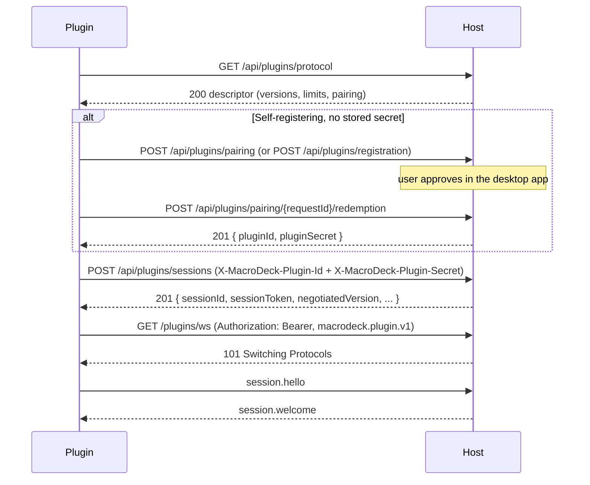
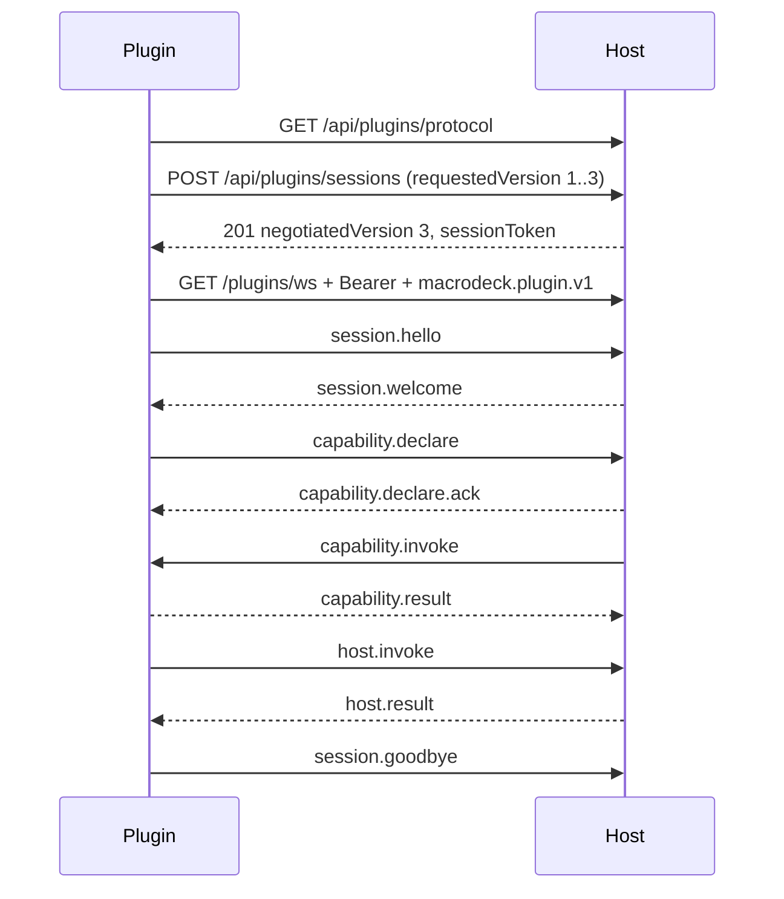
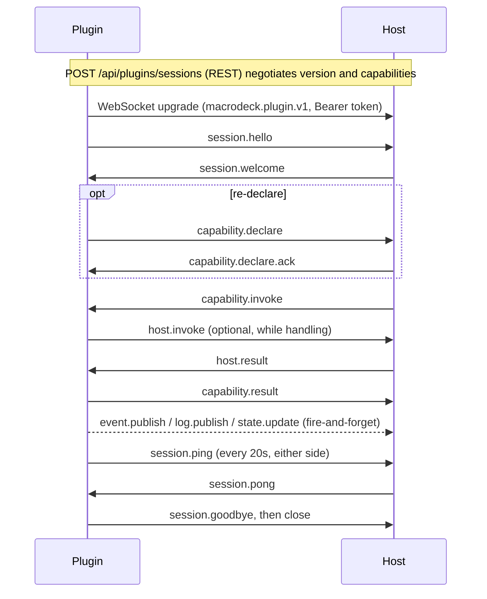

# Reference: SDK packages, hosting, manifest, protocol, auth, REST

Pages of docs.macro-deck.app merged into one file by `scripts/sync_docs.py`. Each page is an `## <Page title>` section with its source URL. Grep for a type or heading to jump to it.

Contents:

- Analyzers: https://docs.macro-deck.app/reference/analyzers/
- Authentication: https://docs.macro-deck.app/reference/authentication/
- Capability parity: https://docs.macro-deck.app/reference/capability-parity/
- Conformance suite: https://docs.macro-deck.app/reference/conformance/
- Manifest reference: https://docs.macro-deck.app/reference/manifest/
- Plugin hosting: https://docs.macro-deck.app/reference/plugin-hosting/
- Plugin protocol: https://docs.macro-deck.app/reference/protocol/
- SDK overview: https://docs.macro-deck.app/reference/sdk-packages/
- Store links: https://docs.macro-deck.app/reference/store-links/
- WebSocket reference: https://docs.macro-deck.app/reference/websocket/

## Analyzers

> Source: https://docs.macro-deck.app/reference/analyzers/
>
> Roslyn diagnostics provided by MacroDeck.Plugin.Analyzers, each with a snippet that triggers it and the fix.

`MacroDeck.Plugin.Analyzers` reports plugin mistakes at build time. The plugin template already references it:

```xml
<PackageReference Include="MacroDeck.Plugin.Analyzers" PrivateAssets="all" />
```

Keep `PrivateAssets="all"`: it is build-time tooling and must not become a runtime dependency of your plugin.

### Example

A manifest id with an underscore and a `.bmp` icon, built with `dotnet build`:

```text
manifest.json(4,9): error MDP1001: manifest.json declares id 'Hello_Deck', which is not usable. It must be
  reverse-domain, lowercase and hyphen-separated, with at least two segments (e.g. 'com.example.my-plugin').
manifest.json(8,11): error MDP1003: manifest.json declares icon 'Assets/icon.bmp', whose extension has no
  known media type. Supported extensions are: .svg, .png, .jpg, .jpeg, .webp.
```

Every diagnostic carries a help link to its heading on this page. **Diagnostic ids are stable public contracts**: an id never changes meaning, and a rule that no longer applies is deprecated rather than reused.

### Diagnostics

| Id | Severity | Reported when |
| --- | --- | --- |
| [MDP1001](#mdp1001) | Error | `manifest.json` has a missing or invalid `id`, `name` or `version`. |
| [MDP1002](#mdp1002) | Error | A statically known action or declared capability local id is invalid. |
| [MDP1003](#mdp1003) | Error | The manifest icon has an unsupported file extension. |
| [MDP1004](#mdp1004) | Error | An `IPluginIntegration` type restates identity or icon metadata the manifest owns. |
| [MDP2001](#mdp2001) | Error | A statically visible capability id is declared twice for the same kind. |
| [MDP2002](#mdp2002) | Error | A capability handler declares an unknown kind. |
| [MDP2003](#mdp2003) | Warning | A capability handler is registered as a service but not as `ICapabilityHandler`. |
| [MDP2004](#mdp2004) | Warning | An `IPluginIntegration` is registered directly instead of through `RegisterIntegration`. |
| [MDP2005](#mdp2005) | Error | Plugin code maps a route below the reserved `/_macrodeck` prefix. |
| [MDP2006](#mdp2006) | Warning | `[MacroDeckIntegration]` is on an out-of-process `IPluginIntegration`, where it does nothing. |
| [MDP3001](#mdp3001) | Warning | Capability or action code discards the cancellation token in scope. |
| [MDP3002](#mdp3002) | Warning | A blocking wait or sleep runs inside an SDK contract member. |
| [MDP3003](#mdp3003) | Warning | An SDK contract type declares an `async void` member. |
| [MDP4001](#mdp4001) | Error | A singleton's constructor takes invocation-scoped context. |
| [MDP4002](#mdp4002) | Warning | The plugin overrides the listener URL Macro Deck assigns. |
| [MDP5001](#mdp5001) | Warning | Code uses an `[Obsolete]` Macro Deck SDK, hosting or protocol API. |
| [MDP5002](#mdp5002) | Warning | Code uses an API that carries Macro Deck deprecation metadata. |
| [MDP5003](#mdp5003) | Warning | Macro Deck deprecation metadata is inconsistent or has no guidance. |
| [MDP5004](#mdp5004) | Error | Code uses an API whose declared removal version has been reached. |
| [MDLOC001](#mdloc001) | Error | A key exists in a translation but not in the default-language resource. |
| [MDLOC002](#mdloc002) | Error | A translation's placeholders differ from the default language's. |
| [MDLOC003](#mdloc003) | Error | A key is declared twice in one resource file. |
| [MDLOC004](#mdloc004) | Error | A placeholder type declaration in a resource comment is not usable. |
| [MDLOC005](#mdloc005) | Error | A resource file's culture suffix is not a well-formed culture name. |
| [MDLOC006](#mdloc006) | Error | Code references a Macro Deck catalog key that has been removed. |
| [MDLOC007](#mdloc007) | Error | A plural family has a form outside the closed set, or no `Other` form. |
| [MDLOC008](#mdloc008) | Error | A key is both a member and the group other keys nest under. |

The analyzer reports only what it can establish from syntax, symbols or declared additional files. Values assembled at runtime stay the runtime's job - see [Runtime validation still applies](#runtime-validation-still-applies).

### Identity

#### MDP1001

**Error.** The manifest `id` must be a reverse-domain package id (lowercase, hyphen-separated segments, at least two, joined by dots); `name` and `version` must be present and non-empty. `PluginHostBuilder.Build()` rejects the same values at runtime.

```jsonc
"id": "Hello_Deck"               // MDP1001
"id": "com.example.hello-deck"   // fixed
```

#### MDP1002

**Error.** A declared local id (an action's `Id`, a `DeclaredCapability.LocalId`) must be lowercase kebab case starting with a letter, within the length bound, and must never contain `::`, which the host reserves to join an id to its owner.

```csharp
public string Id => "Set_Volume";   // MDP1002
public string Id => "set-volume";   // fixed
```

The state ids an `IStateProviderActionDefinition` returns are **not** covered: they come from a runtime call, not a constant. The host enforces their grammar when a button adopts them, and so does conformance check [MDC0310](https://docs.macro-deck.app/reference/conformance/#mdc0310). No analyzer rule exists for them by design.

#### MDP1003

**Error.** The manifest `icon` must end in `.svg`, `.png`, `.jpg`, `.jpeg` or `.webp`.

```jsonc
"icon": "Assets/icon.bmp"   // MDP1003
"icon": "Assets/icon.svg"   // fixed
```

#### MDP1004

**Error.** `manifest.json` is the only source of a plugin's id, name, version and icon. An `IPluginIntegration` type that also declares a public `Id`, `Name` or `Version` string, an `IsInitialized` bool, or implements `IIntegrationIconProvider`, is reported. Delete the member.

```csharp
public sealed class PluginIntegration : IPluginIntegration
{
    public string Id => "com.example.hello-deck";   // MDP1004 - delete it
    // ...
}
```

### Registration

#### MDP2001

**Error.** Two statically visible declarations of the same capability kind share a constant id, so one of them is unreachable. Rename one.

```csharp
internal sealed class PlayAction : IActionDefinition { public string Id => "play"; /* ... */ }
internal sealed class ResumeAction : IActionDefinition { public string Id => "play"; /* ... */ }   // MDP2001 on both

internal sealed class ResumeAction : IActionDefinition { public string Id => "resume"; /* ... */ } // fixed
```

#### MDP2002

**Error.** `ICapabilityHandler.Kind` must return one of the known capability kinds, or no operation can ever reach the handler.

```csharp
public string Kind => "sounds";                  // MDP2002
public string Kind => CapabilityKinds.Events;    // fixed
```

#### MDP2003

**Warning.** The capability catalog is built from every registered `ICapabilityHandler`. A handler registered only under its concrete type is constructed but never reaches it.

```csharp
builder.ConfigureServices((_, services) => services.AddSingleton<EventsHandler>());   // MDP2003
builder.RegisterCapabilityHandler<EventsHandler>();                                   // fixed
```

#### MDP2004

**Warning.** `RegisterIntegration<T>()` also adds the actions handler and a handler for every other capability interface `T` implements. A raw `AddSingleton` skips all of that.

```csharp
builder.ConfigureServices((_, services) => services.AddSingleton<PluginIntegration>());   // MDP2004
builder.RegisterIntegration<PluginIntegration>();                                         // fixed
```

#### MDP2005

**Error.** Every path under `/_macrodeck` belongs to the SDK's health, readiness, info and diagnostics endpoints; the SDK answers first, and `PluginHostBuilder.Build()` rejects a colliding route.

```csharp
endpoints.MapGet("/_macrodeck/status", () => "ok");   // MDP2005
endpoints.MapGet("/status", () => "ok");              // fixed
```

#### MDP2006

**Warning.** `[MacroDeckIntegration]` carries only `Platforms` and `EnabledByDefault`, and both are inert out of process: platform gating comes from the manifest's `entrypoints`, and enabled-by-default from whether the plugin declares a config flow. Remove the attribute.

```csharp
[MacroDeckIntegration]   // MDP2006 - remove it
public sealed class PluginIntegration : IPluginIntegration { /* ... */ }
```

### Async

#### MDP3001

**Warning.** Inside `ICapabilityHandler.InvokeAsync` and `IActionExecutor.ExecuteAsync`, passing `CancellationToken.None` or `default`, or omitting an optional token parameter, discards the cancellation the caller asked for. Forward `cancellationToken` or `context.CancellationToken`. An overload with no token parameter at all, such as `Task.Delay(int)`, is not reported.

```csharp
await Task.Delay(500, CancellationToken.None);        // MDP3001
await Task.Delay(500, context.CancellationToken);     // fixed
```

#### MDP3002

**Warning.** `Task.Result`, `Task.Wait()`, `GetAwaiter().GetResult()` and `Thread.Sleep` block a thread of the shared invocation dispatcher, which has 32 concurrent slots. Applies to `ICapabilityHandler`, `IActionExecutor`, `IConfigFlow` and the other SDK contract types. Await instead.

```csharp
Thread.Sleep(100);            // MDP3002
await Task.Delay(100, ct);    // fixed
```

#### MDP3003

**Warning.** An exception from an `async void` member on an SDK contract type crashes the process instead of failing one invocation. Return `Task`.

```csharp
private async void Refresh() => await Task.Delay(1);       // MDP3003
private async Task RefreshAsync() => await Task.Delay(1);  // fixed
```

### Lifecycle

#### MDP4001

**Error.** `ICapabilityInvocationContext` exists only inside one invocation's scope. `PluginHostBuilder` validates scopes, so resolving a singleton that takes it fails at startup, every time. Resolve it inside `InvokeAsync` instead. Registrations through `AddSingleton`, `RegisterIntegration` and `RegisterCapabilityHandler` are all checked.

```csharp
internal sealed class Cache
{
    public Cache(ICapabilityInvocationContext context) { }   // MDP4001 on this parameter
}

builder.ConfigureServices((_, services) => services.AddSingleton<Cache>());
builder.ConfigureServices((_, services) => services.AddScoped<Cache>());   // fixed, or resolve it inside InvokeAsync
```

#### MDP4002

**Warning.** The supervisor sets `ASPNETCORE_URLS` to a port it has already bound and probes it before the plugin finishes starting. Overriding it makes the health check fail silently and permanently. Reported for `UseUrls`, a `urls` configuration write, and `ASPNETCORE_URLS` in `Properties/launchSettings.json`. Remove the override.

```csharp
webHost.UseUrls("http://127.0.0.1:9000");   // MDP4002 - remove it
```

### Compatibility

`MDP5001`-`MDP5004` let you migrate before an SDK removal becomes a hard break. See [Deprecations](https://docs.macro-deck.app/policies/deprecations/) and [Migrations](https://docs.macro-deck.app/policies/migrations/).

#### MDP5001

**Warning.** Reports the same usages as the compiler's `CS0618`/`CS0619`, but only for `[Obsolete]` members declared in `MacroDeck.Sdk`, `MacroDeck.Plugin.Hosting` or `MacroDeck.Plugin.Protocol`, so you can escalate it without escalating every obsolete warning. It stands down where [MDP5002](#mdp5002) applies. No shipped SDK member triggers it today: every obsolete SDK member also carries deprecation metadata.

#### MDP5002

**Warning.** Use of an API carrying `[MacroDeckDeprecated]`. The message names the API, the version it was deprecated in, the planned removal version and the guidance. The deprecated widget state members fire it: `WidgetTargetInfo.HasOnOffStates`, `WidgetAppearanceRequest.State` and `WidgetStateSelector`.

```csharp
bool toggle = info.HasOnOffStates;       // MDP5002 (and CS0618)
bool toggle = info.States.Count > 1;     // fixed
```

#### MDP5003

**Warning.** A `[MacroDeckDeprecated]` declaration needs a companion `[Obsolete]`, a removal version later than the deprecation version, and non-empty guidance. Reported on the declaration.

```csharp
[MacroDeckDeprecated("3.1.0", "4.0.0", "Use NewHelper instead.")]   // MDP5003: no [Obsolete]
public static void OldHelper() { }

[Obsolete("Use NewHelper instead.")]                                // fixed
[MacroDeckDeprecated("3.1.0", "4.0.0", "Use NewHelper instead.", Replacement = "LegacyHelpers.NewHelper")]
public static void OldHelper() { }
```

#### MDP5004

**Error.** The API is still used, and still present, although the declaring assembly has reached its declared removal version. Move to the replacement the message names.

```csharp
LegacyHelpers.OldHelper();   // MDP5004 once the SDK version reaches RemovedIn
LegacyHelpers.NewHelper();   // fixed
```

### Localization

`MDLOC001`-`MDLOC008` come from the source generator that turns `Localization/*.resx` into the typed `Strings` API, so there is nothing separate to enable. See [Localization](https://docs.macro-deck.app/features/localization/) for the workflow.

#### MDLOC001

**Error.** A key exists only in a translation. The default file (`Strings.resx`, no culture suffix) is what every translation is checked against and the last fallback. Add the key there.

```xml
<!-- Strings.de.resx; Strings.resx has no OnlyInGerman: MDLOC001 -->
<data name="OnlyInGerman"><value>Nur deutsch</value></data>
```

#### MDLOC002

**Error.** Placeholders are named, and the generated method's parameters come from the default language. A translation must use exactly the same set.

```xml
<data name="Greeting"><value>Hello {name}</value></data>   <!-- Strings.resx -->
<data name="Greeting"><value>Hallo {user}</value></data>   <!-- Strings.de.resx: MDLOC002 -->
<data name="Greeting"><value>Hallo {name}</value></data>   <!-- fixed -->
```

#### MDLOC003

**Error.** Two entries with the same name in one file leave the winner to file order. Rename or delete one.

```xml
<data name="Greeting"><value>Hello {name}</value></data>
<data name="Greeting"><value>Hi {name}</value></data>   <!-- MDLOC003 -->
```

#### MDLOC004

**Error.** A resource comment may declare a placeholder type as a bracketed prefix, such as `[count:int]`. Only types with one unambiguous text form are accepted, and the declared placeholder must appear in the template.

```xml
<data name="DeviceCount"><value>{count} devices found</value><comment>[total:int]</comment></data>   <!-- MDLOC004 -->
<data name="DeviceCount"><value>{count} devices found</value><comment>[count:int]</comment></data>   <!-- fixed -->
```

#### MDLOC005

**Error.** The suffix in `Strings.<culture>.resx` must be a well-formed BCP-47 name such as `de`, `de-DE` or `zh-Hans-CN`. The shape is checked because .NET accepts almost any plausible name.

```text
Strings.de_DE.resx   MDLOC005
Strings.de-DE.resx   fixed
```

#### MDLOC006

**Error.** Macro Deck's own catalog is a published contract, so a retired key is recorded rather than deleted: code using it still compiles against the SDK that carries the record, and this rule names the replacement. It is this family's counterpart to [MDP5004](#mdp5004).

```text
error MDLOC006: 'Retired' names a Macro Deck localization key that has been removed. Use Current instead.
```

#### MDLOC007

**Error.** A `[plural]` entry is one form of a family keyed by the entry's key without its last segment. The form must be `One` or `Other`, and every family needs `Other`.

```xml
<data name="Icons.One"><value>{count} icon</value><comment>[plural]</comment></data>     <!-- alone: MDLOC007 -->
<data name="Icons.Other"><value>{count} icons</value><comment>[plural]</comment></data>  <!-- add this -->
```

#### MDLOC008

**Error.** A dotted key becomes a nested class, so a key that is also the prefix of other keys would generate a method and a class with the same name. Rename one.

```xml
<data name="Actions.LogMessage"><value>Log</value></data>              <!-- MDLOC008 -->
<data name="Actions.LogMessage.Name"><value>Write log message</value></data>
```

### Manifest and launch settings

The NuGet package's build props add `manifest.json` and `Properties/launchSettings.json` as additional files when present, which is how [MDP1001](#mdp1001), [MDP1003](#mdp1003) and [MDP4002](#mdp4002) see them. If you consume the analyzer project from source instead, add those files as `AdditionalFiles` yourself.

### Suppression

Use normal Roslyn mechanisms, keep suppressions narrow, and say why:

```csharp
#pragma warning disable MDP3002 // Third-party API has no asynchronous equivalent.
var result = LegacySdk.CallSync();
#pragma warning restore MDP3002
```

```xml
<PropertyGroup>
  <NoWarn>$(NoWarn);MDP2003</NoWarn>                            <!-- project-wide -->
  <WarningsAsErrors>$(WarningsAsErrors);MDP5001</WarningsAsErrors> <!-- escalate -->
</PropertyGroup>
```

Do not suppress identity, compatibility or lifecycle diagnostics just to get a build through when the runtime would reject or mishandle the same configuration.

### Runtime validation still applies

Analyzers supplement runtime and package validation. Dynamic ids, provider data, the manifest inside a packed artifact, DI graphs, protocol compatibility and package structure are still validated by hosting and packaging. For package and manifest checks, run `macrodeck-plugin validate` - see the [plugin CLI](https://docs.macro-deck.app/cli/).

### See also

- [SDK packages](https://docs.macro-deck.app/reference/sdk-packages/)
- [Plugin hosting](https://docs.macro-deck.app/reference/plugin-hosting/)
- [Conformance suite](https://docs.macro-deck.app/reference/conformance/)
- [Deprecations](https://docs.macro-deck.app/policies/deprecations/)
- [Localization](https://docs.macro-deck.app/features/localization/)

## Authentication

> Source: https://docs.macro-deck.app/reference/authentication/
>
> How a plugin obtains a credential, exchanges it for a session token, presents that token on REST and on the WebSocket, and what it must never do with either.

A plugin presents a **credential** once to buy a session, then a **session token** on every request and on the WebSocket upgrade.

`MacroDeck.Plugin.Hosting` does all of this for you. Read this page when you implement the protocol in
another language, when the handshake fails, or when you need to know what a credential grants. The
reasoning is in [ADR 0028](https://github.com/Macro-Deck-App/Macro-Deck/blob/main/engineering/decisions/0028-plugin-credentials-and-pairing.md).

### At a glance



1. Read the descriptor. It needs no credential.
2. Hold a credential: a launch token (managed), or a stored per-plugin secret (self-registering),
   obtained once through pairing or a Developer token.
3. Exchange it for a session token at `POST /api/plugins/sessions`.
4. Present `Authorization: Bearer <session-token>` on the WebSocket upgrade and on every REST call.

### The credential kinds

| Credential | Held by | Obtained from | Lifetime | Presented on |
| --- | --- | --- | --- | --- |
| Launch bootstrap token | Managed plugin | Injected by the supervisor as `MACRO_DECK_PLUGIN_SECRET`, minted per launch | 2 minutes while unused | `POST /api/plugins/sessions` |
| Per-plugin secret | Self-registering plugin | Pairing redemption, or `POST /api/plugins/registration` with a Developer token | No independent expiry | `POST /api/plugins/sessions` |
| Pairing request + PKCE verifier | Self-registering plugin, first run | `POST /api/plugins/pairing` | Host-advertised, short | Pairing endpoints only |
| Developer token | User, for headless setups | Desktop app, **Developer Tools → Plugin development → Credentials** | Optional expiry, none by default | `POST /api/plugins/registration` only |
| Session token | Any plugin | `POST /api/plugins/sessions` | 15 minutes | WebSocket upgrade, every session-authenticated REST call |

The registration mode decides which credential a plugin holds. It is taken from `UseRegistrationMode`
if called, then from `MacroDeck:Plugin:Mode` (`MACRO_DECK_PLUGIN_MODE`), and is otherwise inferred: an
id and a secret both present means the host supplied them, so the mode is `Managed`. See
[registration modes](https://docs.macro-deck.app/reference/plugin-hosting/#registration-modes).

#### Managed: the launch bootstrap token

```sh
MACRO_DECK_PLUGIN_MODE=Managed
MACRO_DECK_PLUGIN_HOST_URL=http://127.0.0.1:<port>
MACRO_DECK_PLUGIN_ID=com.example.ref-probe
MACRO_DECK_PLUGIN_SECRET=<launch-token>
MACRO_DECK_PLUGIN_INSTANCE_ID=<fresh-instance-id>
MACRO_DECK_PLUGIN_LAUNCH_ID=<launch-id>
MACRO_DECK_PLUGIN_DATA_DIRECTORY=<data-directory>
```

The supervisor mints a cryptographically random token for one launch and injects it with the plugin
id, host URL and a fresh instance id. The host keeps it in memory only, never persisted. It is valid for
**two minutes while unused**; once acquired, the expiry stops mattering, so a plugin that connects
promptly and runs for days is unaffected. A managed plugin never calls the registration endpoint and
persists nothing.

`MACRO_DECK_PLUGIN_LAUNCH_ID` is diagnostic and log-correlation only: the host never reads it back and
it is never asserted on the wire.

### Self-registering: interactive pairing

The default for a self-registering plugin with no stored secret: press F5, approve a prompt in the
desktop app, done. There is no credential for the developer to create or copy.

#### 1. Create a request

```http
POST /api/plugins/pairing HTTP/1.1
Content-Type: application/json

{
  "pluginId": "com.example.ref-probe",
  "displayName": "Ref Probe",
  "codeChallenge": "<base64url(SHA-256(code-verifier))>",
  "codeChallengeMethod": "S256",
  "client": { "executablePath": "/path/to/RefProbe", "processId": 4242, "sdkVersion": "3.0.0" }
}
```

```http
HTTP/1.1 201 Created
Content-Type: application/json

{ "requestId": "<request-id>", "expiresAt": "2026-09-12T10:28:08+00:00", "pollIntervalSeconds": 1 }
```

`codeChallenge` is the PKCE shape OAuth uses: the plugin keeps a high-entropy `codeVerifier` to itself
and the host stores only the challenge. The approval prompt shows the plugin id, display name and the
`client` fields, labelled **self-reported and unverified**. Whether the request arrived on the public
listener is verified by the host and shown as such.

| Rule | Result |
| --- | --- |
| No authentication header | Pairing is gated by loopback reachability and **Developer Mode** instead |
| Developer Mode off | `403`, `details.reason: "developer_mode_disabled"` |
| A live request already exists for this plugin id | `429` - the visible request is never replaced |
| Global pending-request cap reached | `429` with `Retry-After` |
| Identity already registered | `409` `PLUGIN_ALREADY_REGISTERED` |
| Plugin id is installed in Macro Deck | `201`; approval needs a separate takeover confirmation ([below](#taking-over-an-installed-plugin)) |
| Creation and redemption | Each separately rate-limited |

#### 2. Poll

```http
GET /api/plugins/pairing/<request-id> HTTP/1.1
```

```http
HTTP/1.1 200 OK
Content-Type: application/json

{ "status": "approved", "expiresAt": "2026-09-12T10:28:08+00:00" }
```

`status` is `pending`, `approved`, `rejected` or `expired`. An unknown or pruned `requestId` answers
`200` with `expired`, never `404`, so polling has one state machine and the endpoint is not an
existence oracle.

#### 3. Redeem

```http
POST /api/plugins/pairing/<request-id>/redemption HTTP/1.1
Content-Type: application/json

{ "codeVerifier": "<code-verifier>" }
```

```http
HTTP/1.1 201 Created
Content-Type: application/json

{ "pluginId": "com.example.ref-probe", "pluginSecret": "<plugin-secret>" }
```

- The secret is minted **at redemption, never at approval**: an approval nobody redeems leaves any
  existing working credential untouched.
- A wrong verifier does not consume the request, so a retry with the right one succeeds. A successful
  redemption consumes it permanently; replaying fails.
- Unknown, expired, unapproved, already-redeemed and wrong-verifier all answer the same `401`.
- Developer Mode is a continuous condition: turning it off invalidates redemption of a request that was
  already approved.
- Pending and approved requests live in memory only; a host restart discards them regardless of their
  remaining time.

**Replacing a lost credential.** If the host holds an active registration for the plugin id but the
local secret is gone (state directory deleted, different machine), the prompt offers to **replace the
development credential**, with a confirmation separate from a plain approval. Redemption then rotates
the secret in place and terminates the plugin's live sessions, so the old and new secret never both
authenticate. This is the supported recovery for a missing local credential.

#### Taking over an installed plugin

If Macro Deck has a plugin with the requested id installed, the prompt warns that the unverified build
gets that plugin's settings and stored credentials, and asks for a **takeover** confirmation separate
from the approval. On redemption the host stops the installed instance and does not start it again
while the takeover lasts. It refuses the installed plugin's launch token and refuses to install or
update the plugin. The development session is never reported as trusted, and the installed plugin's
trust tier is not touched.

The takeover is memory-only. It ends when the registration is revoked (**Paired plugins** on the
Developer page, or uninstall), when Developer Mode is switched off, or when Macro Deck restarts. The
development credential then stops working and the installed version starts again. A registration
session for an installed id is admitted only while its takeover is active. Developer-token enrolment
never starts a takeover. Background: [ADR 0089](https://github.com/Macro-Deck-App/Macro-Deck/blob/main/engineering/decisions/0089-a-development-build-can-temporarily-take-over-an-installed-plugin.md).

#### Where the secret is stored

`<state>/<pluginId>/credentials.json`, same file for both self-registering paths.

| OS | Default `<state>` |
| --- | --- |
| Windows | `%LOCALAPPDATA%\MacroDeck\plugins` |
| macOS | `~/Library/Application Support/MacroDeck/plugins` |
| Linux | `$XDG_STATE_HOME/macro-deck/plugins`, else `~/.local/state/macro-deck/plugins` |

The file is written to a temporary file made owner-only **before** anything is written, then moved into
place: never readable by others, never half-written. On Windows the per-user profile ACL is the
protection. **Nothing is encrypted at rest.** The SDK persists the secret before first use and never
discards a persisted secret automatically.

#### Discovery: the pairing block

```json
{
  "supportedVersions": [1, 2, 3],
  "pairing": { "supported": true, "requestLifetimeSeconds": 30, "pollIntervalSeconds": 1 }
}
```

(Abridged `GET /api/plugins/protocol` response, captured from the CLI's stub host, which does not report
`developerModeEnabled`. The full response is under [Discovery](#discovery).)

| Field | Meaning |
| --- | --- |
| `pairing` absent | Host predates pairing. The SDK tells the developer to use a Developer token |
| `pairing.supported` | The host implements pairing at all |
| `pairing.developerModeEnabled` | Whether a request would be accepted **right now**. The only field that changes at runtime. Absent means "not reported", not `false` |
| `enrollment.developerModeEnabled` | The same switch, for `POST /api/plugins/registration` |

#### What the SDK does

- Creates a pairing request at most once per process lifetime. Rejection, expiry and an unsupported
  host are **fatal**, never silently re-prompted. See [Debugging plugins](https://docs.macro-deck.app/guides/debugging/).
- If the descriptor reports `developerModeEnabled: false`, it creates no request, keeps retrying on its
  reconnect backoff, and pairs as soon as Developer Mode is enabled, with no restart.
- If the host does not report the field, the SDK must attempt the request; that refusal stays fatal,
  because every refused attempt counts against a rate limit shared by all plugins.
- If the session exchange rejects a stored credential (`401`) before this process has ever connected,
  it pairs once and overwrites the stored credential on success. It does this only with pairing
  enabled, no enrollment token and a credential store that can save. A rejected or expired prompt
  leaves the old file in place, and a second rejection is fatal. A credential revoked while the
  process is connected stays fatal, with no new prompt. SDKs that predate this treat every such `401`
  as fatal.

| Option | Environment variable | Default |
| --- | --- | --- |
| `MacroDeck:Plugin:PairingEnabled` | `MACRO_DECK_PLUGIN_PAIRING` | `true` |
| `MacroDeck:Plugin:PairingTimeout` | `MACRO_DECK_PLUGIN_PAIRING_TIMEOUT` | Unset: the host's `requestLifetimeSeconds` |

`PairingEnabled: false` with no stored credential and no Developer token is a fatal startup condition:
"This plugin has no stored credentials, and interactive pairing is disabled."

### Developer token: headless enrolment

For CI and other unattended setups with nobody to approve a prompt.

```http
POST /api/plugins/registration HTTP/1.1
Content-Type: application/json
X-MacroDeck-Enrollment-Token: <developer-token>

{ "pluginId": "com.example.ref-probe", "displayName": "Ref Probe" }
```

```http
HTTP/1.1 201 Created
Content-Type: application/json

{ "pluginId": "com.example.ref-probe", "pluginSecret": "<plugin-secret>" }
```

- A user creates the token in the desktop app under **Developer Tools → Plugin development →
  Credentials**, with a name and an optional expiry. Scope `plugin:enroll`, the only Developer-token
  scope defined today.
- The plaintext token is shown exactly once; the host stores only its hash. So is the returned
  `pluginSecret`.
- The plugin reads it from `MACRO_DECK_PLUGIN_ENROLLMENT_TOKEN`, enrols on first start, persists the
  secret before using it, and enrols again only if it is gone.
- SDK credential precedence: stored credential, then an explicit enrollment token, then pairing. That
  is what lets automated runs skip the prompt.
- Minting a token is an admin operation the desktop app performs against `api/plugin-tokens`. Not a
  plugin-facing endpoint; the CLI has no command for it.
- An identity that is already registered answers `409` `PLUGIN_ALREADY_REGISTERED`. An id Macro Deck
  has installed adds `details.reason: "plugin_installed"`: enrolment has no human confirmation, so it
  never takes over an installed plugin. Use interactive pairing for that.

### Discovery

```http
GET /api/plugins/protocol HTTP/1.1
```

```json
{
  "supportedVersions": [1, 2, 3],
  "capabilityKinds": ["actions", "events", "variables", "icons", "config-flow", "music-player", "weather", "virtual-profiles", "issues", "ui", "localization", "device-provider", "layout-provider", "folder-view-provider", "migration", "widget-type-provider", "screensaver-provider", "messaging", "video-stream-provider", "calendar"],
  "limits": { "maxMessageBytes": 262144, "maxSessionsPerPlugin": 1 },
  "timeouts": { "handshake": "00:00:10", "sessionResumeWindow": "00:01:00" },
  "pairing": { "supported": true, "requestLifetimeSeconds": 30, "pollIntervalSeconds": 1 }
}
```

Unauthenticated on purpose, so a plugin can decide whether and how to register before it holds a
credential. `limits` and `timeouts` are abridged here; the full set is in the
[WebSocket reference](https://docs.macro-deck.app/reference/websocket/#limits-and-timeouts). Paths are unversioned: the protocol
version is negotiated over `POST /api/plugins/sessions`, never encoded in a URL.

### The session exchange

```http
POST /api/plugins/sessions HTTP/1.1
Content-Type: application/json
X-MacroDeck-Plugin-Id: com.example.ref-probe
X-MacroDeck-Plugin-Secret: <plugin-secret>

{
  "requestedVersion": { "minimum": 1, "maximum": 3 },
  "capabilities": [
    { "kind": "actions", "localId": "ref-probe", "versionRange": { "minimum": 1, "maximum": 1 } }
  ],
  "declaredName": "Ref Probe",
  "declaredVersion": "1.0.0",
  "sdk": { "sdkVersion": "3.0.0", "deprecatedApis": [] }
}
```

```http
HTTP/1.1 201 Created
Content-Type: application/json

{
  "sessionId": "01a09528-913a-7c20-950b-708c5a22707a",
  "sessionToken": "<session-token>",
  "negotiatedVersion": 3,
  "capabilities": [{ "kind": "actions", "accepted": true, "negotiatedVersion": 1 }],
  "limits": { "maxMessageBytes": 262144, "maxSessionsPerPlugin": 1 },
  "timeouts": { "handshake": "00:00:10", "sessionResumeWindow": "00:01:00" }
}
```

One endpoint serves both credential kinds: the host tries the launch-token store, then the
registration store. Negotiation happens here, once, authoritatively.

| Response field | Meaning |
| --- | --- |
| `sessionId` | Canonical lowercase dashed UUIDv7 |
| `sessionToken` | Bearer token for this session: a host-signed JWT with scope claim `plugin`, the plugin id and the session id |
| `negotiatedVersion` | The one protocol version both sides speak |
| `capabilities` | Per-kind result, including rejections (`accepted: false`, `rejectionReason`) |
| `limits`, `timeouts` | What this host enforces. Read them, never hard-code them |
| `compatibility` | Optional deprecation report - see [deprecations](https://docs.macro-deck.app/policies/deprecations/) |

Scope `plugin` is authorised on its own policy: a plugin session token grants no client or admin
access, and neither an admin nor a client token is accepted where a plugin token is required. See
[ADR 0003](https://github.com/Macro-Deck-App/Macro-Deck/blob/main/engineering/decisions/0003-loopback-trust-token-scopes-and-device-identity.md).

A development credential (from pairing or a Developer token) is refused with `403` and
`details.reason: "developer_mode_disabled"` while Developer Mode is off. A managed plugin's launch token
is never gated.

### Presenting the token

```http
GET /plugins/ws HTTP/1.1
Host: 127.0.0.1:<port>
Connection: Upgrade
Upgrade: websocket
Sec-WebSocket-Version: 13
Sec-WebSocket-Key: <random-key>
Sec-WebSocket-Protocol: macrodeck.plugin.v1
Authorization: Bearer <session-token>
```

```http
HTTP/1.1 101 Switching Protocols
Sec-WebSocket-Protocol: macrodeck.plugin.v1
```

The host checks loopback, rate limit, subprotocol and token **before** accepting the upgrade. A failure
is an HTTP response with a `ProtocolError` body, never an accepted socket that closes afterwards.

| Upgrade problem | Response |
| --- | --- |
| Not loopback, or browser-shaped | `403` `UNAUTHENTICATED` |
| Throttled | `429` `RATE_LIMITED`, `Retry-After` |
| Not a WebSocket request, or `macrodeck.plugin.v1` not offered | `400` `INVALID_PAYLOAD` |
| Missing or invalid token | `401` `UNAUTHENTICATED` |

The first message, `session.hello`, carries **no credential**; it only asserts the negotiated version
and session id. See [the handshake](https://docs.macro-deck.app/reference/protocol/#the-handshake).

The token goes in the `Authorization` header and nowhere else: never a cookie (a browser cannot set
`Authorization` on a WebSocket handshake, so a cookie would be only accidentally safe against
cross-site WebSocket hijacking), never the query string (it lands in logs).

#### Header vocabulary

| Header | Used on |
| --- | --- |
| `X-MacroDeck-Enrollment-Token` | `POST /api/plugins/registration` only |
| `X-MacroDeck-Plugin-Id` | `POST /api/plugins/sessions` only |
| `X-MacroDeck-Plugin-Secret` | `POST /api/plugins/sessions` only - never on the WebSocket upgrade |
| `Authorization: Bearer <session-token>` | The WebSocket upgrade and every session-authenticated request |

Pairing carries no credential header: `codeChallenge` and `codeVerifier` travel in the body, and
`requestId` in the URL because it authorises nothing on its own.

### The endpoints

| Endpoint | Authenticated by | Success |
| --- | --- | --- |
| `GET /api/plugins/protocol` | Nothing | `200` descriptor |
| `POST /api/plugins/pairing` | Nothing (loopback + Developer Mode) | `201 { requestId, expiresAt, pollIntervalSeconds }` |
| `GET /api/plugins/pairing/{requestId}` | Nothing | `200 { status, expiresAt }` |
| `POST /api/plugins/pairing/{requestId}/redemption` | PKCE `codeVerifier` in the body (+ Developer Mode) | `201 { pluginId, pluginSecret }` |
| `POST /api/plugins/registration` | `X-MacroDeck-Enrollment-Token` (+ Developer Mode) | `201 { pluginId, pluginSecret }` |
| `POST /api/plugins/sessions` | `X-MacroDeck-Plugin-Id` + `X-MacroDeck-Plugin-Secret` (+ Developer Mode for a development credential) | `201` session response |
| `GET /plugins/ws` | `Authorization: Bearer <session-token>` | `101 Switching Protocols` |
| `DELETE /api/plugins/sessions/{sessionId}` | `Authorization: Bearer <session-token>` | `204`, session non-resumable at once |
| `DELETE /api/plugins/registration/{pluginId}` | Admin bearer token | `204` - revocation of a compromised credential |

Developer Mode is a live switch, off by default, in the desktop app's settings. Turning it off
disconnects development plugins already connected; turning it on makes them workable again without
restarting Macro Deck. Stored credentials survive either way. Full schemas:
[OpenAPI spec](https://docs.macro-deck.app/specs/openapi.yaml), rendered under [REST API](https://docs.macro-deck.app/reference/rest/).

### Lifetime and renewal

| Thing | Lifetime |
| --- | --- |
| Launch bootstrap token | 2 minutes while unused; irrelevant once acquired |
| Pairing request | Host-advertised `expiresAt`; memory-only, discarded on host restart |
| Per-plugin secret | No expiry. Revoked on uninstall or by `DELETE /api/plugins/registration/{pluginId}`. A secret from a Developer token also stops working when that token expires or is revoked; a paired secret has no such dependency. A secret that took over an installed plugin is revoked when the takeover ends |
| Developer token | Optional expiry, none by default. Expiry or revocation stops every registration it minted from opening a new session |
| Session token | 15 minutes |
| Session resume window | 60 seconds after a welcomed connection drops |

**There is no refresh endpoint, deliberately.** A reconnect too late to resume opens a new session and
gets a new token anyway. To renew, run the session exchange again. The window counts from when a
connection that got `session.welcome` dropped; reconnect attempts that fail do not extend it.

The host answers the `/plugins/ws` upgrade with `401` when it no longer knows the session: after Macro
Deck restarted, or when a session connected for longer than the token's fifteen minutes tries to
resume. The SDK then opens a new session with its stored credential straight away.

The host re-checks the live session registry on every request, so terminating a session takes effect
immediately even though its token stays cryptographically valid for the rest of its 15 minutes.

The SDK reconnects with full-jitter exponential backoff (1 s initial, 30 s maximum, factor 2), resumes
inside the window, and tolerates `MacroDeck:Plugin:MaxAuthenticationFailures` (default 3) consecutive
authentication failures on the socket before treating them as fatal. A `401` on the upgrade of a session
token issued in the same attempt counts as one; a `401` for an older session does not.

### Reachability

Every plugin endpoint is served on both the public and the private loopback listener, but accepts only a
**loopback remote address**. A LAN caller gets `403` whichever port it used, and so does a request that
looks like it came from a browser. A self-registering plugin must run on the same machine as the host.

### What a plugin must never do

- **Send the plugin secret anywhere but `POST /api/plugins/sessions`** - not on the WebSocket upgrade,
  not in a query string, not in a log line.
- **Put the session token in a cookie or a URL.** The `Authorization` header only.
- **Persist a plaintext Developer token.** It is shown once to be pasted into configuration; a caller
  that displays it should discard it.
- **Assert identity on the wire and expect trust.** The host checks the credential against its own
  record, never against a claim. `MACRO_DECK_PLUGIN_LAUNCH_ID` is yours to log and nothing more.
- **Treat a managed launch token as reusable state.** It is per launch; the managed credential store
  refuses to save it.
- **Send the PKCE `codeVerifier` anywhere but the redemption call.** Treat it like any other secret in
  transit.

### Authentication errors

```http
HTTP/1.1 401 Unauthorized
Content-Type: application/json

{ "code": "UNAUTHENTICATED", "message": "Authentication failed.", "retryable": false }
```

```http
HTTP/1.1 403 Forbidden
Content-Type: application/json

{ "code": "UNAUTHENTICATED", "message": "Authentication failed.", "details": { "reason": "developer_mode_disabled" }, "retryable": false }
```

```http
HTTP/1.1 429 Too Many Requests
Retry-After: 12
Content-Type: application/json

{ "code": "RATE_LIMITED", "message": "Too many requests; retry after the given delay.", "details": { "retryAfterSeconds": "12" }, "retryable": true }
```

Every authentication failure is one byte-identical `401`: no `details`, `retryable: false`. An unknown
plugin id, a wrong secret, a spent or expired bootstrap token, a revoked registration, an unknown or
expired Developer token and a missing header are indistinguishable by design. Pairing redemption
follows the same rule. `403` reuses `UNAUTHENTICATED`: the wire vocabulary has no "forbidden" code.

| Code | HTTP / close | Meaning | What the SDK does |
| --- | --- | --- | --- |
| `UNAUTHENTICATED` | `401` | Any credential failure | Fatal on the REST handshake, except one re-pair when a stored credential is rejected before the process first connected |
| `UNAUTHENTICATED` | `401` on the `/plugins/ws` upgrade | The host does not know the session, for example after a restart, or its token expired | Drops the cached session and opens a new one with the stored credential. A just-issued token refused this way counts towards `MaxAuthenticationFailures` |
| `UNAUTHENTICATED` | `403` | Non-loopback or browser caller, or a token naming a different session | Fatal |
| `UNAUTHENTICATED` + `reason: developer_mode_disabled` | `403` | Developer Mode off (pairing, registration, development-credential session) | Reports Developer Mode as the cause; for pairing, waits and retries if the descriptor reported it |
| `PLUGIN_ALREADY_REGISTERED` | `409` | Identity already registered | Fatal on pairing and enrolment |
| `PLUGIN_ALREADY_REGISTERED` + `reason: plugin_installed` | `409` | Developer-token enrolment for an id installed in Macro Deck | Fatal; points to interactive pairing with Developer Mode, or uninstalling |
| `PROTOCOL_VERSION_UNSUPPORTED` | `422`, close `4001` | No common version; `details.supportedMinimum`/`supportedMaximum` on `422` | Fatal |
| `RATE_LIMITED` | `429` + `Retry-After`, `details.retryAfterSeconds` | Too many attempts | Retries on backoff |
| `SESSION_EXPIRED` | close `4002` | Session gone or session id mismatch | Drops the cached session, opens a new one |
| - | close `4003` | Authentication failed on the socket | Drops the session and retries, up to `MaxAuthenticationFailures`, then fatal |
| `SESSION_REPLACED` | close `4000` | A newer connection took the session | Fatal for this instance |

Rate limits: enrolment shares one bucket; session exchange is per plugin id; pairing creation and
redemption are limited separately.

### See also

- [Debugging plugins](https://docs.macro-deck.app/guides/debugging/) - approve the pairing prompt, or enrol headlessly, then reuse
  the persisted credential from an IDE launch profile.
- [Plugin hosting](https://docs.macro-deck.app/reference/plugin-hosting/) - registration modes and the environment the supervisor
  injects.
- [Plugin protocol](https://docs.macro-deck.app/reference/protocol/) - the wire contract these credentials open.
- [WebSocket reference](https://docs.macro-deck.app/reference/websocket/) - the message catalogue behind the upgrade.
- [Security model](https://docs.macro-deck.app/policies/security/) - the trust boundary and its limits.
- [OpenAPI spec](https://docs.macro-deck.app/specs/openapi.yaml) - the machine-readable REST surface.

## Capability parity

> Source: https://docs.macro-deck.app/reference/capability-parity/
>
> Where out-of-process plugins behave differently from in-process integrations, and what that means for your code.

A plugin implements the same SDK contracts as an in-process integration, but the process and protocol boundary changes timing, caching, failure handling and a few identity rules. Once a difference is documented and shipped it is part of the plugin contract, and changes follow the [compatibility policy](https://docs.macro-deck.app/policies/compatibility/).

### Capabilities

**Same** means the same contract from a plugin author's point of view; **Differs** means supported with a difference worth knowing; **No** means unavailable to plugins.

| Capability | In-process | Plugin | Notes |
| --- | --- | --- | --- |
| Actions | Yes | Same | Execution, dynamic options and state providing work; remote failures and timeouts become action results, never transport exceptions. |
| Action state providers | Yes | Differs | Polled, not pushed - see [The state-poll window](#the-state-poll-window). |
| Action icon providers | Yes | Differs | Polled plus a coarse invalidate push, and unavailability falls back to the configured icon - see [The icon-poll window](#the-icon-poll-window). |
| Explicit widget state writes | Yes | No | `IWidgetApi.SetStateAsync`/`AdvanceStateAsync` have no wire operation, so they return `NotFound` - see [Explicit state writes](#explicit-state-writes). |
| Widget appearance | Yes | Differs | From protocol major `2` a change addresses its state by stable id; a major `1` session keeps the fixed selector, translated by the host, and cannot reach states past the first two. |
| `ActionResult.Accepted` | Yes | Differs | Same meaning, carried inside the action-result payload rather than as a separate transport status. |
| Action ids | Yes | Differs | A plugin owns one integration namespace, so action local ids must be unique across the whole plugin process. |
| Action interactions | Yes | Differs | Interaction callbacks such as pickers work only while their action execution is live. |
| Action modals | Yes | Differs | Opening answers at once with a modal id, and the answer arrives later - see [Action modals](#action-modals). |
| Variables | Yes | Differs | Eager half snapshot-backed, catalog half live, scalar wire types only - see [Snapshot-backed state](#snapshot-backed-state). |
| Events | Yes | Differs | Catalog, options and publication work; the catalog is snapshot-backed, and `GetBindings()` serves the last `event-bindings` push, so it is empty until the host has pushed once. |
| Integration icon | Yes | Differs | Uploaded and cached as an asset instead of read synchronously, so a replacement shows after a new asset commit. |
| Config flows | Yes | Differs | Flow sessions work; OAuth and session context cross as invocation state, not as a live host object. |
| Music players | Yes | Same | Instances, state, controls, artwork, catalog, devices and transfer work; state reads can degrade to unavailable, but catalog and device failures stay real failures. |
| Weather | Yes | Same | Instances and snapshots work; unavailable remote state becomes an unavailable snapshot. |
| Calendars | Yes | Differs | Accounts, calendars, events and single-event details work. The account list is snapshot-backed, an `events` reply carries no description or participants and is cut to a size limit, and read failures stay real failures - see [Calendars over the plugin protocol](https://docs.macro-deck.app/features/calendars/#over-the-plugin-protocol). |
| Virtual profiles | Yes | Differs | Catalogs and widget interactions work; the catalog is snapshot-backed and interaction delivery is fire-and-forget. |
| Device providers | Yes | Same | Full parity from capability version 2, but sessions are always re-opened, never resumed - see [Device provider sessions](#device-provider-sessions). |
| Folder view providers | Yes | Same | Registered through the `folder-views` host API; see [Provider catalogues across a disconnect](#provider-catalogues-across-a-disconnect). |
| Screensaver providers | Yes | Same | Registered through the `screensavers` host API; see [Provider catalogues across a disconnect](#provider-catalogues-across-a-disconnect). |
| Widget type providers | Yes | Same | Widgets of the type are drawn, previewed and configured through the provider's own `ui` sessions, one per widget per viewer, with no separate rendering path. |
| Layout providers | Yes | Same | Registered through the `layouts` host API; see [Provider catalogues across a disconnect](#provider-catalogues-across-a-disconnect). |
| Migrations | Yes | Same | `describe`, `migrate-action` and `migrate-configuration` work; the declared list is snapshot-backed - see [Migrations](#migrations). |
| Integration issues | Yes | Same | Listing and resolving are live calls. |
| Android devices (`IAndroidDeviceManager`) | No | Differs | Plugin-only: a built-in integration reaches ADB through the host's own services, and gets no `IAndroidDeviceManager`. A plugin needs `host:adb` and the user's consent - see [Android devices](https://docs.macro-deck.app/features/android-devices/). |
| Video stream providers | Yes | Differs | Same contract and exactly-one-close rule; a plugin's sessions end with its connection and are never carried across a reconnect - see [Video stream sessions](#video-stream-sessions). |
| Messaging (`IIntegrationContext.Messages`) | Yes | Same | Plugins and built-in integrations share one broker and one set of topics; a plugin's handlers are unreachable while it reconnects - see [Messaging between plugins](https://docs.macro-deck.app/features/messaging/). |
| Host callbacks (`IIntegrationContext`) | Yes | Same | Host APIs cross the protocol or use pushed snapshots instead of object references - see [Host callbacks](#host-callbacks). |
| Synchronous catalogs | Yes | Differs | Serve the last `describe` snapshot until `state.update` refreshes it. |
| Multiple integrations per process | Yes | No | One plugin session is one integration; ship separate plugins for separate integration identities. |
| Integration version and name | Yes | Same | Taken from installed or declared plugin metadata, with host-controlled precedence for managed plugins. |
| Platform declaration | Yes | Differs | Follows packaged entrypoints and runtime support, not the `[MacroDeckIntegration]` attribute ([MDP2006](https://docs.macro-deck.app/reference/analyzers/#mdp2006)). |
| Logging | Yes | Same | `MacroDeck.Plugin.Serilog` forwards events to the host log; identity is stamped from the authenticated session. |
| Client positions | Yes | Differs | A plugin reads them from pushed deck state, so quick moves can arrive as one change and `GetClients()` is empty until the first push after a host restart. In process, every move is seen. See [Deck and clients](https://docs.macro-deck.app/features/deck/). |
| UI resource registration | No | Differs | `IIntegrationContext.UiResources` throws `Unsupported` in process; built-in integrations write to the host's resource store directly. See [Resources](https://docs.macro-deck.app/ui/reference/resources/#registering-your-own-images). |
| Macro Deck UI | Yes | Same | One provider contract: sessions, patch relay, limits and invalidation behave identically, `maxUiResourceBytes` bounds a real transfer, and payloads are relayed byte for byte. |

### Snapshot-backed state

A synchronous SDK property cannot wait on a WebSocket request, so a plugin's catalogs (variables, events, profiles, provider instances, migrations) are served from the most recent snapshot the plugin sent. After a change, publish a state update; until the host has it, it still serves the previous snapshot. Read anything that must be live through an async operation.

Variables split one capability in two:

| Member | Served from |
| --- | --- |
| `IVariableProvider.Variables`, `DeclaredVariables` | The last `variables/describe` snapshot. |
| `DiscoverAsync`, `ResolveAsync`, `ReadAsync`, `SetValueAsync` | A live `capability.invoke` every time. |

When the plugin is disconnected, a read answers **unavailable**, never a stale value. A write answers `Unavailable` or `Failed`, never a silent success. Values and writes use the protocol's scalar types, and an unsupported CLR value degrades to unavailable. Static attributes ride the `describe` snapshot; volatile `min`, `max` and `step` ride each reading.

#### Which side enforces a variable limit

| Limit | Enforced by | Effect |
| --- | --- | --- |
| `MaxVariableCatalogPageSize` | Plugin SDK (`MacroDeck.Plugin.Hosting`) | Clamped. Not binding on a raw-protocol plugin or an in-process provider. |
| `MaxVariableSubscriptions` | Plugin SDK | Clamped. Not binding on a raw-protocol plugin or an in-process provider. |
| `MaxVariableValuesPerBatch` | Both, on the `value` host-API push (not `subscribe`) | The SDK splits an oversized publish into batches; the host rejects an oversized batch with `InvalidPayload` rather than truncating it. |
| `MaxEagerVariablesPerProvider` | Plugin SDK **and** host, at registration | Binds every provider however it is written; conformance check [MDC0315](https://docs.macro-deck.app/reference/conformance/#mdc0315) reports a subject over it. |

### The state-poll window

A button following a state provider lags by up to its poll interval. There is no push: `state.update` is keyed by declared capability id (the action *type*), and a configured instance has no wire identity, so a plugin cannot say which instance changed.

Two moments do not wait for the next poll. When the user presses a button and its own provider action succeeds, the host reads the state again right away, with or without an expected state id. When a button starts being displayed after it was hidden, its polling returns to the requested interval on the next scheduling tick instead of keeping the slower idle cadence it used while nothing showed it.

```csharp
// A request, not a guarantee: the host clamps it to 1 s - 2 min.
public TimeSpan StatePollInterval => TimeSpan.FromMilliseconds(200); // polled every 1 s
```

- The default is 2 seconds. While nothing displays the button, the host polls about every 30 seconds instead.
- A `state.update` for the `actions` kind brings the next read forward.
- An action can bridge the lag by returning the state it expects. The host shows it until a matching read confirms it (disagreeing stale reads do not replace it) or 5 seconds pass:

```csharp
return ActionResult.Success(expectedStateId: "playing");
```

Answer a state read from what the provider already holds; do not connect or authenticate to answer it.

### The icon-poll window

An icon provider is polled like a state provider: `IIconProviderActionDefinition.IconPollInterval` (default 5 seconds) is a request, clamped the same way, and polled less often while nothing displays the widget. When the widget starts being displayed again, polling returns to the requested interval on the next scheduling tick. It also has a push, which does not replace polling:

```csharp
await context.Widgets.InvalidateIconAsync("now-playing", cancellationToken);
```

- It is keyed by the action's *declared local id*: the host re-reads every widget following that action and refetches bytes only for those whose identity changed.
- It is its own operation because `state.update` re-describes a whole capability's catalog, which is too heavy for every track change.
- The SDK default is a no-op, so against a host that predates the operation the call does nothing.

On `null`, a timeout, an exception, or a missing or disabled block or integration, the host shows the widget's **configured icon**, not the last one it showed. This is the opposite of a state provider, which keeps its last state, because an icon has a meaningful default and a state does not.

### Explicit state writes

```csharp
var result = await context.Widgets.SetStateAsync(widgetId, "on", cancellationToken);
// In a plugin: result.Success == false, result.Error == WidgetStateWriteError.NotFound
```

Influence a button's state by providing it as a state provider instead.

### Action modals

A modal opens while its `actions/execute` is live, like a picker. Opening returns a modal id immediately, because `host.invoke` has a fixed deadline and a person does not. The user's answer arrives later as a `ui`/`modal.result` invoke. If the plugin disconnects while the modal is open, the modal is cancelled, not left hanging.

### Device provider sessions

Registration, updates, presence and unregistration cross as host callbacks. The host reads the provider's catalogue back on connect, so a reconnect restores its devices; a dropped session takes them offline and keeps them.

| Capability version | Behaviour |
| --- | --- |
| 1 | Registration only; the host never opens a session. |
| 2 and later | Deck surfaces, interactions and icon transfer at full parity; icon bytes use the chunked asset pipeline in both directions. |

**Sessions are always re-opened, never resumed.** A reconnect gets a fresh session, a fresh revision sequence and a complete snapshot, never a diff.

### Provider catalogues across a disconnect

Folder view, screensaver, widget type and layout providers register and withdraw through host callbacks, and the host reads each catalogue back when the plugin connects, so a reconnect restores it without waiting for discovery.

| Provider | Losing the session | Withdrawing |
| --- | --- | --- |
| Folder view | Folders keep their stored view id and configuration and show Macro Deck's placeholder until the view returns. | Same as losing the session. |
| Screensaver | Devices keep their stored screensaver id and configuration and show Macro Deck's clock until the screensaver returns. | Same as losing the session. |
| Widget type | The catalogue entry stays, so widgets keep their name and default data while the plugin restarts. | Only uninstalling or stopping the integration withdraws a type, and never deletes a placed widget. |
| Layout | Devices using its layouts keep their last-resolved geometry instead of becoming unconstrained. | - |

### Video stream sessions

A plugin's [video stream providers](https://docs.macro-deck.app/features/video-streams/) behave as a built-in integration's do, except
where a plugin crosses a connection:

| Event | Built-in integration | Plugin |
| --- | --- | --- |
| The connection to Macro Deck drops, resumed or not | - | The plugin's side closes every open session with `HostDisconnected`; consumers see `ProviderRemoved`, and the providers are listed again once the host has read them back. |
| Stream catalogue | Read from the provider object | Read over `describe` and `streams`, coalesced, after `providers-changed` and `streams-changed` |
| Media | The description's URL is fetched by the host's [relay](https://docs.macro-deck.app/features/video-streams/#the-relay) | The same: the URL is fetched by the host, so a plugin's source can listen on loopback only |
| Call bounds | Every call bounded by ten seconds; an open that returns later is closed at once | At most 8 calls at a time and 4 closes, up to 256 more queued, each bounded by the capability invoke timeout |

Sessions are never resumed across a reconnect: consumers open new ones.

### Migrations

A source name the host does not know is dropped from the declaration instead of rejecting the capability. Any failure - unreachable plugin, timeout, malformed result - reads as "no equivalent" and costs one placeholder action that carries the original configuration, never a failed migration.

<a id="failure-behavior"></a>

### Failure behaviour

Remote adapters keep the meaning of the SDK contract and hide the transport:

| Operation | On transport failure |
| --- | --- |
| State-like reads | Unavailable or empty, but only where that does not falsely claim a real provider state. |
| Reads where empty is a real answer (catalog browsing) | A real failure, never an empty list. |
| Action execution | A truthful `ActionResult`. |
| Config flows | An error, since silently continuing a setup wizard would corrupt it. |

Do not depend on which internal transport exception produced these results.

### Identity

- The plugin id is also the integration owner id the host sees.
- Macro Deck qualifies local capability ids; never pass an already qualified id where the SDK expects a local one.
- Runtime resource ids may use the broader resource-id grammar; authored capability ids use the stable declared-id grammar.

### Host callbacks

`IIntegrationContext` APIs stay available, but a call can be a protocol round trip, so prefer events or caching to tight loops against the host. Some synchronous context properties are filled from host-pushed snapshots, for the same reason as plugin catalogs.

### See also

- [Plugin protocol](https://docs.macro-deck.app/reference/protocol/) - exact operations and message fields.
- [Capabilities](https://docs.macro-deck.app/features/) - capability semantics.
- [Compatibility policy](https://docs.macro-deck.app/policies/compatibility/)

## Conformance suite

> Source: https://docs.macro-deck.app/reference/conformance/
>
> The fixed set of protocol-level checks any plugin can be run against, in any language, without a Macro Deck installation.

The conformance suite is 49 protocol-level checks in 8 categories. It runs against any plugin, in any language, with no Macro Deck installation: it lives in `MacroDeck.Plugin.Testing.Conformance`, on the same `MacroDeckTestHost` as [Testing plugins](https://docs.macro-deck.app/features/testing/), and produces one report with no test-framework types in it.

### Example

The plugin the template generates, run with no test project:

```bash
macrodeck-plugin new --name "Hello Deck" --id com.example.hello-deck --publisher Example -y
cd HelloDeck
macrodeck-plugin test --project src/HelloDeck
```

```text
Macro Deck plugin conformance report (suite 1.2.0)
Plugin: com.example.hello-deck 1.0.0
Started: 2026-09-12T10:27:14.6935280+00:00, duration: 00:00:20.8027253
Passed: 25, Failed: 0, Skipped: 24
Conformant: yes

[PASS] MDC0101 The plugin id is a valid reverse-domain package id (Required)
[PASS] MDC0102 Every declared capability's local id is a valid declared-kind identifier (Required)
[SKIP] MDC0103 Every weather station instance id is a valid resource-kind identifier (Required)
    Reason:   This subject does not declare the weather capability.
[SKIP] MDC0104 The manifest declares a supported manifest version and a protocol range this suite satisfies (Required)
    Reason:   This subject has no manifest - only an artifact subject does.
...
[SKIP] MDC0502 A deadline that elapses produces TIMEOUT, and nothing arrives afterward (Recommended)
    Reason:   No declared action ran long enough, under a 300 ms deadline, to observe deadline enforcement.
...
[PASS] MDC0804 Reconnecting does not replay a burst of previously published events (Required)
```

Skips are normal: a check that has nothing to exercise says so and why. Run a packed artifact (`--artifact`) to also cover the manifest checks.

### Running it

| From | How |
| --- | --- |
| CLI | `macrodeck-plugin test` with `--project`, `--executable` or `--artifact`. Filter with `--category`, `--check` (both repeatable) and `--required-only`; `--list-checks` prints the vocabulary. See [`test`](https://docs.macro-deck.app/cli/test/). |
| Your tests | `ConformanceRunner` plus a `ConformanceSubject`, below. Neither depends on a test framework. |

#### In a test project

One NUnit test per check, so each failure is reported under its own id:

```csharp
using MacroDeck.Plugin.Testing.Conformance;
using NUnit.Framework;

[TestFixture]
public sealed class ConformanceTests
{
    private static readonly ConformanceRunner Runner = new();
    private static ConformanceReport? _report;

    public static IEnumerable<IConformanceCheck> Checks => Runner.Checks;

    [OneTimeSetUp]
    public async Task RunSuite()
    {
        await using var subject = ConformanceSubject.InProcess(builder => builder
            .UseLocalization(Strings.LocalizationCatalog)
            .RegisterIntegration<PluginIntegration>());

        _report = await Runner.RunAsync(subject);
    }

    [TestCaseSource(nameof(Checks))]
    public void Check(IConformanceCheck check)
    {
        var result = _report!.Results.Single(r => r.Id == check.Id).Result;

        if (result.Outcome is ConformanceOutcome.Skipped or ConformanceOutcome.Inconclusive)
        {
            Assert.Ignore(result.SkipReason);
        }

        if (check.Requirement == ConformanceRequirement.Required)
        {
            Assert.That(result.Outcome, Is.EqualTo(ConformanceOutcome.Passed),
                $"Expected: {result.Expected}\nActual: {result.Actual}");
        }
    }
}
```

Under xUnit, use `[Theory]`/`[MemberData]` and `Assert.Skip`/`Assert.True`; the runner and subject are unchanged.

| Subject factory | Runs |
| --- | --- |
| `ConformanceSubject.InProcess(Action<PluginHostBuilder> configure, PluginTestManifest? manifest = null)` | The same delegate you give `MacroDeckPlugin.CreatePlugin()`, against source. |
| `ConformanceSubject.Executable(PluginLaunchSpec spec)` | A real built process. |
| `ConformanceSubject.Artifact(string macroDeckPluginPath)` | A packed `.macroDeckPlugin`, closest to what a user installs. |

Pass `ConformanceOptions` to the `ConformanceRunner` constructor to filter:

| Option | Default | Meaning |
| --- | --- | --- |
| `Categories` | `[]` | Only these `ConformanceCategory` values; empty means all. |
| `Ids` | `[]` | Only these check ids; empty means all. |
| `RequiredOnly` | `false` | Only Required checks. |
| `PerCheckTimeout` | 60 s | Hard limit per check, enforced even when a check ignores its own cancellation token. |

The three filters intersect.

### Outcomes and requirements

| Outcome | Meaning | Blocks `Conformant`? |
| --- | --- | --- |
| Passed | The subject satisfied the check. | No |
| Failed | The subject violated the check. | Only for a Required check |
| Skipped | A declared precondition (live session, manifest, external process, controllable clock) was not met, or the check does not apply to this subject. | No |
| Inconclusive | The suite's own infrastructure could not reach a verdict, for a reason outside the subject's control. | No |

- **Required** checks decide `ConformanceReport.Conformant`. **Recommended** checks need cooperation no protocol rule guarantees (an action slow enough to time out, log output to observe); their failures are reported and counted but never make a subject non-conformant.
- `ConformanceRunner` evaluates every precondition before the check body runs.
- Skipped and Inconclusive always carry a non-empty reason (`ConformanceCheckResult.Skip`/`Inconclusive` reject an empty one). A skip is not a pass: a plugin with no weather capability is not proven to handle weather correctly.
- **Every check id is a stable public contract.** An id is never reassigned, so `--check MDC0305` in CI or a documented suppression stays valid. A title may be clarified; what the id asserts does not change.

**Guard** below marks a regression guard: a check a plugin built on the .NET SDK (`MacroDeck.Plugin.Hosting`) structurally cannot fail, because `PluginHostBuilder.Build()` or `CapabilityDispatcher` already enforces it. Guards still run against the wire; they make the suite a real contract check for a plugin written in another language or on another SDK. Every other check has a counterexample proven by this repository's own misbehaving fixture, except MDC0804, which is a generic proxy for a trigger that cannot be built generically.

### Checks

Titles are shortened; `macrodeck-plugin test --list-checks` prints the full ones. Req: **R** Required, **Rec** Recommended.

#### Manifest and identifiers (MDC01xx)

MDC0104-MDC0107 read the manifest, so they skip for any subject but an artifact.

| Id | Req | Checks | How to fix |
| --- | --- | --- | --- |
| <a id="mdc0101"></a>MDC0101 | R, guard | The id `/_macrodeck/info` reports matches the reverse-domain package-id grammar. | Use an id like `com.example.my-plugin`. |
| <a id="mdc0102"></a>MDC0102 | R, guard | Every declared capability `LocalId` on the wire matches the declared-id grammar. | Use lowercase kebab-case local ids. |
| <a id="mdc0103"></a>MDC0103 | R | Every id `weather/instances` returns matches the resource-id grammar; skips without weather. | Validate instance ids chosen at runtime. |
| <a id="mdc0104"></a>MDC0104 | R | `manifestVersion` is supported and a declared `compatibility.protocol` overlaps the suite's protocol range. | Set a supported manifest version and protocol range. |
| <a id="mdc0105"></a>MDC0105 | R, guard | The manifest `id` equals the reported id (ordinal); also skips with no reported id. | Keep one id. |
| <a id="mdc0106"></a>MDC0106 | R | The manifest `name` and `version` equal `PluginHealthReport.Name`/`Version` (ordinal); also skips when neither is reported. | Do not override name or version at runtime. |
| <a id="mdc0107"></a>MDC0107 | R | `icons/describe` reports the media type the manifest icon's extension implies, from the check's own extension table; skips with no icon or an unmapped extension ([MDP1003](https://docs.macro-deck.app/reference/analyzers/#mdp1003)). | Serve the icon with its real media type. |

#### Registration and negotiation (MDC02xx)

| Id | Req | Checks | How to fix |
| --- | --- | --- | --- |
| <a id="mdc0201"></a>MDC0201 | R, guard | `session.hello` carries the negotiated version and session id, and `session.welcome` arrives exactly once. | Follow the [handshake](https://docs.macro-deck.app/reference/protocol/). |
| <a id="mdc0202"></a>MDC0202 | R, guard | `session.hello` to `session.welcome` takes at most `ProtocolTimeouts.Handshake` (10 s); skips with no completed handshake. | Answer the handshake promptly. |
| <a id="mdc0203"></a>MDC0203 | R, guard | Against a host with an unreachable protocol range, the subject exits cleanly or settles not-live; tested through the client-side pre-check. | Stop rather than retry forever. |
| <a id="mdc0204"></a>MDC0204 | R | Two starts of a self-registering subject against the same host and state directory register exactly once; skips unless in-process and self-registering. | Persist and reuse the credentials. |
| <a id="mdc0205"></a>MDC0205 | R | A managed subject makes zero registration calls; skips unless managed. | Never register when managed. |
| <a id="mdc0206"></a>MDC0206 | R | With no enrollment token, a self-registering subject pairs through `POST /api/plugins/pairing`, the redeemed verifier hashes to the sent challenge, and a second start opens a session without pairing again; skips unless in-process and self-registering. | Prove possession of the verifier, and persist the credential. |

#### Capability serialization (MDC03xx)

| Id | Req | Checks | How to fix |
| --- | --- | --- | --- |
| <a id="mdc0301"></a>MDC0301 | R, guard | Every declared kind is in `CapabilityKinds.All`. | Declare only known kinds. |
| <a id="mdc0302"></a>MDC0302 | R | Every declared version range has `Minimum <= Maximum`, and no negotiated capability was rejected. | Declare a range the host supports. |
| <a id="mdc0303"></a>MDC0303 | R, guard | Every kind but actions and variables declares exactly one capability, at local id `provider` (`icon` for `icons`); `variables` catalog operations do not make it provider-shaped. | Declare provider-shaped kinds once, at the documented id. |
| <a id="mdc0304"></a>MDC0304 | R, guard | At most `MaxDeclaredCapabilities` (512) capabilities are declared. | Declare fewer. |
| <a id="mdc0305"></a>MDC0305 | R | The `actions/describe` reply is within `MaxMessageBytes` (256 KiB) and deserializes into `ActionCatalogPayload`; skips without actions. | Keep action metadata small. |
| <a id="mdc0306"></a>MDC0306 | R | `ui/describe` deserializes into `UiDescribePayload` and no surface has an empty `kind`; skips without ui. | Name every surface's kind. |
| <a id="mdc0307"></a>MDC0307 | R | No `ui/describe` surface has an empty `sessionMode`; skips without ui. | Set a session mode, since an unknown one is treated as exclusive. |
| <a id="mdc0308"></a>MDC0308 | R | The `ui/describe` reply is within 256 KiB and deserializes into `UiDescribePayload`; skips without ui. | Keep the surface list small. |
| <a id="mdc0309"></a>MDC0309 | R | For each action reporting `ProvidesState`, `state` returns an `ActionStateResult` whose present snapshot has a non-empty `States` list with non-empty unique ids and an `ActiveStateId` naming one of them; `null` passes. | Return a consistent snapshot, or `null` when nothing is known. |
| <a id="mdc0310"></a>MDC0310 | R | Every returned state id passes `MacroDeckId.TryValidateLocalId(_, LocalIdKind.Declared)`, as a button persists it; skips without `ProvidesState`. | Use declared-id grammar for state ids. |
| <a id="mdc0311"></a>MDC0311 | R | `variables/discover` answers within 5 s with at most `MaxVariableCatalogPageSize` items, each with a known `VariableType` and a resource id without `::` and within `MacroDeckId.MaxResourceLocalIdLength`, and any `ContinuationToken` non-empty; skips without variables or with `supportsCatalog: false`, and **fails** if `describe` cannot be answered. | Page and bound the catalog. |
| <a id="mdc0312"></a>MDC0312 | R | For each action reporting `ProvidesIcon`, a `NoIcon` snapshot has no `Reference` and an empty `Version`, and any other has a non-empty `Version` and a `Reference` with non-empty `Type` and `Reference`; `HasValue: false` passes. | Return an internally consistent icon snapshot. |
| <a id="mdc0313"></a>MDC0313 | R | A non-`NoIcon` snapshot with no `Reference` answers `icon.content` with a non-empty `ContentHash` and an `image/*` `MediaType`, reports its `Version` has moved on, or fails only with `AssetTooLarge`; skips without `ProvidesIcon`. | Serve the icon bytes you advertise. |
| <a id="mdc0314"></a>MDC0314 | R | For each eager variable declaring `write`, writing its current reading back through `variables/set` succeeds as an invocation with a status other than `NotWritable` or `NotFound`; skips when nothing declares `write`, inconclusive when every writable variable reads unavailable. | Declare `write` only on variables you accept writes for. |
| <a id="mdc0315"></a>MDC0315 | R | `variables` and `declaredVariables` together hold at most `VariableLimits.MaxEagerVariablesPerProvider` eager entries, counted across the whole plugin; skips without variables. | Move the rest into a catalog. |

#### Duplicate ids (MDC04xx)

| Id | Req | Checks | How to fix |
| --- | --- | --- | --- |
| <a id="mdc0401"></a>MDC0401 | R, guard | No `(Kind, LocalId)` pair repeats among declared capabilities. | Rename one. |
| <a id="mdc0402"></a>MDC0402 | R | No `Id` repeats in `weather/instances`; skips without weather. | Keep instance ids unique. |
| <a id="mdc0403"></a>MDC0403 | R | No two eager variables resolve to the same local id, or to the same identity derived from `Name` when neither declares one; catalog ids are out of scope; skips without variables. | Give each eager variable its own id. |

#### Timeout and cancellation (MDC05xx)

| Id | Req | Checks | How to fix |
| --- | --- | --- | --- |
| <a id="mdc0501"></a>MDC0501 | R, guard | One invocation gets exactly one reply for its correlation id; skips with nothing to invoke. | Reply once. |
| <a id="mdc0502"></a>MDC0502 | Rec | An action invoked with a short deadline (300 ms) that times out produces exactly one reply; skips when no action runs that long. | Stop after `TIMEOUT`. |
| <a id="mdc0503"></a>MDC0503 | R, guard | Cancelling an unknown correlation id, or an already answered one, produces no plugin message. | Ignore such cancels. |
| <a id="mdc0504"></a>MDC0504 | Rec | Cancelling an in-flight invocation that reports cancelled produces exactly one reply; skips when nothing stays in flight long enough. | Reply once to a cancel. |
| <a id="mdc0505"></a>MDC0505 | Rec, guard | 40 concurrent invocations never push the reported in-flight count past `MaxConcurrentInvocations` (32), and all complete; skips with nothing to invoke. | Queue a burst, do not fail it. |

#### Disconnect and reconnect (MDC06xx)

| Id | Req | Checks | How to fix |
| --- | --- | --- | --- |
| <a id="mdc0601"></a>MDC0601 | R | After a retryable close, a new session opens and health reports ready again. | Reconnect after non-fatal closes. |
| <a id="mdc0602"></a>MDC0602 | R | That reconnect sends the right `resumeSessionId` in `session.hello` and gets `resumed: true` with the same session id. | Resume inside the window. |
| <a id="mdc0603"></a>MDC0603 | R | With a zero resume window, the reconnect gets a fresh session id and eventually becomes ready. | Make re-initialization idempotent. |
| <a id="mdc0604"></a>MDC0604 | R | A close with `SupervisorShutdown` (4004) leaves a managed subject not-live and a self-registering one live. | Exit on 4004 only when managed. |

#### Health endpoint (MDC07xx)

| Id | Req | Checks | How to fix |
| --- | --- | --- | --- |
| <a id="mdc0701"></a>MDC0701 | R | While session creation is held, `/_macrodeck/health` answers and `/_macrodeck/ready` does not; ready turns true once released. | Report ready only with a session. |
| <a id="mdc0702"></a>MDC0702 | R | `/_macrodeck/info` and `/_macrodeck/diagnostics` report the negotiated version and declared/accepted capability counts the host recorded. | Report the real session. |
| <a id="mdc0703"></a>MDC0703 | R, guard | An unmapped path under `/_macrodeck/` answers 404. | Map nothing under the prefix ([MDP2005](https://docs.macro-deck.app/reference/analyzers/#mdp2005)). |
| <a id="mdc0704"></a>MDC0704 | R | A health probe at the base address the launcher expects succeeds. | Listen where you are told ([MDP4002](https://docs.macro-deck.app/reference/analyzers/#mdp4002)). |

#### Bounded queues (MDC08xx)

| Id | Req | Checks | How to fix |
| --- | --- | --- | --- |
| <a id="mdc0801"></a>MDC0801 | Rec | An invocation that logs still replies while draining is paused, so `capability.result` is pause-exempt, and its logs arrive after resuming; skips without log output. | Do not block on logging. |
| <a id="mdc0802"></a>MDC0802 | Rec | After a log flood while paused, a trailing Error still arrives and `Dropped` is honest; skips without enough log output. | Log through the SDK pipeline, not a private sink. |
| <a id="mdc0803"></a>MDC0803 | R | Every collected log event is within the protocol limits for message length, property count, property value length, source-context length and exception-chain depth; skips before any logs. | Trim oversized log events. |
| <a id="mdc0804"></a>MDC0804 | R | The published-event count is the same just before and just after a disconnect/reconnect cycle. | Do not replay events on reconnect. |
| <a id="mdc0805"></a>MDC0805 | Rec, guard | The MDC0505 burst, against `variables/get` on the first declared variable; skips without variables. | Queue a burst, do not fail it. |

### The report

`ConformanceRunner.RunAsync` returns a `ConformanceReport`; `ConformanceReportWriter.ToText`, `ToJson` and `ToMarkdown` render it, and the CLI's `--report Text|Json|Markdown` selects the same writers.

| Member | Type |
| --- | --- |
| `SuiteVersion` | `string` (currently `1.2.0`) |
| `PluginId`, `PluginVersion` | `string?` |
| `StartedAt` | `DateTimeOffset` |
| `Duration` | `TimeSpan` |
| `Results` | `IReadOnlyList<ConformanceCheckOutcome>`, one per selected check, in id order |
| `Passed`, `Failed`, `Skipped` | `int`; `Skipped` counts Skipped and Inconclusive together |
| `Conformant` | `bool` |

Each `ConformanceCheckOutcome` carries `Id`, `Title`, category, requirement and a `ConformanceCheckResult`: `Outcome`, `Expected`/`Actual` for a failure, `SkipReason` for a skip or inconclusive, `Duration`, and any `Observations`.

JSON is camelCase, indented, with string enums (trimmed):

```json
{
  "suiteVersion": "1.2.0",
  "pluginId": "com.example.hello-deck",
  "pluginVersion": "1.0.0",
  "startedAt": "2026-09-12T10:27:59.604661+00:00",
  "duration": "00:00:21.5385029",
  "results": [
    {
      "id": "MDC0101",
      "title": "The plugin id is a valid reverse-domain package id",
      "category": "manifestAndIdentifiers",
      "requirement": "required",
      "result": {
        "outcome": "passed",
        "expected": null,
        "actual": null,
        "skipReason": null,
        "duration": "00:00:00.0055956",
        "observations": [{ "label": "plugin id", "detail": "com.example.hello-deck" }]
      }
    }
  ],
  "passed": 25,
  "failed": 0,
  "skipped": 24,
  "conformant": true
}
```

Markdown (trimmed):

```md
# Macro Deck plugin conformance report

Suite version: `1.2.0`
Plugin: `com.example.hello-deck` `1.0.0`
Conformant: **yes**
Passed: 25 - Failed: 0 - Skipped: 24

| Id | Title | Category | Requirement | Outcome | Detail |
|---|---|---|---|---|---|
| MDC0101 | The plugin id is a valid reverse-domain package id | ManifestAndIdentifiers | Required | PASS |  |
| MDC0103 | Every weather station instance id is a valid resource-kind identifier | ManifestAndIdentifiers | Required | SKIP | This subject does not declare the weather capability. |
```

### See also

- [Testing plugins](https://docs.macro-deck.app/features/testing/) - `MacroDeck.Plugin.Testing`, which the suite is built on.
- [`macrodeck-plugin test`](https://docs.macro-deck.app/cli/test/) - options and report formats.
- [ADR 0026](https://github.com/Macro-Deck-App/Macro-Deck/blob/main/engineering/decisions/0026-plugin-protocol-and-sdk-boundary.md) - why the suite is framework-agnostic and its ids are a stable contract.
- [Plugin protocol](https://docs.macro-deck.app/reference/protocol/) - the wire contract the checks assert.
- [Analyzers](https://docs.macro-deck.app/reference/analyzers/) - the compile-time counterparts.

## Manifest reference

> Source: https://docs.macro-deck.app/reference/manifest/
>
> Every field of a Macro Deck plugin manifest.json - types, required-ness, patterns, defaults and clamped ranges - with a complete worked example.

`manifest.json` sits at the root of a `.macroDeckPlugin` artifact, at the root of an installed version
directory and, during development, at the plugin's content root, where the SDK reads it at startup.

### Example

What `macrodeck-plugin new` generates:

```json
{
  "$schema": "https://schemas.macro-deck.app/plugin-manifest-v1.schema.json",
  "manifestVersion": 1,
  "id": "com.example.hue-lights",
  "name": "Hue Lights",
  "version": "1.0.0",
  "description": "Control Hue lights from Macro Deck.",
  "icon": "Assets/icon.svg",
  "entrypoints": {
    "win-x64": { "executable": "runtimes/win-x64/HueLights.exe" },
    "osx-arm64": { "executable": "runtimes/osx-arm64/HueLights" },
    "linux-x64": { "executable": "runtimes/linux-x64/HueLights" }
  },
  "publisher": { "name": "Example Publisher" },
  "license": "MIT",
  "compatibility": { "macroDeck": ">=3.0.0-0" },
  "repository": "https://github.com/example/hue-lights",
  "homepage": "https://example.com/hue-lights"
}
```

- Schema: [`plugin-manifest-v1.schema.json`](https://docs.macro-deck.app/schemas/plugin-manifest-v1.schema.json)
  (`$id` `https://schemas.macro-deck.app/plugin-manifest-v1.schema.json`). Name it in `$schema` for editor
  validation and completion.
- Property names are camelCase.
- **Unknown properties are ignored everywhere**, so an older host reads a newer manifest as it did before.
  Do not validate with a schema that rejects unknown properties; the host accepts them.

### Fields

Requirement is the [category](#requirement-categories) that decides when a field is required.

| Field | Type | Requirement | Meaning |
| --- | --- | --- | --- |
| `manifestVersion` | integer | runtime | Must be exactly `1`. |
| `id` | string | runtime | Reverse-domain plugin id; must match the install directory. |
| `name` | string | runtime | Display name, 1-128 characters, no control characters. |
| `version` | string | runtime | SemVer 2.0; must match the install directory. |
| `entrypoints` | object | runtime | At least one launch target, keyed by runtime identifier. |
| `description` | string | publication | Human-readable description. |
| `icon` | string | publication | Relative path to the plugin icon. |
| `publisher` | object | publication | The Creator or Organization account that owns the listing. |
| `license` | string | publication | SPDX identifier by convention, carried verbatim and never parsed. |
| `repository` | string | publication | Absolute `http`/`https` URL. Informational. |
| `compatibility` | object | publication | SDK, protocol and Macro Deck ranges the plugin supports. |
| `homepage` | string | recommended | Absolute `http`/`https` URL. Informational. |
| `additionalLinks` | object[] | recommended | Further links shown in the Store. See [`additionalLinks`](#additionallinks). |
| `shutdown` | object | recommended | Graceful shutdown timeout. |
| `health` | object | recommended | Health probe settings. |
| `permissions` | string[] | recommended | Host capabilities the plugin declares it uses. |
| `languages` | string[] | recommended | BCP-47 tags of the plugin's own strings. Normally derived by the tooling. |
| `ai` | object | recommended | Self-declaration about AI use, shown in the Store. See [`ai`](#ai). |
| `dependencies` | object[] | recommended | Plugins this one needs. |
| `conflicts` | object[] | recommended | Plugins this one cannot run beside. |
| `iconPacks` | object[] | recommended | Icon packs this one references. |
| `bundledIconPacks` | object[] | recommended | Icon packs shipped inside the plugin's own package. See [Bundled icon packs](#bundled-icon-packs). |
| `files` | object[] | generated | Per-file digests of the payload. Written by `pack`. |
| `signature` | object | generated | Creator signature. Written by the signer. |

The five `runtime` fields are the schema's top-level `required` array.

### Identity

```json
"manifestVersion": 1,
"id": "com.example.hue-lights",
"name": "Hue Lights",
"version": "1.0.0"
```

- `manifestVersion` other than `1` is rejected before the rest is parsed, so a future manifest reports
  exactly that (`unsupported-manifest-version`).
- `name`: the no-control-characters rule is enforced by the host; the schema cannot express it.
- `id` and `version` locate the install: `<dataRoot>/plugins/<id>/versions/<version>/`. A manifest whose
  `id` or `version` disagrees with that directory is rejected.

#### Package-ID rules

```
^[a-z][a-z0-9]*(-[a-z0-9]+)*(\.[a-z][a-z0-9]*(-[a-z0-9]+)*)+$
```

| Rule | Valid | Invalid |
| --- | --- | --- |
| Lowercase letters, digits, hyphens, dots only | `com.example.hue-lights` | `com.Example.hue_lights` |
| At least two dot-separated segments | `com.example` | `myplugin` |
| Each segment starts with a letter; hyphens only between letters/digits | `my-plugin2` | `-my`, `my--plugin`, `my-` |
| At most 128 characters | | |

The same pattern validates `publisher.id` and every `id` in `dependencies`, `conflicts` and `iconPacks`.
Because an underscore is illegal, the `_staging` and `_cache` directories can never be taken for a plugin.

### Entrypoints

```json
"entrypoints": {
  "win-x64": { "executable": "runtimes/win-x64/HueLights.exe", "arguments": ["--quiet"] },
  "osx-arm64": { "executable": "runtimes/osx-arm64/HueLights" },
  "linux-x64": {
    "executable": "runtimes/linux-x64/HueLights.dll",
    "runtime": { "kind": "FrameworkDependent", "dotnetVersion": "10.0" }
  }
}
```

| Field | Type | Default | Requirement | Rules |
| --- | --- | --- | --- | --- |
| `executable` | string | - | runtime | Relative to the version directory and inside it: no `..`, no absolute path. Never a script: `.sh`, `.bat`, `.cmd`, `.ps1`, `.command` are rejected whatever the `runtime`. |
| `arguments` | string[] | none | recommended | Passed to the executable in order. |
| `runtime.kind` | string | `SelfContained` | recommended | `SelfContained` or `FrameworkDependent`, case-insensitive. Omitting `runtime` means self-contained. |
| `runtime.dotnetVersion` | string | - | recommended | `major.minor`, e.g. `"10.0"`. Required when `kind` is `FrameworkDependent`, ignored otherwise. |

Reader-only cross-field rule: `FrameworkDependent` requires `executable` to end in `.dll`; self-contained
requires it not to.

The `runtimes/<rid>/` layout that `build` and `pack` expect is described once, in
[Staging layout](https://docs.macro-deck.app/cli/build/#staging-layout). `build` and `validate --level package` judge it with one
shared rule (`entrypoint-layout-invalid`). `build` treats the entrypoint keys as the list of platforms to
build (or one with `--rid`) and fails when a declared entrypoint is missing from the output.

#### Runtime

**Prefer `FrameworkDependent` with `dotnetVersion` `"10.0"`** for a .NET plugin; it is what
[`new`](https://docs.macro-deck.app/cli/new/#macrodeck-buildjson) generates. Packaged Macro Deck ships a .NET runtime
(`Microsoft.NETCore.App` and `Microsoft.AspNetCore.App` 10.0, the patch its own release was built and
tested on) and runs the host itself on it, so a framework-dependent plugin carries no runtime: about
0.7 MB compressed per platform for the template plugin, against about 43 MB self-contained.

The host launches a framework-dependent entrypoint with `dotnet <executable>` and picks the runtime as
follows:

1. The bundled runtime, when it has every framework the plugin's `<Name>.runtimeconfig.json` (beside the
   `.dll`) asks for, under that file's roll-forward policy. Without a readable runtimeconfig the
   requirement is `Microsoft.NETCore.App` at `dotnetVersion`.
2. Otherwise a system-installed `dotnet` that has them, for example for `Microsoft.WindowsDesktop.App` or
   another .NET major. Installed runtimes are read once per host process; restart Macro Deck after
   installing one.
3. A system `dotnet` whose runtimes could not be listed is launched anyway; when nothing satisfies the
   requirement the plugin stays stopped (see
   [troubleshooting](https://docs.macro-deck.app/guides/troubleshooting/#a-framework-dependent-plugin-reports-a-missing-runtime)).

Later Macro Deck releases add a new .NET major beside the existing one instead of replacing it, and do
not roll a plugin forward onto a major it did not ask for.

**Stay self-contained** (omit `runtime`) when the plugin needs a runtime Macro Deck does not ship, pins a
specific runtime patch, or is not .NET at all. Self-contained entrypoints are launched directly.

An `osx-x64` framework-dependent entrypoint that an `osx-arm64` host falls back to (see
[below](#runtime-identifier-resolution)) runs on the bundled arm64 runtime: managed code works, x64-only
native libraries do not load. Declare `osx-arm64` for a framework-dependent plugin.

#### Runtime identifier resolution

| Host RID | Uses |
| --- | --- |
| Exact key present | That key |
| `osx-arm64` without its own key | `osx-x64` |
| `win-arm64` without its own key | `win-x64` |
| Anything else, including `linux-musl-*` | Nothing - there is no `"any"` key and no other fallback |

An artifact with no entrypoint for the host still installs and activates; the installer adds an advisory
warning and does not start it. Only the entrypoint for the current RID is checked for existence on disk.

### Icon

```json
"icon": "Assets/icon.svg"
```

- Forward-slash path relative to the version directory: no `..` segment, no absolute path.
- Lets a listing show an icon for a plugin that is not running; a running plugin's icon still travels over
  the asset pipeline.
- Not checked for existence at Development level, so a missing icon never stops a working plugin. At
  Package level and above, `validate`, `build` and `pack` report `icon-declared-not-present`.
- When `files[]` is present, list the icon there like any other payload file.

### Timing settings

```json
"shutdown": { "gracefulTimeoutSeconds": 10 },
"health": {
  "path": "/_macrodeck/health",
  "intervalSeconds": 15,
  "timeoutSeconds": 2,
  "unhealthyThreshold": 3
}
```

Numeric values are **clamped, never rejected**.

| Field | Type | Default | Clamped to | Meaning |
| --- | --- | --- | --- | --- |
| `shutdown.gracefulTimeoutSeconds` | integer | 10 | 1-60 | Time to exit after `session.goodbye` and the WebSocket close, before a process-tree kill. |
| `health.path` | string | `/_macrodeck/health` | - | SDK health route the probe calls. |
| `health.intervalSeconds` | integer | 15 | 5-120 | Seconds between probes. |
| `health.timeoutSeconds` | integer | 2 | 1-10 | Seconds before one probe counts as failed. |
| `health.unhealthyThreshold` | integer | 3 | 2-10 | Consecutive failures before the plugin is unhealthy. The floor of 2 means one missed probe never restarts a plugin. |

### `permissions`

```json
"permissions": ["host:variables", "net:outbound"]
```

Recommended. Array of unique strings. Known vocabulary, one per host callback surface:

| Group | Permissions |
| --- | --- |
| Host | `host:variables`, `host:user-variables`, `host:config`, `host:deck`, `host:scripts`, `host:widgets`, `host:notifications`, `host:action-interactions`, `host:devices`, `host:variable-values`, `host:layouts`, `host:folder-views`, `host:widget-types`, `host:event-bindings`, `host:screensavers`, `host:adb`, `host:messaging`, `host:video-streams` |
| Other | `events:publish`, `assets:upload`, `net:outbound`, `fs:user-files`, `process:spawn`, `device:usb` |

- Unknown permission: warning (`unknown-permission`), still installs. Not an enum on purpose.
- Duplicate: rejected.
- **Declared, validated, persisted and exposed.** The host enforces only `host:adb`: an installed plugin
  that does not declare it cannot use the `adb` host API, see [Android devices](https://docs.macro-deck.app/features/android-devices/).
  Every other permission is enforced nowhere. See
  [the security model](https://docs.macro-deck.app/policies/security/#permissions-declared-not-enforced).

### `languages`

```json
"languages": ["en", "de", "zh-Hant-TW"]
```

Recommended. Array of unique [BCP-47](https://www.rfc-editor.org/info/bcp47) tags.

- **Normally not hand-written.** `build` and `pack` derive it from `Localization/*.resx`: unsuffixed
  `Strings.resx` is `en`, each culture-suffixed sibling adds its tag. A hand-written value survives only
  when there is nothing to derive from; when both exist and disagree, the derived list wins and `pack` says
  so. See [the manifest languages field](https://docs.macro-deck.app/features/localization/#the-manifest-languages-field).
- Full tags, never truncated: `zh-Hans`/`zh-Hant` and `pt-BR`/`pt-PT` stay distinct.
- Shape: 2-3 letter language, optional 4-letter script, optional 2-letter or 3-digit region - the shape
  [MDLOC005](https://docs.macro-deck.app/features/localization/#mdloc005) checks.
- Unrecognised tag: not an error. Blank or duplicate (case-insensitive, `de` = `DE`): rejected.
- For stores and update listings before install only. A running plugin's localization capability is the
  authority; nothing in the host resolves text against this list.

### `ai`

```json
"ai": {
  "interaction": true,
  "generatedContent": false,
  "generatedAssets": false,
  "services": ["OpenAI"]
}
```

Recommended. The plugin's self-declaration about artificial intelligence. The Store shows it on the
package page under **AI**.

| Field | Type | Default | Meaning |
| --- | --- | --- | --- |
| `interaction` | boolean | `false` | Users interact with an AI system through the plugin: a chatbot, a voice assistant, a conversational agent. |
| `generatedContent` | boolean | `false` | The plugin generates images, audio, video or text with AI while it runs. |
| `generatedAssets` | boolean | `false` | The plugin ships icons, images, sounds or texts that were created or substantially changed with AI. |
| `services` | string[] | none | Display names of the external AI services the plugin uses. At most 16 names of at most 64 characters, shown as plain text. |

- **Omitted means "not declared"**, and the Store says exactly that. It never reads as "uses no AI". To
  state that the plugin uses no AI, declare the object with every flag `false` and no `services`. Naming a
  service without setting a flag still counts as using AI.
- Declarative only. The host never enforces or checks it, and a malformed value never stops a plugin from
  installing or running. A flag that is not `true` or `false` (including `null`), or a `services` value
  that is not an array or has no readable name left, makes the whole declaration read as not declared,
  never as "uses no AI". Otherwise blank, over-long or repeated names are dropped. `validate` still
  reports a shape the schema does not allow.
- Icon packs and the Store registry use the same object, so every package kind is labelled the same way.
- A plugin that uses AI must declare it accurately to be listed in the Store. The declaration does not
  replace your own legal obligations, for example under the EU AI Act.

### Publication metadata

```json
"description": "Control Hue lights from Macro Deck.",
"license": "MIT",
"repository": "https://github.com/example/hue-lights",
"homepage": "https://example.com/hue-lights",
"publisher": {
  "name": "Example Publisher",
  "id": "com.example",
  "email": "plugins@example.com",
  "url": "https://example.com"
}
```

`homepage`, `repository` and `publisher.url` must be absolute `http`/`https` URLs.

On the package's Store page, **Links** starts with `homepage` as **Homepage**, then `repository`. The Store
links only `https` addresses, and lists a `homepage` that equals `repository` once.

#### `additionalLinks`

Resources beyond `homepage` and `repository`, shown in declared order under **Links** on the package's
Store page, after the repository.

```json
"additionalLinks": [
  { "type": "documentation", "url": "https://docs.example.com" },
  { "type": "issues", "url": "https://github.com/example/hue-lights/issues" },
  { "type": "community", "url": "https://discord.gg/example" },
  { "type": "custom", "label": "Setup Guide", "url": "https://example.com/setup" }
]
```

| `type` | Shown as (English) |
| --- | --- |
| `documentation` | Documentation |
| `wiki` | Wiki |
| `issues` | Report an issue |
| `support` | Support |
| `community` | Community |
| `donate` | Donate |
| `privacy` | Privacy policy |
| `terms` | Terms of service |
| `changelog` | Changelog |
| `license` | License |
| `custom` | Its own `label` |

Macro Deck labels the standard types in the viewer's language. The constants are
`PluginManifestLinkTypes` in `MacroDeck.Plugin.Packaging`.

| Field | Type | Rules |
| --- | --- | --- |
| `type` | string | Required. |
| `url` | string | Required. Absolute `http`/`https` URL. |
| `label` | string | Required for `custom`, at most 128 characters, no control characters, shown as written. Not allowed on a standard type. `null` is the same as absent. |

- No two links may share a URL. URLs are compared after normalising scheme and host case; the path, query
  and fragment must match exactly, so `docs#setup` and `docs#faq` are different links.
- No standard type may appear twice. Two `community` links would both read "Community"; give the second one
  a `custom` label instead.
- No two `custom` labels may be equal, ignoring case and surrounding spaces.
- An unknown `type` is a warning (`unknown-link-type`), never an error. A type added in a later release still
  installs on an older Macro Deck, which simply does not show that link.

`validate`, `build` and `pack` report a broken link as `invalid-additional-link`. The host itself never refuses to install or run a plugin because of `additionalLinks`: an invalid
link is not shown. `pack` rewrites each entry with only `type`, `url` and `label`. Tools can apply the same
rules with `PluginManifestLinks.Validate`, and pick the entries safe to show with
`PluginManifestLinks.Displayable`.

Older Macro Deck versions ignore the field.

#### `publisher`

| Field | Type | Requirement | Rules |
| --- | --- | --- | --- |
| `name` | string | publication | Required, non-empty, whenever the block is present. |
| `id` | string | recommended | Reverse-domain id when present. |
| `email` | string | recommended | Contact email. |
| `url` | string | recommended | Absolute `http`/`https` URL. |

Locally `publisher` is an unchecked claim. At upload the Creator Portal checks that `publisher.name`
matches the authenticated Creator/Organization account and that `publisher.id`, **when present**, is that
account's id - so `publisher.id` stays recommended. Signing, not this field, authenticates an artifact:
see [signature](#signature), [Publishing to the Store](https://docs.macro-deck.app/guides/publishing/) and
[the security model](https://docs.macro-deck.app/policies/security/).

#### `compatibility`

```json
"compatibility": {
  "sdk": ">=1.0.0,<2.0.0",
  "protocol": { "minimum": 1, "maximum": 1 },
  "macroDeck": ">=3.0.0-0"
}
```

The block is publication-required: declare at least one member. An absent member declares nothing, never
"incompatible".

| Field | Type | Requirement | At install |
| --- | --- | --- | --- |
| `sdk` | version range | recommended | Recorded, **not** checked - the host learns the SDK only on connect. |
| `protocol` | `{ minimum, maximum }` | recommended | Outside the host's range **rejects**. Inclusive range of protocol majors; `minimum` >= 1, `maximum` >= `minimum`, both runtime-required once `protocol` is present. Same type as the wire handshake. |
| `macroDeck` | version range | recommended | Outside the range **rejects**. Skipped on a development host build (`0.0.0-dev`). |

A failed compatibility check is a rejection, never a warning.

#### Version range grammar

Used by `compatibility.sdk`, `compatibility.macroDeck` and every `versionRange`:

```
*                      any version
>=1.2.0                one comparator
>=1.2.0,<2.0.0         comma means AND
```

- Comparators: `=`, `>`, `>=`, `<`, `<=`. **No caret, tilde, `||` or wildcard.**
- Plain SemVer 2.0 precedence: `>=1.0.0` is not satisfied by `1.0.0-beta.1`.
- To accept prereleases of the lower bound, end it with `-0`, the lowest prerelease of any version:
  `>=3.0.0-0` is satisfied by `3.0.0-beta.1`, `3.0.0-rc.1`, `3.0.0` and everything after. This is what
  [`macrodeck-plugin new`](https://docs.macro-deck.app/cli/new/) writes for `compatibility.macroDeck`.
- Whitespace around comparators and commas is trimmed: `">= 1.0.0, < 2.0.0"` is accepted.

### Dependencies

```json
"dependencies": [
  { "id": "com.example.core", "versionRange": ">=1.0.0,<2.0.0" },
  { "id": "com.example.extras", "optional": true }
],
"conflicts": [{ "id": "com.example.legacy" }],
"iconPacks": [{ "id": "com.example.icons", "versionRange": ">=1.0.0", "optional": true }]
```

`dependencies`, `conflicts` and `iconPacks` are arrays of:

| Field | Type | Default | Requirement |
| --- | --- | --- | --- |
| `id` | string | - | runtime - reverse-domain id |
| `versionRange` | string | any version | recommended - [grammar](#version-range-grammar) |
| `optional` | boolean | `false` | recommended - `false` makes a dependency hard |

A duplicate `id` within one array, or an `id` in both `dependencies` and `conflicts`, is rejected.

| Declaration | When | Severity | Effect |
| --- | --- | --- | --- |
| dependency, `optional: false` | Missing or out of range | Blocking | Installs and activates; **not** auto-started. |
| dependency, `optional: true` | Missing or out of range | Advisory | Installs, activates, starts. |
| conflict | Named plugin installed **and** its active version satisfies the conflict's `versionRange` | Blocking | Installs and activates; **not** auto-started, whatever `optional` says. Outside the range: no warning at all. |
| icon pack | Always | Advisory | Parsed and exposed only - icon packs have database ids minted on import, so resolution cannot succeed today. |

Blocking never fails install or activation; it only withholds the automatic start.

### Bundled icon packs

```json
"bundledIconPacks": [
  { "key": "logos", "path": "icon-packs/logos.macroDeckIconPack" },
  { "key": "status", "path": "icon-packs/status.macroDeckIconPack" }
]
```

Icon packs the plugin ships inside its own `.macroDeckPlugin`, such as logos of the services it controls.
The host imports each one as a read-only pack owned by the plugin, so users can put its icons on any button
right after installing the plugin, and keeps it in step on update and uninstall. Add them with
[`macrodeck-plugin icon-pack add`](https://docs.macro-deck.app/cli/icon-pack/) rather than by hand.

| Field | Type | Requirement | Rules |
| --- | --- | --- | --- |
| `key` | string | runtime | Identifies the pack within this plugin: lowercase letters, digits and inner hyphens, at most 64 characters. Keep it stable across versions: an update that keeps the key replaces the installed pack and keeps its icons by name, so buttons keep their icons. |
| `path` | string | runtime | Forward-slash path to a `.macroDeckIconPack` file, relative to the version directory: no `..` segment, no absolute path. The extension is compared case-insensitively. |

- A pack is identified by the plugin id plus its key, never by a global pack id, and its icons by name.
  Names must be unique within a pack (compared case-insensitively); the same name may appear in two packs of
  one plugin.
- At most 32 entries. A repeated `key`, or a repeated `path` (case-insensitive), is rejected by the reader
  (`invalid-bundled-icon-pack`).
- The reader checks the shape only, never that the file exists. `validate` warns
  `bundled-icon-pack-missing` for a declared file that is not there, and for a packed manifest
  `bundled-icon-pack-not-in-files` for a path `files[]` does not list.
- List each pack in `files[]` like any other payload file, which `build` and `pack` do for you. The host
  skips a pack its signed file list does not cover.
- Separate from [`iconPacks`](#dependencies), which keeps its meaning: references to packs the plugin would
  like available, not packs it carries.
- **Compatibility:** a host that predates this field ignores it and installs the plugin without the packs.
  The plugin still runs; its icon references then resolve to no icon.

### `files`

```json
"files": [
  {
    "path": "runtimes/win-x64/HueLights.exe",
    "sha256": "sha256:b512f83e009ab0fcdda47e89a16013fa8bdf0baeb4b10e3343fc7ceca3cf6f3a",
    "size": 204800
  }
]
```

Generated by `macrodeck-plugin pack`, which recomputes it from disk and discards any authored value.

| Field | Type | Rules |
| --- | --- | --- |
| `path` | string | Required. Forward-slash, relative to the version directory. Duplicates rejected case-insensitively. |
| `sha256` | string | Required. `sha256:` plus exactly 64 lowercase hex characters. |
| `size` | integer | Required. Bytes, >= 0. |

- Present: the installer verifies every entry **and rejects any extracted file not listed**.
- Absent: the installer records an advisory warning.
- Hand-authored in an unbuilt source tree: `validate`, `build` and `pack` warn `generated-field-authored`
  (a packed artifact or extracted install legitimately carries it).

### `signature`

```json
"signature": {
  "algorithm": "ed25519",
  "keyId": "macro-deck-store-2026",
  "value": "MEUCIQDx8p6...base64...==",
  "signedAt": "2026-01-15T12:00:00Z"
}
```

Generated: written by the Creator Portal for a Store artifact, or by `macrodeck-plugin sign` outside the
Store. Signs the format's canonical digest, never re-serialised manifest JSON. Embedded here, with
`certificate.json` and `certificate.sig` at the archive root, plus `issuer.json` and `issuer.sig` when an
issuer certificate signed the certificate; no detached signature file. The certificate files are never
listed in `files[]`. `issuer.json` and `issuer.sig` are reserved only in a package whose certificate names
an issuer; a package signed directly under the root may declare files of those names like any other.
Exact shape:
[package signature schema](https://docs.macro-deck.app/schemas/macrodeck-package-signature-v1.schema.json).

| Field | Type | Rules |
| --- | --- | --- |
| `algorithm` | string | Required, non-blank. Only `ed25519` is understood. |
| `keyId` | string | Required, non-blank. The signing certificate's `certificateId`; verification fails if it names another certificate than the one carried. |
| `value` | string | Required, non-blank. Base64 signature bytes. |
| `signedAt` | string | RFC 3339 date-time. The certificate's validity is evaluated at this instant, so a package stays verifiable after its certificate expires. |

- The host verifies before writing the install and on every launch. Every outcome except "unsigned"
  refuses; unsigned installs only on explicit confirmation for a file the user selected or uploaded. A
  present signature that does not verify is a failure, not a weaker unsigned.
- Sign **after** packing: `pack` recomputes `files[]`, so an earlier signature no longer matches. `pack`
  passes an existing `signature` through untouched; `sign` refuses to replace one.
- Hosts older than the issuer chain refuse an artifact signed under an issuer certificate.
- `macrodeck-plugin verify` runs the same check (chain, validity at `signedAt`, canonical digest, every
  declared file) - gate CI on it. See [`sign`](https://docs.macro-deck.app/cli/signing/#sign), [`verify`](https://docs.macro-deck.app/cli/signing/#verify) and the
  [signing verdict table](https://docs.macro-deck.app/policies/security/#signing-the-creator-portal-signs-and-the-host-verifies-before-install-and-before-every-load).

### Requirement categories

| Category | Required when |
| --- | --- |
| `runtime` | Always. The host's reader rejects a manifest missing one. |
| `publication` | Before acceptance into the public Macro Deck plugin ecosystem. Never for local development. |
| `recommended` | Never. |
| `generated` | Never hand-authored; produced by `build`/`pack`/signing (`files`, `signature`). |

Categories feed three cumulative levels, `Development ⊂ Package ⊂ Publication`. A manifest valid at a
level stays valid at that level.

| Level | Checks | Run by |
| --- | --- | --- |
| Development | Every `runtime` field, manifest/entrypoint/compatibility shape. Never gets stricter. | The host at install - the only level it enforces. `validate --manifest`/`--directory` by default. |
| Package | Development, plus packaged content (entrypoints and icon present, valid multi-RID layout), plus missing `publication` fields as **warnings**. | `build`, `pack`, `validate --level package`; `validate --artifact` by default. |
| Publication | Package, with missing `publication` fields as **errors**. | `validate --level publication`, the Creator Portal at upload. |

Each schema property carries a non-standard `x-macrodeck-requirement` annotation (`"runtime"`,
`"publication"`, `"recommended"` or `"generated"`). Validators ignore it; tooling can read categories from
[the schema](https://docs.macro-deck.app/schemas/plugin-manifest-v1.schema.json) instead of hardcoding this table.
`MacroDeck.Plugin.Packaging.Manifest.PluginManifestRequirements` reads the same annotations from the
schema embedded in that package.

See [`validate --level`](https://docs.macro-deck.app/cli/validate/), [Publishing to the Store](https://docs.macro-deck.app/guides/publishing/) and
[Plugin hosting](https://docs.macro-deck.app/reference/plugin-hosting/).

### Validation

```bash
macrodeck-plugin validate --manifest manifest.json
macrodeck-plugin validate --manifest manifest.json --level publication
```

`validate` runs the real reader, the embedded schema, the permission vocabulary and, when `files[]` is
present, the digests against real bytes, reporting every independent problem in one run. `inspect`
describes an artifact without judging it. See [the CLI guide](https://docs.macro-deck.app/cli/).

Actual output for broken variants of the example:

| Change | Diagnostic |
| --- | --- |
| `"manifestVersion": 2` | `error unsupported-manifest-version: Manifest version 2 is not supported; only 1 is understood.` |
| `"id": "MyPlugin"` | `error invalid-plugin-id: 'MyPlugin' is not a valid plugin id.` |
| `name` removed | `error schema:required: Required properties ["name"] are not present []` |
| `"version": "1.0"` | `error invalid-version: '1.0' is not a valid SemVer version. [/version]` |
| `"entrypoints": {}` | `error no-entrypoints: Manifest declares no entrypoints.` |
| `"executable": "../x"` | `error entrypoint-outside-version-directory: Entrypoint 'linux-x64' executable '../x' escapes the version directory.` |
| `"executable": "run.sh"` | `error invalid-entrypoint-runtime: Entrypoint 'linux-x64' executable 'run.sh' looks like a script, which the artifact format forbids.` |
| `FrameworkDependent`, executable `x` | `error invalid-entrypoint-runtime: Entrypoint 'linux-x64' is framework-dependent but its executable does not end in '.dll'.` |
| No `runtime`, executable `x.dll` | `error invalid-entrypoint-runtime: Entrypoint 'linux-x64' is self-contained but its executable ends in '.dll'.` |
| `"icon": "../icon.svg"` | `error invalid-icon: Icon path '../icon.svg' is not a safe relative path.` |
| Missing icon file, `--level package` | `error icon-declared-not-present: 'Assets/nope.svg' is declared as 'icon' but is not present in the packaged content. [/icon] (package)` |
| `"homepage": "example.com"` | `error schema:pattern: The string value is not a match for the indicated regular expression [/homepage]` |
| `{ "type": "custom", "url": "https://example.com/setup" }` | `error invalid-additional-link: Link 0 is a custom link and must declare a label. [/additionalLinks/0/label]` |
| `{ "type": "wiki", "label": "Our wiki", ... }` | `error invalid-additional-link: Link 0 is a 'wiki' link, which Macro Deck labels itself; remove its label. [/additionalLinks/0/label]` |
| Two links with the same `url` | `error invalid-additional-link: Link 1 url 'https://docs.example.com' is already declared by another link. [/additionalLinks/1/url]` |
| `{ "type": "roadmap", ... }` | `warning unknown-link-type: Link 0 has the unknown type 'roadmap' and will not be shown. [/additionalLinks/0/type]` |
| Permission listed twice | `error invalid-permission: Permission 'host:variables' is declared more than once.` |
| `"permissions": ["host:teleport"]` | `warning unknown-permission: 'host:teleport' is not a known permission. [/permissions/0]` |
| `"languages": ["de", "DE"]` | `error invalid-language: Language 'DE' is declared more than once.` |
| `"macroDeck": "^3.0.0"` | `error invalid-compatibility: Compatibility.MacroDeck '^3.0.0' is not a valid version range.` |
| `"protocol": { "minimum": 2, "maximum": 1 }` | `error invalid-compatibility: Compatibility.Protocol range [2, 1] is invalid.` |
| `"protocol": { "minimum": 1 }` | `error schema:required: Required properties ["maximum"] are not present [/compatibility/protocol]` |
| Same id in `dependencies` and `conflicts` | `error invalid-dependency: 'com.example.core' cannot be both a dependency and a conflict.` |
| `"publisher": { "id": "com.example" }` | `error schema:required: Required properties ["name"] are not present [/publisher]` |
| `description` removed, `--level package` | `warning publication-metadata-missing: 'description' is required to publish to the Macro Deck plugin ecosystem. It is not required to develop or run this plugin locally. [/description] (publication)` |
| `compatibility` removed, `--level publication` | `error publication-metadata-missing: 'compatibility' is required to publish to the Macro Deck plugin ecosystem: declare at least one of 'sdk', 'protocol' or 'macroDeck'. ...` |
| `"health": { "unhealthyThreshold": 1 }` | No diagnostic - clamped to 2. |

### See also

- [The raw schema](https://docs.macro-deck.app/schemas/plugin-manifest-v1.schema.json) - machine-checkable, with per-field
  descriptions.
- [Plugin hosting](https://docs.macro-deck.app/reference/plugin-hosting/) - the artifact, the installer's rules and the on-disk layout.
- [Plugin CLI](https://docs.macro-deck.app/cli/) - `build`, `validate`, `inspect` and `pack`.
- [Security model](https://docs.macro-deck.app/policies/security/) - what signing and permissions do and do not guarantee.

## Plugin hosting

> Source: https://docs.macro-deck.app/reference/plugin-hosting/
>
> Build and run an out-of-process .NET plugin with MacroDeck.Plugin.Hosting.

```csharp
var plugin = MacroDeckPlugin.CreatePlugin(args)
    .UseMacroDeckLogging()
    .UseLocalization(Strings.LocalizationCatalog)
    .RegisterIntegration<PluginIntegration>()
    .Build();

await plugin.RunAsync();
```

`MacroDeck.Plugin.Hosting` turns a .NET application into an out-of-process Macro Deck plugin. The project
file, manifest and `Program.cs` are on [Project setup](https://docs.macro-deck.app/introduction/manual-setup/). For an integration
compiled into Macro Deck itself, see
[Contributing an integration](https://github.com/Macro-Deck-App/Macro-Deck/blob/main/engineering/development/contributing-integrations.md).

### What the SDK does for you

Protocol negotiation, sessions, reconnection, heartbeats, backpressure, dispatch, cancellation, host
callbacks and the reserved runtime endpoints. Plugin code implements integrations and capabilities, never
a second protocol client.

### Builder API

| Member | Does |
| --- | --- |
| `MacroDeckPlugin.CreatePlugin(args)` / `CreatePlugin()` | Starts a `PluginHostBuilder`, optionally reading configuration from the command line. |
| `RegisterIntegration<T>()` | Registers the integration as a DI singleton plus a handler per capability interface it implements. The only supported door - raw `AddSingleton` is flagged by MDP2004. |
| `RegisterIntegration<T>(Func<IServiceProvider, T>)` | Same, built by a factory. |
| `RegisterCapabilityHandler<T>()` | Adds a handler for one capability kind. |
| `UseLocalization(catalog)` | Publishes the plugin's strings and declares the `localization` capability. The catalog scope must be `plugin:<plugin-id>`. |
| `UseRegistrationMode(mode)` | Forces a [registration mode](#registration-modes) instead of inferring it. |
| `ConfigureServices((ctx, services) => ...)` | Registers services, in the order added. |
| `Configure((ctx, app) => ...)` | Adds middleware, in order, after the SDK's reserved-path middleware. |
| `UseStartup<T>()` | An `IPluginStartup` class for both halves, built once with `ActivatorUtilities`. |
| `Services`, `Configuration`, `Logging`, `Environment`, `WebApplicationBuilder` | The underlying ASP.NET Core builder. |
| `Build()` | Validates locally and returns a `PluginApplication`; throws `PluginConfigurationException` listing every problem. |
| `PluginApplication.RunAsync()` / `StartAsync()` / `StopAsync()` | Runs the plugin. Exposes `Services`, `Configuration`, `Metadata`, `Logger`, `WebApplication`. |

### Registration modes

```csharp
builder.UseRegistrationMode(PluginRegistrationMode.SelfRegistering);
```

| Mode | Started by | Credentials |
| --- | --- | --- |
| `Managed` | The Macro Deck supervisor, for an installed plugin. | Id and secret injected in the environment. The plugin never calls the registration endpoint, never enrolls and persists nothing. |
| `SelfRegistering` | A developer or tooling, on the same machine as the host. | Interactive pairing by default: the plugin requests approval, the desktop app prompts, and the approved secret is stored locally and reused. A Developer token (`EnrollmentToken`) is the headless fallback for CI and unattended setups; it skips the prompt but still needs **Developer Mode** on the host. Not for installed store artifacts. |

Left unset, the mode is inferred: an id plus a secret in configuration means managed. A managed plugin
must not override the host-provided listener; the supervisor observes it through the reserved health
endpoint. See [Authentication](https://docs.macro-deck.app/reference/authentication/).

### What the supervisor injects

A managed launch gets these environment variables. The launcher first scrubs every inherited
`MACRO_DECK_PLUGIN_*` variable and `ASPNETCORE_URLS`. Treat them as host-owned: do not replace the
listener URL or persist credentials for later runs.

| Variable | Option (`MacroDeck:Plugin:*`) | Value |
| --- | --- | --- |
| `MACRO_DECK_PLUGIN_MODE` | `Mode` | `Managed` |
| `MACRO_DECK_PLUGIN_HOST_URL` | `HostUrl` | `http://127.0.0.1:<host port>` |
| `MACRO_DECK_PLUGIN_ID` | `Id` | Plugin id |
| `MACRO_DECK_PLUGIN_SECRET` | `Secret` | Plugin secret |
| `MACRO_DECK_PLUGIN_DATA_DIRECTORY` | `DataDirectory` | Plugin state directory that survives updates and rollbacks |
| `MACRO_DECK_PLUGIN_INSTANCE_ID` | `InstanceId` | New id per launch |
| `MACRO_DECK_PLUGIN_LAUNCH_ID` | `LaunchId` | Launch id, for diagnostics and log correlation only |
| `MACRO_DECK_PLUGIN_HOST_PROCESS_ID` | `HostProcessId` | Host pid |
| `MACRO_DECK_PLUGIN_HOST_STARTED_AT` | `HostStartedAt` | Host start time, UTC round-trip format |
| `ASPNETCORE_URLS` | - | `http://127.0.0.1:<health port>` |

The SDK also reads, but the supervisor does not set: `MACRO_DECK_PLUGIN_ENROLLMENT_TOKEN`
(`EnrollmentToken`), `MACRO_DECK_PLUGIN_STATE_DIRECTORY` (`StateDirectory`, where a self-registering plugin
keeps its credentials), `MACRO_DECK_PLUGIN_PAIRING` (`PairingEnabled`, default `true`) and
`MACRO_DECK_PLUGIN_PAIRING_TIMEOUT` (`PairingTimeout`). `HostUrl` defaults to `http://127.0.0.1:8193`. All
of `PluginHostOptions` binds from `MacroDeck:Plugin`, so `appsettings.json` and the command line work too.

`macrodeck-plugin run` additionally sets `MACRO_DECK_PLUGIN_BUNDLED_ICON_PACKS` (`BundledIconPacks`) for a
self-registering launch against a real host: `sync` brings the host's copy of the plugin's
[bundled icon packs](https://docs.macro-deck.app/reference/manifest/#bundled-icon-packs) in line when the session starts, `watch`
(with `run --watch`) also resyncs whenever `icon-packs/` or the manifest's `bundledIconPacks` change. The
supervisor never sets it: an installed plugin's bundled packs are imported by the host from its package.
With `--project`, `run` also sets `MACRO_DECK_PLUGIN_BUNDLED_ICON_PACKS_ROOT` (`BundledIconPacksRoot`) to the
project directory; the manifest and the packs are read from there instead of the content root.
See [Bundled icon packs](https://docs.macro-deck.app/cli/run/#bundled-icon-packs).

`HostUrl` is where the plugin connects, for the REST calls and the session socket alike. A stored credential
records the host that issued it, but does not redirect the plugin there: when the two differ (the same Macro
Deck on another port), the plugin connects to `HostUrl` and logs a warning. A different Macro Deck rejects the
credential when the session is opened; on first connect, with pairing on and no enrollment token, the plugin
then pairs again.

### Lifecycle

```
connect -> session established -> InitializeAsync
  resume            -> integrations keep running
  session lost      -> ShutdownAsync -> new session -> InitializeAsync
shutdown requested  -> ShutdownAsync -> process exits
```

- Integrations initialise only after a session exists, because `IIntegrationContext` host APIs need a live
  connection.
- `InitializeAsync` and `ShutdownAsync` may run more than once per process; make them safe across session
  replacement.
- Capability invocations run concurrently. Protect mutable shared state as in any concurrently used ASP.NET
  Core service.

### What to expect at shutdown

1. Macro Deck requests graceful shutdown over the protocol.
2. The plugin honours cancellation; hosted services and integrations stop.
3. If it has not exited within the grace period (`shutdown.gracefulTimeoutSeconds`), the supervisor kills
   the process.

#### A managed plugin exits when its host does

```csharp
builder.Services.Configure<PluginHostOptions>(options =>
{
    options.ExitWhenHostProcessDies = false;
});
```

If the host crashes or is force-killed, no shutdown request is sent and a dropped connection looks the same
as a restart. So a managed plugin watches the host process that launched it and stops itself, as a normal
application stop (hosted services and `ShutdownAsync` run), within a few seconds - the check runs about
every five seconds.

| `ExitWhenHostProcessDies` | Managed | Self-registering |
| --- | --- | --- |
| unset (default) | Watches | Keeps running |
| `true` | Watches | Watches |
| `false` | Keeps running (useful to keep a debugger attached across a host restart) | Keeps running |

The host is identified by pid **and** start time, since pids are reused. If a host does not supply both, as
an older Macro Deck or `macrodeck plugin run` does not, the watch is disabled.

### `IIntegrationContext`

Host capabilities: variables, configuration, deck navigation, scripts, widgets, events, notifications and
action interactions. Out of process these are protocol calls or cached protocol state, so prefer cached or
event-driven designs to tight loops over host APIs. See [Capabilities](https://docs.macro-deck.app/features/) and
[Capability parity](https://docs.macro-deck.app/reference/capability-parity/).

### Reserved routes

| Route | Answers |
| --- | --- |
| `/_macrodeck/health` | Liveness - as soon as the process serves, regardless of session. |
| `/_macrodeck/ready` | Readiness - only once a session is open. |
| `/_macrodeck/info` | The plugin's metadata and mode. |
| `/_macrodeck/diagnostics` | Connection state, queue depths, capability counts. |

All of `/_macrodeck/*` is reserved (`/_macrodeckery` is not). Do not map routes there: middleware added
with `Configure` runs after the SDK's and cannot answer them, and a constant path there is analyzer error
MDP2005. The plugin's own listener defaults to loopback; exposing custom endpoints to the network is a
separate, explicit security decision.

### Errors and connection loss

| Option | Default | Effect |
| --- | --- | --- |
| `FailFastOnFirstConnect` | `false` | Stop instead of retrying when the host is unreachable at startup. |
| `StopApplicationOnFatalProtocolError` | on when managed, off when self-registering | Stop on an unsupported version, a session replaced by another instance, or repeated authentication failures. |
| `MaxAuthenticationFailures` | `3` (1-100) | Consecutive failures before giving up: socket closes with `4003`, and `401` on the upgrade of a just-issued session token. A stored secret is never discarded automatically. |

Report domain and provider failures through the SDK result types and honour cancellation tokens. Do not
wrap the hosting runtime in a second connection loop.

### Logging

Use normal application logging; `MacroDeck.Plugin.Serilog` forwards Serilog into Macro Deck's log
pipeline. See [Logging](https://docs.macro-deck.app/features/logging/). Never log credentials, OAuth tokens, authorization headers or
other reusable secrets.

### Signing

Signing belongs to packaging and publishing, not the hosting API. Store artifacts are signed server-side by
the Creator Portal; no signing key reaches a plugin author or CI - see
[Publishing to the Store](https://docs.macro-deck.app/guides/publishing/). Check an artifact with [`verify`](https://docs.macro-deck.app/cli/signing/#verify); the
trust model and what the host still does not enforce are in the [security model](https://docs.macro-deck.app/policies/security/).

### The .macroDeckPlugin artifact

A ZIP containing `manifest.json` and the declared platform payload. A development process can run straight
from its build output; installed plugins come as artifacts - create and validate them with
[the plugin CLI](https://docs.macro-deck.app/cli/). Installation and activation policy belongs to the packaging contract and the
installer, not the hosting runtime.

The installer enforces only the Development
[manifest requirement level](https://docs.macro-deck.app/reference/manifest/#requirement-categories). Package and Publication are
tooling-side (`build`, `pack`, `validate`, the Creator Portal), so missing publishing metadata never blocks a
local install.

### Testing

Use `MacroDeck.Plugin.Testing` - see [Testing plugins](https://docs.macro-deck.app/features/testing/) and the
[Conformance suite](https://docs.macro-deck.app/reference/conformance/). Test observable capability behaviour and lifecycle
assumptions, not protocol internals the hosting package owns.

### Related reference

- [SDK reference](https://docs.macro-deck.app/reference/sdk-packages/)
- [Plugin protocol](https://docs.macro-deck.app/reference/protocol/)
- [Manifest](https://docs.macro-deck.app/reference/manifest/)
- [Capabilities](https://docs.macro-deck.app/features/)
- [Compatibility policy](https://docs.macro-deck.app/policies/compatibility/)

## Plugin protocol

> Source: https://docs.macro-deck.app/reference/protocol/
>
> The versioned HTTP and WebSocket contract for out-of-process plugins - envelope, negotiation, errors, limits, backpressure and reconnection.

The plugin protocol is a versioned JSON contract over HTTP and WebSocket; implement it directly only when building another runtime or language binding - .NET plugins use `MacroDeck.Plugin.Hosting`.

The machine-readable contracts are authoritative for exact fields: the [OpenAPI spec](https://docs.macro-deck.app/specs/openapi.yaml)
(HTTP bootstrap, registration, sessions, the upgrade) and the [AsyncAPI spec](https://docs.macro-deck.app/specs/asyncapi.yaml)
(envelopes and payloads). The public DTOs and constants live in `MacroDeck.Plugin.Protocol`, which is
independent of the host assemblies. The message catalogue is in the [WebSocket reference](https://docs.macro-deck.app/reference/websocket/).

### At a glance



1. Read the descriptor.
2. Self-registering only: register once, through pairing or a Developer token. Managed plugins receive
   launch credentials instead. See [Authentication](https://docs.macro-deck.app/reference/authentication/) and
   [Plugin hosting](https://docs.macro-deck.app/reference/plugin-hosting/).
3. Exchange the credential for a short-lived session - **this is where the version is negotiated**.
4. Upgrade to `/plugins/ws` with the session token.
5. Send `session.hello`, wait for `session.welcome`.
6. Exchange capability and host-callback messages until the session ends.

### The envelope

```json
{
  "type": "session.hello",
  "id": "01a09528-bb98-798a-bd96-e46f5388cd89",
  "sentAt": "2026-09-12T10:27:49.784Z",
  "protocolVersion": 3,
  "payload": {
    "protocolVersion": 3,
    "sessionId": "01a09528-bb8e-7eb4-a4f0-0aa018202b2b",
    "instanceId": "01a09528-bb9d-7057-8d59-ff9a1d93885a"
  }
}
```

| Field | Type | Required | Notes |
| --- | --- | --- | --- |
| `type` | string | yes | `<domain>.<verb>` |
| `id` | string | yes | UUIDv7, minted by the sender |
| `correlationId` | string | no | The `id` this message answers |
| `sentAt` | string | no | RFC 3339 UTC, informational only |
| `protocolVersion` | integer | no | |
| `deadlineMs` | integer | no | |
| `idempotencyKey` | string | no | At most 128 characters |
| `payload` | object | no | Shaped by `type`; mutually exclusive with `error` |
| `error` | `ProtocolError` | no | See [Errors](#errors) |

Compatibility rules:

- Unknown optional fields are ignored on read and never echoed back.
- An unknown `type` gets `UNKNOWN_MESSAGE_TYPE` with the `id` preserved as `correlationId`, and **does
  not terminate the session**.
- Malformed input (unparseable, oversize, too deep, missing `type` or `id`) gets `MALFORMED_ENVELOPE`,
  never an unhandled parser exception, and does not close the socket either.
- Replies carry the request's `id` as `correlationId`. Correlation, cancellation and idempotency rules
  are in the [WebSocket reference](https://docs.macro-deck.app/reference/websocket/#correlation-and-response-pairing).

### Version negotiation

Request, in `POST /api/plugins/sessions`:

```json
{ "requestedVersion": { "minimum": 1, "maximum": 3 } }
```

Response:

```json
{ "negotiatedVersion": 3, "capabilities": [{ "kind": "actions", "accepted": true, "negotiatedVersion": 1 }] }
```

No overlap:

```http
HTTP/1.1 422 Unprocessable Entity
Content-Type: application/json

{ "code": "PROTOCOL_VERSION_UNSUPPORTED", "message": "The requested protocol version is not supported.", "details": { "supportedMinimum": "1", "supportedMaximum": "3" }, "retryable": false }
```

The version is a single integer major, not semver. Additive changes stay inside the current major;
breaking wire changes need a new major, with earlier majors still served. The host picks the highest
mutually supported version, once. `session.hello` only confirms it.

| Major | Change | Older plugins |
| --- | --- | --- |
| `1` | Baseline | - |
| `2` | `widgets` host-api payload only: a widget appearance change names the states it applies to by stable id, not the old fixed selector | Translated by the host |
| `3` | Descriptor text (action names, parameter labels, config-flow text) may be a `{"$localized":…}` reference instead of a plain string. Below `3` a plugin must send a plain string | Translated by the host |

- The subprotocol `macrodeck.plugin.v1` names the protocol **family**, not the major, and does not
  change between majors.
- Capability versions negotiate independently per kind. An unsupported capability comes back
  `accepted: false` with a `rejectionReason`, without rejecting the whole session.
- See the [migration guide](https://docs.macro-deck.app/policies/migrations/) and the [compatibility policy](https://docs.macro-deck.app/policies/compatibility/).

### The handshake

Captured against the CLI's stub host:

```json
{"type":"session.welcome","id":"01a09528-bb9d-7b67-9659-b7ec73280280","correlationId":"01a09528-bb98-798a-bd96-e46f5388cd89","payload":{"sessionId":"01a09528-bb8e-7eb4-a4f0-0aa018202b2b","resumed":false}}
```

The first message must be `session.hello` (see [the envelope](#the-envelope)) within the handshake
timeout (10 s). It carries no credential.

| `session.hello` field | Required | Meaning |
| --- | --- | --- |
| `protocolVersion` | yes | The negotiated version, asserted |
| `sessionId` | yes | The session from `POST /api/plugins/sessions` |
| `resumeSessionId` | no | Present when resuming a dropped session |
| `instanceId` | no | The connecting process instance, for logs |

| Outcome | Host response |
| --- | --- |
| Timeout, not `session.hello`, or malformed payload | `protocol.error` `INVALID_PAYLOAD`, normal close |
| Session unknown, or `sessionId` does not match the token | `SESSION_EXPIRED`, close `4002` |
| `protocolVersion` differs from the negotiated one | `PROTOCOL_VERSION_UNSUPPORTED`, close `4001` |
| Resume refused | `SESSION_NOT_RESUMABLE`, normal close |
| Success | `session.welcome` with `resumed` |

### Capability operations

```json
{ "type": "capability.invoke", "id": "<id>", "deadlineMs": 30000, "payload": { "…": "…" } }
```

```json
{ "type": "capability.result", "id": "<id>", "correlationId": "<invoke-id>", "payload": { "…": "…" } }
```

A plugin declares the capabilities it serves. The host invokes them with `capability.invoke`; the
plugin answers with `capability.result`, an error, or the cancellation path. The kinds a host supports
are listed in the descriptor's `capabilityKinds`:

`actions`, `events`, `variables`, `icons`, `config-flow`, `music-player`, `weather`,
`virtual-profiles`, `issues`, `ui`, `localization`, `device-provider`, `layout-provider`,
`folder-view-provider`, `migration`, `widget-type-provider`, `screensaver-provider`, `messaging`,
`video-stream-provider`, `calendar`.

- **Do not invent operation names inside an existing kind.** Additions to the operation vocabulary are
  compatibility-sensitive protocol changes. Exact operations and payloads are in the protocol package
  and AsyncAPI.
- `state.update` is an invalidation signal: the peer refreshes that capability's state. It is not a
  second per-capability diff protocol.
- `music-player` state gained `badge`, additively in major `1`. A plugin that does not send it shows no
  badge, and a host that predates it skips the field.
- `actions` gained `state`, additively in major `1`, for actions that supply an Action Button's states.
  It is keyed by the action's configured parameters, so the host **polls** it: `state.update` is keyed
  by the declared capability id (the action type) and cannot name which configured instance changed.
- `actions` also gained `icon` and `icon.content`, the same way, for an action whose configured instance
  supplies a widget's icon (`ActionDescriptorDto.ProvidesIcon`). `icon` is polled like `state` and
  answers an identity, not bytes; `icon.content` fetches the bytes only when that identity changes,
  uploaded over the `asset.*` pipeline, never inside the capability reply. The `widgets` host API's
  `invalidate-icon` asks the host to re-read an action sooner than its next poll.
- `calendar` was added as a new kind at capability version `1`, additively in major `3`. A host that
  predates it rejects the declaration non-fatally (`accepted: false`) and the session goes on without it.
  Its operations and reply limits are in the [WebSocket reference](https://docs.macro-deck.app/reference/websocket/#calendar).

See [capabilities](https://docs.macro-deck.app/features/) and [Capability parity](https://docs.macro-deck.app/reference/capability-parity/).

### Host callbacks

```json
{ "type": "host.invoke", "id": "<id>", "payload": { "…": "…" } }
```

```json
{ "type": "host.result", "id": "<id>", "correlationId": "<host-invoke-id>", "payload": { "…": "…" } }
```

Plugins call host-owned APIs with `host.invoke` and cancel with `host.cancel`. `MacroDeck.Plugin.Hosting`
maps these to `IIntegrationContext`. Some synchronous-looking SDK state is served from the last
`host.state` snapshot, so check [Capability parity](https://docs.macro-deck.app/reference/capability-parity/) before assuming
in-process timing.

The `deck` snapshot carries `folders`, `profiles`, `clients` and `revision`. Each entry in `clients` is one
connected client with `clientId`, `deviceId` (absent for a client that is not a paired device), `profileId`
and `folderId`. `revision` increases with every `deck` push within one host run and starts again when the
host restarts; hosts that predate it omit both fields, which read as an empty list and 0. `deck` pushes can
arrive out of order, so apply one only when its revision is higher than the last one applied in this
session, always apply revision 0, and reset the last applied revision when a session is not resumed.

The `adb` snapshot, pushed per plugin, follows the same revision rule. It is the only host API a plugin
may be refused by its manifest: see [the WebSocket reference](https://docs.macro-deck.app/reference/websocket/#adb).

A callback can return bytes: an icon from the `devices` api's `icon` operation, or a widget's rendered
action icon from its `widget-icon` operation. These travel over `host.asset.*`, a host-to-plugin
pipeline kept separate from the plugin-to-host `asset.*` types so those keep their major-1 direction.
See [the WebSocket reference](https://docs.macro-deck.app/reference/websocket/#assets).

### Errors

```json
{
  "type": "protocol.error",
  "id": "<id>",
  "correlationId": "<id-of-the-offending-message>",
  "error": { "code": "UNKNOWN_MESSAGE_TYPE", "message": "The message type is not recognised.", "retryable": false }
}
```

On HTTP the same `ProtocolError` object is the whole response body. Protocol failures (malformed input,
unsupported operations or capabilities, authentication, timeouts, cancellation, backpressure) are
protocol outcomes with stable codes, not transport exceptions. `message` is a default English string
keyed by `code`; localise from the code. `details` is a string-to-string map, at most 16 entries.

| Code | Default message |
| --- | --- |
| `PROTOCOL_VERSION_UNSUPPORTED` | The requested protocol version is not supported. |
| `UNKNOWN_MESSAGE_TYPE` | The message type is not recognised. |
| `MALFORMED_ENVELOPE` | The message envelope could not be parsed. |
| `INVALID_PAYLOAD` | The message payload does not match the expected shape. |
| `UNAUTHENTICATED` | Authentication failed. |
| `PLUGIN_ALREADY_REGISTERED` | A plugin is already registered with this identity. |
| `SESSION_EXPIRED` | The session has expired. |
| `SESSION_NOT_RESUMABLE` | The session can no longer be resumed. |
| `SESSION_REPLACED` | The session was replaced by a newer connection. |
| `SESSION_NOT_FOUND` | No session matches that id. |
| `CAPABILITY_UNSUPPORTED` | The capability kind is not supported. |
| `CAPABILITY_UNAVAILABLE` | The capability is not currently available. |
| `PAYLOAD_TOO_LARGE` | The message payload exceeds the allowed size. |
| `ASSET_TOO_LARGE` | The asset exceeds the allowed size. |
| `QUEUE_OVERFLOW` | The message queue overflowed. |
| `RATE_LIMITED` | Too many requests; retry after the given delay. |
| `TIMEOUT` | The operation timed out. |
| `CANCELLED` | The operation was cancelled. |
| `CORRELATION_UNKNOWN` | No in-flight message matches this correlation id. |
| `DUPLICATE_IDEMPOTENCY_KEY` | This idempotency key is already in flight. |
| `INTERNAL_ERROR` | An internal error occurred. |
| `ADB_NOT_ENABLED` | ADB is not enabled in Macro Deck. |
| `ADB_NOT_ALLOWED` | This plugin is not allowed to use ADB. |
| `ADB_FAILED` | The ADB operation failed. |
| `UI_RESOURCE_QUOTA_EXCEEDED` | The plugin's UI resource quota is exhausted. |
| `PLUGIN_ICON_NOT_FOUND` | The plugin's bundled icon packs contain no such icon. |
| `ICON_PACK_INVALID` | The icon pack archive is not usable. |
| `ICON_PACK_SYNC_NOT_ALLOWED` | Only a self-registered development session can sync bundled icon packs. |
| `ICON_NOT_FOUND` | No installed icon pack contains an icon with this id. |

The list is append-only within a major. The three `ADB_*` codes answer only the `adb` host API; see
[the WebSocket reference](https://docs.macro-deck.app/reference/websocket/#adb). A `reason` in `details` refines a deliberately generic
code, for example `developer_mode_disabled`, `host_locked`, one of the `adb_` reasons of `ADB_FAILED`, or
one of the `video_stream_` reasons of `CAPABILITY_UNAVAILABLE` (see
[`video-streams`](https://docs.macro-deck.app/reference/websocket/#video-streams));
the values are in
[`ProtocolErrorReasons.cs`](https://github.com/Macro-Deck-App/Macro-Deck/blob/main/protocol/src/MacroDeck.Plugin.Protocol/Errors/ProtocolErrorReasons.cs).
A client that does not recognise a reason handles the code alone.

Closing the socket is reserved for seven conditions; everything else is a `protocol.error` on an open
socket:

| Close | Condition | .NET SDK |
| --- | --- | --- |
| `1013` | `QUEUE_OVERFLOW` (RFC 6455 "Try Again Later") | Reconnects |
| `4000` | `SESSION_REPLACED` | Stops |
| `4001` | `PROTOCOL_VERSION_UNSUPPORTED` | Stops |
| `4002` | `SESSION_EXPIRED` | Opens a new session |
| `4003` | Authentication failed | New session, up to `MaxAuthenticationFailures`, then stops |
| `4004` | Supervisor is stopping a managed plugin - nothing failed | Stops |
| `4005` | Declared capabilities rejected (invalid or duplicated ids, colliding integration id). Terminal: fix the declaration | Stops |

### Delivery and retries

Delivery is **at-most-once**. There are no sequence numbers and no replay log for messages lost during
a disconnect; do not expect the host to replay an unacknowledged event after reconnecting. For a
retryable operation that must not run twice, send an `idempotencyKey`: a repeat while the original is in
flight gets `DUPLICATE_IDEMPOTENCY_KEY`, a repeat after completion gets the cached result. A cancelled
invocation caches nothing, so a retry with its key runs again; an invocation that finished despite the
cancel keeps its result, so a retry replays it instead of running twice.

### Limits

```json
{ "maxMessageBytes": 262144, "maxInboundQueueDepth": 256, "queueHighWatermark": 192, "queueLowWatermark": 64, "maxConcurrentInvocations": 32, "maxSessionsPerPlugin": 1 }
```

Message size, queue depth, concurrency, timeouts and asset sizes are published in the descriptor and
again in the session response (`limits`, `timeouts`). Read them at runtime; do not copy the numbers into
plugin logic. The full current table is in the [WebSocket reference](https://docs.macro-deck.app/reference/websocket/#limits-and-timeouts).
A message over `maxMessageBytes` is `MALFORMED_ENVELOPE`; a payload over a specific cap (UI tree, asset)
is `PAYLOAD_TOO_LARGE` or `ASSET_TOO_LARGE`.

### Backpressure

Sent by the host when its inbound queue reaches the high watermark (192), and lifted at the low
watermark (64):

```json
{ "type": "flow.pause", "id": "<id>", "payload": { "reason": "The host's inbound queue is filling." } }
```

```json
{ "type": "flow.resume", "id": "<id>", "payload": { "reason": "The host's inbound queue has drained." } }
```

| Field | Required | Meaning |
| --- | --- | --- |
| `reason` | yes | Diagnostic text |
| `resumeAfterMs` | no | Hint for when to try again |

While paused, send only the exempt types (replies, pings, cancels, `host.*` calls, errors - the full
list is in the [WebSocket reference](https://docs.macro-deck.app/reference/websocket/#backpressure)). A peer that keeps sending
past `maxInboundQueueDepth` gets one `QUEUE_OVERFLOW` and a `1013` close. Use bounded concurrency and
honour cancellation.

### Reconnection and resume

```json
{ "type": "session.hello", "id": "<id>", "payload": { "protocolVersion": 3, "sessionId": "<session-id>", "resumeSessionId": "<session-id>", "instanceId": "<instance-id>" } }
```

```json
{ "type": "session.welcome", "id": "<id>", "correlationId": "<hello-id>", "payload": { "sessionId": "<session-id>", "resumed": true } }
```

| Situation | Result |
| --- | --- |
| New connection with `resumeSessionId`, inside the 60 s window, session still exists | Resume: `resumed: true` |
| Same, but outside the window or the session is gone | `SESSION_NOT_RESUMABLE` - open a new session |
| The host no longer knows the session at all, for example after a restart, or the token expired | The upgrade is refused with `401` before any hello - open a new session |
| New session for a plugin that already has one (`maxSessionsPerPlugin` is 1) | The old connection is closed with `4000` |
| `session.goodbye` or `DELETE /api/plugins/sessions/{sessionId}` | Session non-resumable at once |
| No inbound traffic for 60 s (host pings every 20 s) | Host aborts the socket |

A resume keeps the session id, negotiated version, capability map, declared catalogue and the plugin-side
idempotency cache. It drops in-flight invocations (a retry of one with its idempotency key runs
again), event subscriptions and queued outbound messages. A fresh session after expiry is not a resume
and may need capability state and lifecycle re-initialisation. Reconnect with full-jitter exponential backoff: 1 s initial, 30 s maximum, factor 2.
`MacroDeck.Plugin.Hosting` does all of this for .NET plugins.

### Security

Plugin endpoints need plugin-specific credentials and accept only local callers. Browser cookies are
not a plugin WebSocket authentication mechanism. Never log plugin secrets, session tokens, enrolment
credentials, OAuth credentials or authorisation headers. See [Security](https://docs.macro-deck.app/policies/security/) and
[Authentication](https://docs.macro-deck.app/reference/authentication/).

### SDK compatibility metadata

```json
{ "sdk": { "sdkVersion": "3.0.0", "deprecatedApis": [], "truncated": false } }
```

Sent in `POST /api/plugins/sessions`. `deprecatedApis: null` means "not reported"; `[]` means "reported,
none used". The host can return a `compatibility` report without making older plugins unable to
deserialise the session response. See [Deprecations](https://docs.macro-deck.app/policies/deprecations/).

### Implementing the protocol yourself

The specs and `MacroDeck.Plugin.Protocol` are the source of truth; this page does not duplicate every
field, timeout, operation or message type. Test at least negotiation, authentication, unknown-message
tolerance, cancellation, idempotency and retry, reconnect and resume, backpressure, and capability
payload compatibility. The [conformance suite](https://docs.macro-deck.app/reference/conformance/) runs these against a plugin.

### See also

- [WebSocket reference](https://docs.macro-deck.app/reference/websocket/) - every message type and payload.
- [Authentication](https://docs.macro-deck.app/reference/authentication/) - credentials and the session token.
- [Plugin hosting](https://docs.macro-deck.app/reference/plugin-hosting/)
- [Capability parity](https://docs.macro-deck.app/reference/capability-parity/)
- [Manifest](https://docs.macro-deck.app/reference/manifest/)
- [Conformance suite](https://docs.macro-deck.app/reference/conformance/)
- [Compatibility policy](https://docs.macro-deck.app/policies/compatibility/)

## SDK overview

> Source: https://docs.macro-deck.app/reference/sdk-packages/
>
> The packages a Macro Deck plugin builds against, the integration model they share, and where each area is documented.

Small packages, so a plugin depends only on what it uses. Every public member is documented in XML
docs and IntelliSense; every package is a compatibility commitment - see the
[compatibility policy](https://docs.macro-deck.app/policies/compatibility/). Package versions follow the Macro Deck release they were
built with; each package's README is its NuGet overview.

### Packages

| Package | Install | For | Docs |
| --- | --- | --- | --- |
| `MacroDeck.Plugin.Hosting` | `dotnet add package MacroDeck.Plugin.Hosting` | Running an out-of-process plugin on ASP.NET Core; brings `MacroDeck.Sdk`. | [Plugin hosting](https://docs.macro-deck.app/reference/plugin-hosting/) |
| `MacroDeck.Sdk` | `dotnet add package MacroDeck.Sdk` | Integration contracts: lifecycle, actions, capabilities, variables, events, profiles, decks, widgets, notifications, config flows, UI session providers. | [Capabilities](https://docs.macro-deck.app/features/) |
| `MacroDeck.Localization` | `dotnet add package MacroDeck.Localization` | Localization keys, deferred `LocalizedString`/`LocalizedText`, the culture fallback chain and the reusable `MacroDeckStrings` catalog. | [Localization](https://docs.macro-deck.app/features/localization/) |
| `MacroDeck.Plugin.Analyzers` | `dotnet add package MacroDeck.Plugin.Analyzers` | Compile-time diagnostics, and the source generator that turns `Localization/*.resx` into a typed API. | [Analyzers](https://docs.macro-deck.app/reference/analyzers/) |
| `MacroDeck.Plugin.Serilog` | `dotnet add package MacroDeck.Plugin.Serilog` | Forwarding Serilog events to the host log. | [Logging and health](https://docs.macro-deck.app/features/logging/) |
| `MacroDeck.Plugin.Testing` | `dotnet add package MacroDeck.Plugin.Testing` | Test host, fakes and the conformance suite. | [Testing plugins](https://docs.macro-deck.app/features/testing/) |
| `MacroDeck.Plugin.Cli` | `dotnet tool install --global MacroDeck.Plugin.Cli --prerelease` | The `macrodeck-plugin` tool. | [Plugin CLI](https://docs.macro-deck.app/cli/) |
| `MacroDeck.Ui` | `dotnet add package MacroDeck.Ui` | The Macro Deck UI framework: declarative C# DSL and reactive runtime over `MacroDeck.Ui.Model`. | [Macro Deck UI](https://docs.macro-deck.app/ui/) |
| `MacroDeck.Ui.Testing` | `dotnet add package MacroDeck.Ui.Testing` | Headless testing of Macro Deck UI views. | [Macro Deck UI](https://docs.macro-deck.app/ui/) |
| `MacroDeck.Ui.Model` | `dotnet add package MacroDeck.Ui.Model` | Transport-neutral UI tree, events, patches, resources and capability negotiation - the wire contract under the UI framework. | [Macro Deck UI](https://docs.macro-deck.app/ui/) |
| `MacroDeck.Plugin.Packaging` | `dotnet add package MacroDeck.Plugin.Packaging` | The manifest and `.macroDeckPlugin` package model. | [Manifest](https://docs.macro-deck.app/reference/manifest/) |
| `MacroDeck.Plugin.Protocol` | `dotnet add package MacroDeck.Plugin.Protocol` | Low-level plugin wire contracts. Most plugins use `MacroDeck.Plugin.Hosting` instead. | [Plugin protocol](https://docs.macro-deck.app/reference/protocol/) |
| `MacroDeck.Signing` | `dotnet add package MacroDeck.Signing` | Ed25519 package signing and verification shared by the CLI, host and Platform. | [Security model](https://docs.macro-deck.app/policies/security/) |

Only `-preview` versions are published before 3.0, so add `--prerelease` to `dotnet add package` too.

### First use

#### `MacroDeck.Plugin.Hosting`

```csharp
var plugin = MacroDeckPlugin.CreatePlugin(args)
    .RegisterIntegration<PluginIntegration>()
    .Build();

await plugin.RunAsync();
```

#### `MacroDeck.Sdk`

```csharp
public sealed class PluginIntegration(ILogger logger) : IPluginIntegration
{
    public IReadOnlyList<IActionDefinition> Actions { get; } = [new LogMessageAction(logger)];
    public Task InitializeAsync(IIntegrationContext context) => Task.CompletedTask;
    public Task ShutdownAsync() => Task.CompletedTask;
}
```

#### `MacroDeck.Localization` and `MacroDeck.Plugin.Analyzers`

```xml
<PackageReference Include="MacroDeck.Localization" />
<PackageReference Include="MacroDeck.Plugin.Analyzers" PrivateAssets="all" />
```

```csharp
public LocalizedText Name => Strings.Actions.SetBrightness.Name(); // generated from Localization/Strings.resx
new Text(MacroDeckStrings.Common.Save())                           // the shared catalog
```

`PrivateAssets="all"` keeps the analyzers a build-time-only dependency.

#### `MacroDeck.Plugin.Serilog`

```csharp
var plugin = MacroDeckPlugin.CreatePlugin(args)
    .UseMacroDeckLogging(cfg => cfg.MinimumLevel.Debug())
    .RegisterIntegration<PluginIntegration>()
    .Build();
```

#### `MacroDeck.Plugin.Testing`

```csharp
await using var harness = PluginTestHarness.Create(b => b.RegisterIntegration<PluginIntegration>());
await harness.InitializeIntegrationsAsync();

var outcome = await harness.Actions.ExecuteAsync("log-message",
    new Dictionary<string, object?> { ["message"] = "Hello" });
```

#### `MacroDeck.Plugin.Cli`

```bash
dotnet tool install --global MacroDeck.Plugin.Cli --prerelease
macrodeck-plugin new --name "Hue Lights" --id com.example.hue-lights
macrodeck-plugin build
```

#### `MacroDeck.Ui`

```csharp
private readonly UiState<string> _apiKey = new(string.Empty);

private UiFlow Build() => new()
{
    Key = "setup",
    Children = [new UiStep { Key = "credentials", Children = [new UiStringInput { Key = "apiKey", Binding = Bind.To(_apiKey) }] }],
};
```

#### `MacroDeck.Ui.Testing`

```csharp
var host = UiTestHost.Render(view);
host.ById("apiKey").Change("k-1");
await host.SettleAsync();
Assert.That(host.ById("apiKey").Text(UiConfigProperties.Value), Is.EqualTo("k-1"));
```

#### `MacroDeck.Ui.Model`

```csharp
var node = new UiNode { Id = "title", Type = "text" };
string json = UiCanonicalJson.Serialize(node);
```

#### `MacroDeck.Plugin.Packaging`

```csharp
IPluginManifestReader reader = new PluginManifestReader();
var result = reader.Read("manifest.json", expectedPluginId: "com.example.hue-lights", expectedVersion: "1.0.0");
if (!result.Success) Console.WriteLine($"{result.Error}: {result.ErrorMessage}");
```

#### `MacroDeck.Plugin.Protocol`

```csharp
var outcome = ProtocolVersionNegotiator.Negotiate(new ProtocolVersionRange { Minimum = 1, Maximum = 3 });
if (outcome.Succeeded) Console.WriteLine($"Speaking protocol {outcome.NegotiatedVersion}");
```

#### `MacroDeck.Signing`

```csharp
var result = await PackageVerifier.VerifyAsync("HueLights.macroDeckPlugin", new PluginManifestReader());
Console.WriteLine(result.Success ? $"Signed by {result.CertificateId}" : result.Message);
```

Store artifacts are signed by the Creator Portal; no signing key reaches a plugin author. See
[Publishing to the Store](https://docs.macro-deck.app/guides/publishing/).

### Core integration model

An integration exposes actions and opts into more by implementing capability interfaces. Out-of-process
plugins use the same contracts through `MacroDeck.Plugin.Hosting`.

| Area | Namespace |
| --- | --- |
| Actions | `MacroDeck.Sdk.Actions` - `IStateProviderActionDefinition` lets a configured action instance supply an Action Button's states and current state |
| Configuration flows | `MacroDeck.Sdk.ConfigFlow` |
| Variables | `MacroDeck.Sdk.Variables` |
| Events | `MacroDeck.Sdk.Events` |
| Keyboard keys | `MacroDeck.Sdk.Input` - `KeyCode`, `KeyNames` and `NativeKeys` translate native key codes from a keyboard hook into the key and modifier names of a `KeyboardCombo`, see [Keyboard combos](https://docs.macro-deck.app/features/events/#from-a-native-keyboard-hook) |
| Profiles and deck navigation | `MacroDeck.Sdk.Profiles`, `MacroDeck.Sdk.Decks` |
| Widgets | `MacroDeck.Sdk.Widgets` - states addressed by stable id; `WidgetStateSelector` is deprecated, see [migrations](https://docs.macro-deck.app/policies/migrations/) |
| Music and weather providers | `MacroDeck.Sdk.MusicPlayer`, `MacroDeck.Sdk.Weather` |
| Integration issues and logging | `MacroDeck.Sdk.Issues`, `MacroDeck.Sdk.Logging` |
| UI session providers | `MacroDeck.Sdk.Ui` - `IUiProvider` and `IUiSession` in `MacroDeck.Ui.Model` types, so a provider needs no UI framework dependency. See [Macro Deck UI](https://docs.macro-deck.app/ui/). |

Use IntelliSense for individual member contracts.

### Logging

Use the SDK logging abstractions for integration diagnostics, and `MacroDeck.Plugin.Serilog` to forward an
out-of-process plugin's Serilog events into the host log. Never log credentials or other reusable secrets.

### Conditional fields

A configuration input can be conditionally visible while staying part of the form state - unlike
structurally omitting an element from a Macro Deck UI tree. See
[Config and action flows](https://docs.macro-deck.app/features/setup-flows/) and [State and bindings](https://docs.macro-deck.app/ui/concepts/state-and-bindings/).

### Capability identity

Declared capability ids are local. Macro Deck qualifies them with the owning integration or plugin identity
before registration; do not build qualified ids yourself where an API asks for a local id.

### In this section

| Page | What it covers |
| --- | --- |
| [Plugin hosting](https://docs.macro-deck.app/reference/plugin-hosting/) | Builder API, dependency injection, registration modes, lifecycle, reserved routes. |
| [Capabilities](https://docs.macro-deck.app/features/) | Every capability interface and how to choose. |
| [Config and action flows](https://docs.macro-deck.app/features/setup-flows/) | The two things Macro Deck calls a flow. |
| [Macro Deck UI](https://docs.macro-deck.app/ui/) | Authoring, state and bindings, components, serving, headless testing. |
| [Localization](https://docs.macro-deck.app/features/localization/) | `Localization/*.resx`, the typed API, the fallback chain, `MDLOC` diagnostics. |
| [Logging and health](https://docs.macro-deck.app/features/logging/) | Serilog forwarding and the health endpoints. |
| [Authentication](https://docs.macro-deck.app/reference/authentication/) | Credentials, session tokens, pairing. |
| [Testing plugins](https://docs.macro-deck.app/features/testing/) | The harness, the protocol host, what to assert. |
| [Conformance suite](https://docs.macro-deck.app/reference/conformance/) | Framework-agnostic contract checks. |
| [Analyzers](https://docs.macro-deck.app/reference/analyzers/) | Compile-time diagnostics and suppression. |
| [Capability parity](https://docs.macro-deck.app/reference/capability-parity/) | Where out-of-process differs from in-process. |

Beyond the SDK: the [plugin CLI](https://docs.macro-deck.app/cli/) builds, validates and packages; the [manifest](https://docs.macro-deck.app/reference/manifest/)
and [protocol](https://docs.macro-deck.app/reference/protocol/) references document the formats underneath.

## Store links

> Source: https://docs.macro-deck.app/reference/store-links/
>
> The address every Store entry can be shared under, the macrodeck:// link that opens it in the app, where it works, and what it refuses.

Every entry in the official Store, whether a plugin, an icon pack or a template, has one address you can
share, for example in a README, a Discord message or a video description.

:::caution
The Store website that this address opens is not live yet. Until it is, the `https` address does not show a
page. The `macrodeck://` link described below already works in Macro Deck.
:::

### Sharing an entry

Use the entry's package id, the reverse-DNS name from its manifest:

```text
https://store.macro-deck.app/<package-id>
```

The page shows the entry, an **Open in Macro Deck** button, and download links for people who do not have
Macro Deck yet. Macro Deck will offer **Copy link** on an entry's Store page once the website is live.

Only entries of the official Macro Deck registry have an address. An unknown id, an entry that is not listed
in the Store and a withdrawn package all answer "not found". The address has no way to name another registry,
manifest or download URL.

### Opening an entry from a link

**Open in Macro Deck** uses the `macrodeck://` scheme:

```text
macrodeck://store/<package-id>
```

If Macro Deck is not running, it starts and shows the entry. If it is running, it comes to the front and
shows the entry. Share the `https` address, not the `macrodeck://` one: a browser cannot fall back to
anything when no application handles a custom scheme, and the web page can.

The link is accepted only in this exact form, with a package id as defined by the
[manifest](https://docs.macro-deck.app/reference/manifest/): lowercase, dot-separated, at least two parts, at most 128 characters.
Anything else is ignored and written to the log, without a message on screen: another destination, a second
path segment, a query or fragment, a user name or port, percent-encoded characters, spaces, control
characters or a second address appended to the id.

A launch that carries a link is treated as that link alone, so anything else on the same command line is
ignored. The id is only ever looked up. Macro Deck asks its own copy of the official registry whether the package
exists, is listed and is not withdrawn, and opens the page it finds there. Nothing in the link is used as a
path, a command or a web address. If the registry has not loaded yet, Macro Deck waits for it for about half
a minute before it says the Store is not available.

### Where the link works

| Platform | How the scheme is registered |
| --- | --- |
| Windows | The installer registers `macrodeck` for the current user. |
| macOS | The app bundle declares the scheme, so it works from the first launch from Applications. |
| Linux | The DEB and RPM packages declare it in the desktop entry, which the package manager registers. |

An AppImage is not supported: it registers nothing by itself, and whether a desktop integration tool passes
the link on depends on that tool. Development builds never register the scheme, so they do not take the
link over from an installed Macro Deck.

If Macro Deck was started by a link and later restarts itself to finish an update, macOS and Linux may
open the same entry once more.

If two Macro Deck installations claim the scheme, the operating system decides which one opens.

### For plugin authors

Link to your plugin with the `https` address. It stays the same across versions, and it starts working when
the package is listed in the Store.

## WebSocket reference

> Source: https://docs.macro-deck.app/reference/websocket/
>
> The envelope, the full message catalogue with direction and payload, correlation and cancellation rules, error handling and the unknown-message-type rule.

Every message on the plugin WebSocket, with a real frame for each; the narrative lives on [the protocol page](https://docs.macro-deck.app/reference/protocol/), the machine-readable contract in [asyncapi.yaml](https://docs.macro-deck.app/specs/asyncapi.yaml) (AsyncAPI 3.0.0), and the C# types in [`protocol/src/MacroDeck.Plugin.Protocol/`](https://github.com/Macro-Deck-App/Macro-Deck/blob/main/protocol/src/MacroDeck.Plugin.Protocol/), kept in step by drift tests.

### At a glance

```http
GET /plugins/ws HTTP/1.1
Upgrade: websocket
Sec-WebSocket-Protocol: macrodeck.plugin.v1
Authorization: Bearer <session-token>
```



The frames on this page were captured from the .NET SDK talking to the `MacroDeck.Plugin.Testing` stub host, except where a section says the example is built from the schema.

### Connecting

| | |
| --- | --- |
| Path | `/plugins/ws`, loopback remote addresses only |
| Subprotocol | `macrodeck.plugin.v1`, offered through `Sec-WebSocket-Protocol` - required |
| Authentication | `Authorization: Bearer <sessionToken>`, scope `plugin`, checked before the upgrade is accepted |
| Encoding | JSON, camelCase, `application/json` |

See [authentication](https://docs.macro-deck.app/reference/authentication/) for how the session token is obtained.

### The envelope

```json
{
  "type": "host.invoke",
  "id": "01a09528-bc61-7dea-be36-6c143daa1395",
  "sentAt": "2026-09-12T10:27:49.98595+00:00",
  "protocolVersion": 3,
  "deadlineMs": 30000,
  "payload": { "api": "variables", "operation": "list" }
}
```

Every message, in either direction, is one `ProtocolEnvelope`.

| Field | Type | Required | Meaning |
| --- | --- | --- | --- |
| `type` | string | yes | `<domain>.<verb>`, e.g. `capability.invoke`. |
| `id` | string | yes | UUIDv7, minted by the sender. |
| `correlationId` | string | no | The `id` of the message this one answers. |
| `sentAt` | string | no | RFC 3339 UTC; **informational only**, clocks differ between the processes. |
| `protocolVersion` | integer | no | The sender's protocol version. |
| `deadlineMs` | integer | no | The request deadline. |
| `idempotencyKey` | string | no | At most 128 characters, scoped to `(sessionId, key)`. |
| `payload` | object | no | Shaped by `type`. |
| `error` | `ProtocolError` | no | Set instead of `payload` on failure. |

- `payload` and `error` are **mutually exclusive**.
- Unknown optional fields are ignored on read and never echoed back - there is no extension-data slot.
- Deadline, idempotency key and correlation live on the envelope only; no payload repeats them.
- Strict serialisation: camelCase, case-sensitive, no comments, no trailing commas. A number sent as a string (`"deadlineMs": "30000"`) is a hard failure. Maximum nesting depth is `maxJsonDepth` (32).

#### `ProtocolError`

```json
{
  "type": "capability.result",
  "id": "01a09528-bc76-73cb-9d15-b0dc9c05eada",
  "correlationId": "01a09528-bc76-758e-a190-263c3254b26f",
  "protocolVersion": 3,
  "error": {
    "code": "CAPABILITY_UNAVAILABLE",
    "message": "No action 'does-not-exist' is registered in this plugin.",
    "details": {},
    "retryable": false
  }
}
```

| Field | Type | Required | Meaning |
| --- | --- | --- | --- |
| `code` | string | yes | Stable error code - see [Error handling](#error-handling). |
| `message` | string | yes | Default English text keyed by `code`, **not copy to render**; localise from the code. |
| `details` | map of string to string | no | Extra diagnostic context. |
| `retryable` | boolean | yes | Whether retrying can succeed. |

### Message catalogue

Twenty-eight message types. Direction is enforced by the transport: a message arriving from the wrong side is rejected.

| Family | Types |
| --- | --- |
| [Session](#session) | `session.hello`, `session.welcome`, `session.goodbye`, `session.ping`, `session.pong` |
| [Capabilities](#capabilities) | `capability.declare`, `capability.declare.ack`, `capability.invoke`, `capability.result`, `capability.cancel` |
| [Host callbacks](#host-callbacks) | `host.invoke`, `host.result`, `host.cancel`, `host.state` |
| [Events, logs and state](#events-logs-and-state) | `event.publish`, `log.publish`, `state.update` |
| [Assets](#assets) | `asset.begin`, `asset.chunk`, `asset.commit`, `asset.ack`, `host.asset.begin`, `host.asset.chunk`, `host.asset.commit`, `host.asset.ack` |
| [Flow control and errors](#flow-control-and-errors) | `flow.pause`, `flow.resume`, `protocol.error` |

#### Session

```json
{"type":"session.hello","id":"01a09528-bc4b-7500-8673-1df7313e68c9","protocolVersion":3,
 "payload":{"protocolVersion":3,"sessionId":"01a09528-bc42-7dc7-bf63-3d18ff4880c9","instanceId":"54292"}}
```

```json
{"type":"session.welcome","id":"01a09528-bc53-7099-817f-88ae70b8c334",
 "correlationId":"01a09528-bc4b-7500-8673-1df7313e68c9",
 "payload":{"sessionId":"01a09528-bc42-7dc7-bf63-3d18ff4880c9","resumed":false}}
```

| Type | Direction | Payload |
| --- | --- | --- |
| `session.hello` | plugin → host | `protocolVersion` (int, required), `sessionId` (required), `resumeSessionId`, `instanceId` |
| `session.welcome` | host → plugin | `sessionId` (required), `resumed` (bool, required) |
| `session.goodbye` | both | `reason` |
| `session.ping` | both | none - `payload` is omitted; an empty object is also valid |
| `session.pong` | both | none - `payload` is omitted; an empty object is also valid |

- `session.hello` asserts the version and session id already negotiated over REST; it never re-negotiates. A mismatch is `PROTOCOL_VERSION_UNSUPPORTED` and closes with `4001`.
- `resumeSessionId` distinguishes a resume from a replacement: presented inside the resume window, the session resumes; absent, the new connection **replaces** the prior session, which is closed with `4000`.
- `session.goodbye` is voluntary teardown and makes the session non-resumable at once. A plugin sends it to end its own session; the host sends it to a managed plugin the supervisor is stopping, immediately before a `4004` close.
- Either side may send `session.ping`; the reply is a `session.pong` correlated to it. Interval 20s, timeout 60s.

```json
{"type":"session.pong","id":"01a09529-55ae-752b-98d2-983ca3e8d859",
 "correlationId":"01a09528-c000-7000-8000-000000000001","protocolVersion":3}
```

#### Capabilities

```json
{"type":"capability.invoke","id":"01a09528-bc6e-7610-94f6-f7a6d537ad16",
 "payload":{"kind":"variables","localId":"temperature","operation":"get"}}
```

```json
{"type":"capability.result","id":"01a09528-bc71-789e-bcff-8de629047430",
 "correlationId":"01a09528-bc6e-7610-94f6-f7a6d537ad16","protocolVersion":3,
 "payload":{"data":{"value":{"kind":"number","number":21.5}}}}
```

| Type | Direction | Payload |
| --- | --- | --- |
| `capability.declare` | plugin → host | `capabilities` (array of `DeclaredCapability`, required, ≤ 512 items) |
| `capability.declare.ack` | host → plugin | `capabilities` (array of `CapabilityNegotiationResult`, required) |
| `capability.invoke` | host → plugin | `kind`, `localId`, `operation` (all required), `arguments` |
| `capability.result` | plugin → host | `data` - the **success value only**; a failure sets the envelope's `error` instead |
| `capability.cancel` | host → plugin | `reason` - best-effort, see [Correlation](#correlation-and-response-pairing) |

Capabilities are first declared on the `POST /api/plugins/sessions` request; `capability.declare` re-declares on the open socket. It is **complete, not a delta**: it replaces what the session knows. Built from the schema:

```json
{"type":"capability.declare","id":"<uuid-v7>",
 "payload":{"capabilities":[
   {"kind":"actions","localId":"toggle-light","versionRange":{"minimum":1,"maximum":1},"displayName":"Toggle light"},
   {"kind":"weather","localId":"provider","versionRange":{"minimum":1,"maximum":1}}]}}
```

```json
{"type":"capability.declare.ack","id":"<uuid-v7>","correlationId":"<declare id>",
 "payload":{"capabilities":[
   {"kind":"actions","accepted":true,"negotiatedVersion":1},
   {"kind":"weather","accepted":false,"rejectionReason":"<reason>"}]}}
```

| Shape | Field | Type | Required | Meaning |
| --- | --- | --- | --- | --- |
| `DeclaredCapability` | `kind` | string | yes | One of the twenty kinds below. |
| | `localId` | string | yes | The capability's id within the plugin. |
| | `versionRange` | `{minimum, maximum}` | yes | Integer capability versions the plugin serves. |
| | `displayName` | string | no | Human-readable name. |
| `CapabilityNegotiationResult` | `kind` | string | yes | The kind negotiated. |
| | `accepted` | boolean | yes | Whether the session will use it. |
| | `negotiatedVersion` | integer | no | The agreed capability version. |
| | `rejectionReason` | string | no | Why it was rejected. |

Negotiation fails **non-fatally**: an unsupported or unknown kind comes back rejected with a reason, and the session proceeds degraded.

The twenty `kind` values: `actions`, `events`, `variables`, `icons`, `config-flow`, `music-player`, `weather`, `virtual-profiles`, `issues`, `ui`, `localization`, `device-provider`, `layout-provider`, `folder-view-provider`, `migration`, `widget-type-provider`, `screensaver-provider`, `messaging`, `video-stream-provider`, `calendar`. `operation` comes from a fixed vocabulary per kind - see [capability operations](https://docs.macro-deck.app/reference/protocol/#capability-operations). Two more captured invokes:

```json
{"type":"capability.invoke","id":"01a09528-bc57-7b85-bed4-952327ffedcd",
 "payload":{"kind":"actions","localId":"toggle-light","operation":"execute","arguments":{"parameters":{}}}}
```

```json
{"type":"capability.result","id":"01a09528-bc76-7445-bb11-c953c477af93",
 "correlationId":"01a09528-bc72-7432-bc32-be05ca2bbbf3","protocolVersion":3,
 "payload":{"data":{"providerName":"com.example.lights","hasDynamicEventOptions":false,
   "events":[{"localId":"light-toggled","name":"Light toggled","deliveryKind":"Push",
     "configurationParameters":[],"payloadParameters":[]}]}}}
```

##### `localization`

Hands the plugin's own strings to the host instead of baking resolved text into its UI. Both operations are `capability.invoke`.

| Operation | Arguments | Result | Meaning |
| --- | --- | --- | --- |
| `describe` | none | `scope`, `defaultCulture`, `cultures` | Declares the plugin's scope (`plugin:<plugin-id>`) and shipped cultures, so the host can reject a plugin claiming a scope it does not own. |
| `catalog` | `culture` | `culture`, `entries` (key to template) | One culture's strings; nothing for that culture is an empty map, not a failure - the host's fallback chain decides. |

The host asks for one culture at a time (bounded per culture, not across them). Bounded by `maxLocalizationCultures`, `maxLocalizationEntries`, `maxLocalizationKeyLength`, `maxLocalizationValueLength`. See [Localization](https://docs.macro-deck.app/features/localization/) and `MacroDeck.Plugin.Protocol.Capabilities.Localization`.

##### `variables`

The only kind that is **item-shaped and provider-shaped at once**. The eager half declares one capability per variable at that variable's local id, as `actions` does; the catalog half declares nothing and carries resource ids in each operation's arguments, keeping large providers under `maxDeclaredCapabilities`.

| Operation | Arguments | Result | Meaning |
| --- | --- | --- | --- |
| `describe` | none | `variables`, `declaredVariables`, `variablesDependOnConfiguration`, `supportsCatalog`, `supportsPush`, `supportsSearch`, `catalogName` | Eager definitions and whether a catalog is also served. |
| `get` | none | `value`, `min`, `max`, `step` | One variable's value and volatile attributes, or unavailable. |
| `set` | `value` | `status`, `message` | Applies a value; only invoked for a definition that declared `write`. A refused write is a `status`, not a failed operation. |
| `discover` | `parentId`, `search`, `continuationToken`, `pageSize` | `items`, `continuationToken` | One page of browsable catalog resources (`pageSize` ≤ 200). |
| `resolve` | `id` | `definition` (nullable) | Resolves any catalog id, including one never returned by `discover`; `null` means invalid, not unavailable. |
| `subscribe` | `ids` (array) | `values` (array) | Replaces the catalog working set wholesale (empty is "watch nothing", ≤ 1024 ids) and returns current values. |

`get` and `set` address the variable through the invoke's own `localId`; `describe` and the catalog operations ignore it. A definition's `materialization` (`eager` or `on-demand`) is validated against the operation it arrived on. See [Variables](https://docs.macro-deck.app/features/variables/).

##### `calendar`

Provider-shaped, like `weather`: one capability at the local id `provider`, whatever the number of accounts. Accounts come and go with the plugin's configuration, so every operation but `describe` and `accounts` names the account in its arguments. All five operations are `capability.invoke`.

| Operation | Arguments | Result | Meaning |
| --- | --- | --- | --- |
| `describe` | none | `providerName`, `accounts` | The provider name and the accounts (`id`, `displayName`). The host keeps them as the snapshot behind `GetAccounts()`. |
| `accounts` | none | `accounts` | The same account list on its own. The host reads it after a `state.update` for the kind. |
| `calendars` | `accountId` | `calendars` | The account's calendars: `id`, `name`, `color` (`#RRGGBB` or absent), `isPrimary`. |
| `events` | `accountId`, `from`, `to`, `calendarIds` | `events`, `truncated` | Summaries of the events overlapping `from` up to, not including, `to`, ordered by start: `id`, `calendarId`, `title`, `start`, `end`, `isAllDay`, `location`, `meetingUrl`. Empty `calendarIds` means every calendar. |
| `event` | `accountId`, `calendarId`, `eventId` | `event` (nullable) | One event with `description` and `participants` (`name`, `email`, `isOrganizer`, `response`). `null` means the event no longer exists. |

An account id the plugin does not know is `CAPABILITY_UNAVAILABLE`, and a failed read is a failed invoke, never an empty result. `response` is a `CalendarResponseStatus` member name as a string; a reader treats a name it does not know as `Unknown`.

The reply caps are fixed in `ProtocolLimits` rather than advertised, and `MacroDeck.Plugin.Hosting` applies them for you: `maxCalendarReplyBytes` (192 KiB) bounds an `events` or `event` reply, and an `events` reply that would exceed it drops its latest events and sets `truncated`. Titles, calendar names and participant names and emails are cut to `maxCalendarTitleLength` (256), a location to `maxCalendarLocationLength` (512) and a description to `maxCalendarDescriptionLength` (16 KiB); a meeting URL longer than `maxCalendarMeetingUrlLength` (2048) is dropped, because a cut URL would not work, and an event carries at most `maxCalendarParticipants` (100) participants. See [Calendars](https://docs.macro-deck.app/features/calendars/) and `MacroDeck.Plugin.Protocol.Capabilities.Calendar`.

#### Host callbacks

```json
{"type":"host.invoke","id":"01a09528-bc61-7dea-be36-6c143daa1395","protocolVersion":3,"deadlineMs":30000,
 "payload":{"api":"variables","operation":"list"}}
```

```json
{"type":"host.result","id":"01a09528-bc69-7d06-a0dd-85ed3c5e4c69",
 "correlationId":"01a09528-bc61-7dea-be36-6c143daa1395","payload":{"data":[]}}
```

| Type | Direction | Payload |
| --- | --- | --- |
| `host.invoke` | plugin → host | `api`, `operation` (required), `arguments` - the reverse of `capability.invoke` |
| `host.result` | host → plugin | `data` - success value only |
| `host.cancel` | plugin → host | `reason` - best-effort cancellation of a `host.invoke` |
| `host.state` | host → plugin | `api` (required), `data` - the list a plugin's synchronous members serve from |

APIs: `variables`, `user-variables`, `config`, `deck`, `scripts`, `widgets`, `notifications`, `action-interactions`, `ui`, `devices`, `variable-values`, `layouts`, `folder-views`, `widget-types`, `screensavers`, `adb`, `messaging`, `icon-packs`, `video-streams`, `colors`, and the push-only `event-bindings`. There is no `events` api; use `event.publish`. A plugin ignores a `host.state` api it does not know.

`host.state` for `config` has no `data`: it means "your config changed, re-read it". Built from the schema:

```json
{"type":"host.state","id":"<uuid-v7>","payload":{"api":"config"}}
```

| API | Special rule |
| --- | --- |
| `action-interactions` | `show-modal` answers with a modal id as soon as the modal opens; the user's answer arrives later as a `ui`/`modal.result` `capability.invoke` naming that modal. Exactly one result per modal. |
| `widgets` | Payload differs by protocol major - see below. |
| `ui` | Not charged to the per-plugin callback throttle. `snapshot`, `patch` and `fault` are bounded per session by `maxUiUpdatesPerSecond` / `maxUiUpdateBurst`; `reload` ends its session, and one for a session that already ended is ignored; `register-resource`, `remove-resource` and `register-music-player-artwork` have their own per-plugin rate limit, and `register-music-player-artwork` a tighter one on top. |
| `variable-values` | Data-carrying push for the catalog half only; eager variables are always polled via `variables`/`get`. |
| `event-bindings` | Push-only `host.state`, no `host.invoke` operations. `data` lists the triggers bound to this plugin's own events, each an `eventId` and `parameters` keyed by name (`value`, absent for a state operator, and `operator`). Sent on registration and whenever that list changes. |
| `adb` | Gated per plugin, runs off the session's dispatch loop, at most 4 calls in flight per plugin - see [`adb`](#adb). |
| `icon-packs` | `get-icon-resource` and `sync-bundled` reach the calling plugin's own bundled icon packs only, `get-icon` any installed icon by id; `sync-bundled` only from a self-registered development session - see [`icon-packs`](#icon-packs). |
| `messaging` | Needs the `messaging` capability kind; own rate limit instead of the per-plugin callback throttle; `send` and `request` run off the session's dispatch loop - see [`messaging`](#messaging). |
| `video-streams` | Only for sessions the host opened on the calling plugin's own providers; own rate limit instead of the per-plugin callback throttle - see [`video-streams`](#video-streams). |
| `colors` | `resolve` takes `value` and an optional `widgetId` and answers `color`, absent for no colour; only Color variables resolve. `watches` replaces the plugin's whole table of `{watchId, value, widgetId?}`, at most `maxColorWatches`, and the host pushes a `host.state` for `colors` with `revision` and every watch's `{watchId, color?}` after each table change and each change of a watched colour; a push at or below the last applied `revision` is stale. A host without the api answers `CAPABILITY_UNSUPPORTED`. See [Resolving colours yourself](https://docs.macro-deck.app/features/variables/#resolving-colours-yourself). |

##### `widgets` by major

| | Major `1` | Major `2` |
| --- | --- | --- |
| `widgets`/`apply` arguments | `state`: integer selector (`0` current, `1` on, `2` off, `3` both) | `stateIds`: stable state ids or the `$current` / `$all` sentinels |
| `host.state` for `widgets` | each entry has `hasOnOffStates` | each entry has `states` (`{id, label}`) and `currentStateId` |

For a major `1` session the host translates rather than refuses: `off`/`on` map to the states with those literal ids, falling back to the first and second state; `both` reaches every state, including a third and beyond. See the [migration guide](https://docs.macro-deck.app/policies/migrations/).

##### `ui`

```json
{"type":"host.invoke","id":"<uuid-v7>",
 "payload":{"api":"ui","operation":"patch","arguments":{"sessionId":"<ui-session-id>","patch":{"fromRevision":1,"toRevision":2,"operations":[{"op":"set-properties","nodeId":"title","properties":{"text":"Hello"}}]}}}}
```

| Operation | Arguments | Meaning |
| --- | --- | --- |
| `snapshot` | `sessionId`, `tree` | The full current tree; send one for every `session.snapshot` the host invokes. |
| `patch` | `sessionId`, `patch` | One patch; `fromRevision` / `toRevision` are read from the patch itself. |
| `fault` | `sessionId`, `code`, `message` | The session can no longer be served; the host ends it and tells clients, without relaying your text. |
| `reload` | `sessionId` | Your code for this session changed during development. The host ends the session without reporting a fault, and every client showing it opens it again, which asks your provider for a new session. The SDK sends it when .NET Hot Reload updates the plugin. A host that predates it answers `CAPABILITY_UNSUPPORTED`; the SDK then sends `fault` instead, which also makes clients reopen. |
| `register-resource` | `name`, `contentHash`, `mediaType` | Registers bytes as a UI resource under a plugin-chosen name and answers a `resource` (`resourceId`, `contentHash`, `mediaType`, `byteLength`), or `uploadRequired: true` when the host does not hold those bytes for this plugin yet. |
| `remove-resource` | `name` | Removes the named resource. An unknown name is not an error. |
| `register-music-player-artwork` | `name`, `instanceId`, `artworkId` | Registers the artwork of any music player, named by its qualified instance id (`integrationId::instanceId`) and artwork id, as a UI resource under a plugin-chosen name. Needs no upload. Answers a `resource` like `register-resource`, or an empty result with no `resource` when the host knows no such player or artwork. |

`tree` and `patch` are opaque JSON: bounded, then forwarded byte-for-byte (unknown members, member order, number formatting survive). A refused snapshot or patch is an error on its own `host.result`: `PAYLOAD_TOO_LARGE`, `RATE_LIMITED`, `INVALID_PAYLOAD`, `SESSION_NOT_FOUND`. See [Serving a view](https://docs.macro-deck.app/ui/views/sessions/).

To register a resource, call `register-resource` first. On `uploadRequired`, send the bytes as an `asset.*` upload of kind `ui-resource` with the same media type, then call `register-resource` once more; a second `uploadRequired` means the upload was lost, not that you should loop. Registering a name again replaces its bytes: the `resourceId` stays, the `contentHash` changes. Registering unchanged bytes under the same name answers the existing handle without an upload. Resources belong to the plugin session: they survive a resumed session, are released when the session ends or is replaced, and are gone after the host restarts. A refused registration is `INVALID_PAYLOAD` (name, media type, or a type that differs from the upload's), `UI_RESOURCE_QUOTA_EXCEEDED` (`maxUiResourceBytesPerPlugin` or `maxUiResourcesPerPlugin`; what the name held is unchanged), `RATE_LIMITED`, or `SESSION_NOT_FOUND` from a session that has been replaced. A host that predates the operations answers `CAPABILITY_UNSUPPORTED` before any bytes are sent. See [Resources](https://docs.macro-deck.app/ui/reference/resources/#registering-your-own-images).

`register-music-player-artwork` registers the artwork with the same rules as `register-resource`: the resource belongs to the plugin session, counts against `maxUiResourceBytesPerPlugin` and `maxUiResourcesPerPlugin`, and registering a name again replaces it. The host may re-encode the image, so `mediaType` can differ from the player's. A refusal is `INVALID_PAYLOAD` (name, an `instanceId` or `artworkId` empty or over 512 characters, or artwork of a media type a UI resource cannot have; not retryable), `ASSET_TOO_LARGE` (artwork over `maxUiResourceBytes`), `UI_RESOURCE_QUOTA_EXCEEDED`, `RATE_LIMITED` (also when the plugin already waits on four lookups), `TIMEOUT` (the player did not answer within 20 seconds; retryable) or `SESSION_NOT_FOUND`. The host answers it off the session's dispatch loop, so the plugin's other callbacks are served while a slow player is asked. A host that predates the operation answers `CAPABILITY_UNSUPPORTED`.

##### `icon-packs`

| Operation | Arguments | Meaning |
| --- | --- | --- |
| `get-icon-resource` | `key`, `name` | Answers a UI resource handle (`resourceId`, `contentHash`, `mediaType`, `byteLength`) for the icon `name` of the calling plugin's bundled pack `key`. |
| `get-icon` | `iconId` | Answers the same UI resource handle for the icon with that id in any installed icon pack. |
| `sync-bundled` | `packs`: `[{key, contentHash, byteLength}]` | Replaces the development session's bundled packs with the complete declared set: adds, replaces and removes packs by key. Answers `uploadRequired` (content hashes) and `changed`. |

`get-icon-resource` needs no upload and uses no UI resource quota: the handle is served from the host's icon store and stays valid across host restarts. Its `contentHash` changes when the icon is replaced, so clients refetch. Only the calling plugin's packs are searched. An unknown key or name is `PLUGIN_ICON_NOT_FOUND`; an icon that cannot be served within `maxUiResourceBytes` is `ASSET_TOO_LARGE`.

`get-icon` behaves the same way but names the icon by its id, the GUID an `icon` input returns as an `icon-pack` reference and the one Macro Deck copies from the icon packs page. Every installed pack is searched: the user's own, imported, Store and plugin-bundled packs. An id no installed pack holds is `ICON_NOT_FOUND`; an icon that cannot be served within `maxUiResourceBytes` is `ASSET_TOO_LARGE`. A host that predates the operation answers `CAPABILITY_UNSUPPORTED`.

`sync-bundled` is how `macrodeck-plugin run` brings a project's bundled packs into a running host without restarting the plugin. Send every pack the manifest declares, each identified by the content hash of its `.macroDeckIconPack` archive (the same hash `asset.begin` carries); a key left out is removed. When `uploadRequired` is not empty nothing was synced: upload each of those archives as an `asset.*` upload of kind `icon-pack` with media type `application/zip`, then call `sync-bundled` again with the same set. Otherwise `changed` says whether any pack was added, replaced or removed. The archive is bounded by `maxAssetBytes`; a larger pack reaches the host only by installing the built plugin. A session that is not self-registered is refused with `ICON_PACK_SYNC_NOT_ALLOWED`, since an installed plugin's packs come from its artifact, and an archive that is not a usable icon pack is `ICON_PACK_INVALID`, leaving what that key held unchanged. A host that predates the api answers `CAPABILITY_UNSUPPORTED` to both operations.

##### `devices`

| Operation | Arguments | Meaning |
| --- | --- | --- |
| `register` | a `DeviceDescriptor` | Registers a device, or re-registers a known provider-local id as the same device. |
| `update` | a `DeviceDescriptor` | Refreshes a registered device's metadata. |
| `presence` | `deviceId`, `presence` | Reports whether the device is reachable. |
| `unregister` | `deviceId` | Withdraws the device from this session; the device is retained. |
| `interaction` | `sessionId`, `kind`, `widgetId`, `controlIndex`, `value`, `surfaceRevision`, `data` | Reports a hardware interaction; returns a `DeviceInteractionResult`. |
| `icon` | `sessionId`, `iconId`, `size`, `knownETag` | Fetches icon bytes for the current surface; the bytes arrive over `host.asset.*`. |
| `close` | `sessionId` | Closes an open device session at the provider's request. |

`register`, `update`, `presence`, `unregister` need no session, are keyed by provider-local `deviceId`, and are available to every `device-provider` plugin. `interaction`, `icon`, `close` are keyed by the `sessionId` from `session.open`, apply only to an opened session (capability version 2), and are the reverse of the capability's `session.open` / `session.surface` / `session.close` invokes. See [Device providers](https://docs.macro-deck.app/features/devices/).

##### `variable-values`

| Operation | Arguments | Meaning |
| --- | --- | --- |
| `value` | `values` (array of `{id, reading}`) | Publishes values for ids in the most recently subscribed set; other ids are dropped, not faulted. ≤ `maxVariableValuesPerBatch` per call. |
| `invalidate` | none | The resource set changed. Accepted and recorded but not acted on today - nothing re-queries `discover`. |

See [Push instead of poll](https://docs.macro-deck.app/features/variables/#push-instead-of-poll).

##### `adb`

```json
{"type":"host.invoke","id":"<uuid-v7>","deadlineMs":90000,
 "payload":{"api":"adb","operation":"shell","arguments":{"serial":"R58M123","command":"getprop ro.build.version.release"}}}
```

Operations on the Android devices the host's own adb server sees. Every operation names the device by
`serial`. Argument and result shapes are in
[`AdbInvokeArguments.cs`](https://github.com/Macro-Deck-App/Macro-Deck/blob/main/protocol/src/MacroDeck.Plugin.Protocol/Callbacks/AdbInvokeArguments.cs).

| Operation | Arguments | Result `data` |
| --- | --- | --- |
| `shell` | `serial`, `command` | `exitCode`, `standardOutput`, `standardError`, `truncated` |
| `battery` | `serial` | `level`, `isCharging`, `status`, `health` |
| `push` | `serial`, `localPath`, `remotePath` | none |
| `pull` | `serial`, `remotePath`, `localPath` | none |
| `install` | `serial`, `apkPath` | none |
| `uninstall` | `serial`, `packageName` | none |
| `package-installed` | `serial`, `packageName` | `installed` |
| `connect` | `address` (`host:port`) | `serial` |

- **Access is per plugin.** An installed plugin needs `host:adb` in its manifest; a self-registered
  session does not. ADB must be enabled and the user must allow plugins to use it. A refused call fails
  with `ADB_NOT_ENABLED` or `ADB_NOT_ALLOWED`. See [Android devices](https://docs.macro-deck.app/features/android-devices/#who-decides).
- **A non-zero shell exit code is a result.** `command` must not start with `-` and gets no standard
  input. `truncated` is `true` when the host cut the output to fit one message.
- **Local paths** (`localPath`, `apkPath`) are absolute paths on the host's machine, read and written with
  the host's identity. **Device paths** are absolute.
- **At most 4 calls in flight per plugin.** A fifth is refused at once with a retryable `RATE_LIMITED`.
  Calls also count toward the per-plugin callback throttle. Other host APIs keep flowing while an `adb`
  call runs.
- **`host.cancel` ends an in-flight call.** It then gets exactly one `host.result`, with `CANCELLED`.
- **`connect`** runs `adb connect` for a host name or IPv4 address with a port and answers with the serial
  the device has from then on, which is its address. The device reaches every plugin through the `adb`
  `host.state` push. adb reporting that it could not connect is `ADB_FAILED` with `adb_command_failed`.
- **While the host is locked**, `shell`, `push`, `pull`, `install`, `uninstall` and `connect` fail with a retryable
  `CAPABILITY_UNAVAILABLE` and `details.reason: "host_locked"`. `battery` and `package-installed` still
  answer.
- **A failure of adb or the device** is `ADB_FAILED`, refined by `details.reason`: `adb_executable_not_found`,
  `adb_server_unreachable`, `adb_device_not_found`, `adb_device_offline`, `adb_device_unauthorized`,
  `adb_timeout`, `adb_command_failed`, `adb_invalid_argument`, `adb_unsupported`. Treat an unknown reason as
  `ADB_FAILED` alone.
- **The host's own time limit** is ten seconds for `battery` and `package-installed`, twenty seconds for
  `connect`, one minute for `shell` and `uninstall`, and five minutes for `push`, `pull` and `install`. It ends in `ADB_FAILED` with
  `adb_timeout`. Wait longer than that before giving up on the `host.result`, as the .NET SDK does.

The `adb` `host.state` push is per plugin, sent on registration and whenever this plugin's access or the
device list changes. Its shape is
[`AdbStateDto`](https://github.com/Macro-Deck-App/Macro-Deck/blob/main/protocol/src/MacroDeck.Plugin.Protocol/Callbacks/AdbStateDto.cs):

```json
{"type":"host.state","id":"<uuid-v7>","payload":{"api":"adb","data":{"access":"available","revision":7,
 "devices":[{"serial":"R58M123","state":"online","model":"SM-G991B","manufacturer":"samsung","product":"o1s"}]}}}
```

`access` is `available`, `adb-not-enabled` or `adb-not-allowed`; `devices` is empty unless it is
`available`, and a device that left is simply absent. A device's `state` is `online`, `connecting`,
`offline` or `unauthorized`. `revision` follows the same rule as the `deck` push: apply a push only when
its revision is higher than the last one applied in this session. A host without this api never pushes it
and answers every `adb` invoke with `CAPABILITY_UNSUPPORTED`.

##### `messaging`

```json
{"type":"host.invoke","id":"<uuid-v7>","deadlineMs":10000,
 "payload":{"api":"messaging","operation":"request","arguments":{"topic":"obs.scene.current","payload":{"format":"short"}}}}
```

Plugins and integrations talking to each other by topic, brokered by the host. A plugin states what it
listens to with `subscriptions`; the host delivers to it as `capability.invoke` of the
[`messaging` capability kind](#the-messaging-capability-kind), which it declares at local id `provider`. Argument
and result shapes are in
[`MessagingInvokeArguments.cs`](https://github.com/Macro-Deck-App/Macro-Deck/blob/main/protocol/src/MacroDeck.Plugin.Protocol/Callbacks/MessagingInvokeArguments.cs).
The SDK side is [Messaging between plugins](https://docs.macro-deck.app/features/messaging/).

| Operation | Arguments | Result `data` | Meaning |
| --- | --- | --- | --- |
| `publish` | `topic`, `payload` | none | An event for every subscription whose pattern matches, including the publisher's own. Answers once accepted, before delivery. |
| `send` | `topic`, `payload` | none | A command for the topic's one handler. Answers once the handler finished. |
| `request` | `topic`, `payload` | `payload` | A request for the topic's one handler; `payload` is its reply. |
| `subscriptions` | `events`, `commands`, `requests` (arrays of strings) | `rejected` (array) | Replaces everything this plugin listens to. Complete, not a delta. |

- **Topics** are two or more dot-separated segments of `[a-z0-9]`, `-` and `_`, starting and ending with
  a letter or digit, at most 128 characters. `events` entries may instead be a prefix followed by `.*`,
  which matches every topic below the prefix. A malformed topic is `INVALID_PAYLOAD` with reason
  `messaging_invalid_topic`, or a `rejected` entry with that reason.
- **Payloads** are any JSON value, at most 64 KiB serialized (`PAYLOAD_TOO_LARGE`). The host stamps
  the sender; a plugin cannot name one.
- **One handler per command or request topic.** A `subscriptions` entry for a topic another participant
  already handles comes back in `rejected` with `kind` (`event`, `command` or `request`), `topic`,
  `reason` `messaging_topic_handled` and `owner`, that participant's integration id. Each list holds at
  most 256 entries; more is `INVALID_PAYLOAD`.
- **`deadlineMs` bounds the handler.** For `send` and `request` the host waits for the handler for
  `deadlineMs`, at most and by default 30 seconds, and then answers `TIMEOUT` itself. Wait a little longer
  than that for the `host.result`.
- **Failures** of `send` and `request` are `CAPABILITY_UNAVAILABLE` refined by `details.reason`:
  `messaging_no_handler`, `messaging_handler_unavailable` (retryable: the handler's plugin is
  reconnecting) or `messaging_handler_failed`. Treat an unknown reason as a failed handler.
- **Declare the kind first.** A session that did not declare the `messaging` capability kind gets
  `CAPABILITY_UNAVAILABLE` with reason `messaging_not_declared` for every operation. A `subscriptions`
  call from a session that has since been replaced is `SESSION_NOT_FOUND`: send it again from the new
  session.
- **Limits.** `publish`, `send` and `request` share a per-plugin budget of 100 calls, refilled at 50 a
  second, separate from the callback throttle; `subscriptions` is not rate-limited. At most 16 `send`
  and `request` calls per plugin wait at once, and a handler receives at most 8 at once; beyond either is
  a retryable `RATE_LIMITED`, never queued. `host.cancel` ends a waiting `send` or `request`.
- **Lifetime.** A plugin's `subscriptions` survive a resume and are removed when its session is replaced
  or pruned. Send them again after every new session.

A host without this api answers every `messaging` invoke with `CAPABILITY_UNSUPPORTED`, and does not list
`messaging` in the descriptor's `capabilityKinds`.

###### The `messaging` capability kind

The host delivers through it:

```json
{"type":"capability.invoke","id":"<uuid-v7>","deadlineMs":10000,
 "payload":{"kind":"messaging","localId":"provider","operation":"request",
   "arguments":{"topic":"obs.scene.current","sender":"com.example.deck","messageId":"<id>","sentAt":"2026-09-22T10:00:00+00:00","payload":{"format":"short"}}}}
```

| Operation | Arguments | Result `data` |
| --- | --- | --- |
| `event` | `topic`, `sender`, `messageId`, `sentAt`, `payload` | none |
| `command` | same | none |
| `request` | same | `payload`, the reply |

A plugin answers a topic it does not handle with `CAPABILITY_UNAVAILABLE` and reason
`messaging_no_handler`, and a handler that failed with reason `messaging_handler_failed`. The kind has no
`describe`.

##### `video-streams`

```json
{"type":"host.invoke","id":"<uuid-v7>","deadlineMs":10000,
 "payload":{"api":"video-streams","operation":"session-update",
   "arguments":{"sessionId":"<session-id>","state":"Reconnecting","reason":"ProviderReconnecting"}}}
```

A video stream provider tells the host what changed and reports on the sessions the host opened on it. The
host drives the providers and sessions through the
[`video-stream-provider` capability kind](#the-video-stream-provider-capability-kind). Argument shapes are
in
[`VideoStreamsInvokeArguments.cs`](https://github.com/Macro-Deck-App/Macro-Deck/blob/main/protocol/src/MacroDeck.Plugin.Protocol/Callbacks/VideoStreamsInvokeArguments.cs).
The SDK side is [Video streams](https://docs.macro-deck.app/features/video-streams/).

| Operation | Arguments | Result `data` | Meaning |
| --- | --- | --- | --- |
| `providers-changed` | none | none | The plugin registered or withdrew a provider. The host calls `describe`. |
| `streams-changed` | `providerId` | none | A provider's streams, their metadata or their state changed. The host calls `streams`. |
| `session-update` | `sessionId`, `state`, `description`, `reason`, `message` | none | The session's state, optionally with a replacement description. |
| `session-close` | `sessionId`, `reason`, `message` | none | The provider ended the session. The host sends no `session.close` for it. |

- **The host is the only writer of the catalog.** `providers-changed` and `streams-changed` carry no
  data; they make the host read the catalog again. Several in quick succession are coalesced into one read,
  and a read is applied only while the plugin session it came from is still current.
- **Session operations are scoped.** They are accepted only for a session the host opened on one of the
  calling plugin's own providers; anything else is `CAPABILITY_UNAVAILABLE` with reason
  `video_stream_unknown_session`. An update sent while its `session.open` is still in flight is
  held, at most 64 per session, and applied in order after the open's result.
- **Enums travel as the SDK's member names**: `state` is a `VideoStreamSessionState`, `reason` a
  `VideoStreamSessionReason`. A reader maps a name it does not know to `Reconnecting` and `None`.
- **Limits.** Values past a
  [`VideoStreamLimits`](https://github.com/Macro-Deck-App/Macro-Deck/blob/main/protocol/src/MacroDeck.Plugin.Protocol/Limits/VideoStreamLimits.cs)
  bound are `INVALID_PAYLOAD`. The api has its own per-plugin budget of 64 calls, refilled at 32 a second,
  separate from the callback throttle; beyond it is `RATE_LIMITED`.

A host without this api answers every `video-streams` invoke with `CAPABILITY_UNSUPPORTED`, and does not
list `video-stream-provider` in the descriptor's `capabilityKinds`.

###### The `video-stream-provider` capability kind

Version 1, declared at local id `provider`. DTOs are in
[`VideoStreamProviderDtos.cs`](https://github.com/Macro-Deck-App/Macro-Deck/blob/main/protocol/src/MacroDeck.Plugin.Protocol/Capabilities/VideoStreamProvider/VideoStreamProviderDtos.cs).

```json
{"type":"capability.invoke","id":"<uuid-v7>","deadlineMs":10000,
 "payload":{"kind":"video-stream-provider","localId":"provider","operation":"session.open",
   "arguments":{"sessionId":"<session-id>","providerId":"door-cameras","streamId":"front",
     "acceptedTransports":["hls","mjpeg"]}}}
```

| Operation | Arguments | Result `data` |
| --- | --- | --- |
| `describe` | none | `providers`: `id`, `name`, `description`, `registrationId` |
| `streams` | `providerId` | `streams`: `id`, `name`, `description`, `width`, `height`, `hasAudio`, `state`, `metadata` |
| `session.open` | `sessionId`, `providerId`, `streamId`, `acceptedTransports` | `description` (`transport`, `url`), `registrationId` |
| `session.suspend` | `sessionId`, `providerId` | none |
| `session.resume` | `sessionId`, `providerId` | `description`, absent when the previous one stays valid |
| `session.close` | `sessionId`, `providerId`, `reason` | none |

- **The description is where the host fetches the media.** `transport` is `hls` or `mjpeg`, one of
  `acceptedTransports`, and `url` an absolute `http` or `https` URL without user info and without an encoded
  slash in its path; `url` is required for both. The host relays the media to its clients and never passes
  the URL on, so a provider can listen on loopback only. A reader ignores description members it does not
  know, so the description can gain members additively. A description the host refuses, on `session.open`,
  `session.resume` or `session-update`, fails the session: the consumer is told, with `TransportNotAccepted`
  for a transport it did not accept, and the provider gets its one `session.close` with the reason `Failed`.
  The [video streams guide](https://docs.macro-deck.app/features/video-streams/#the-relay) lists what the relay checks.
- **`registrationId` is fresh for every registration.** When the host sees it change or vanish for the
  same provider id, it treats every session it opened on the earlier registration as closed.
- **The host mints `sessionId`.** A `session.close` can overtake its `session.open`: answer the close with
  success, and the open that follows with `video_stream_unknown_session` without opening anything. Closing
  an unknown or already closed session succeeds.
- **Exactly one close.** Every successful `session.open` is followed by one `session.close` for it, unless
  the plugin sent `session-close` first. An open result that arrives after its consumer went away is closed
  at once, with the reason the session ended with; one for an earlier registration of the provider is
  closed with `ProviderRemoved`.
- **Concurrency.** The host sends at most 8 `describe`, `streams`, `session.open`, `session.suspend`,
  `session.resume` calls at once per plugin, queues up to 256 more for at most the
  capability invoke timeout each, and refuses the rest as busy; `session.close` has 4 slots of its own and
  is never dropped, and one refused with `RATE_LIMITED` or `TIMEOUT` is retried up to 10 times in all,
  backing off from 250 ms to 5 s, while the plugin session is current. After that the host gives up; the
  plugin closes its side of the session when its connection ends.
- **Sessions end with the plugin session.** When a plugin session ends or detaches, the host closes every
  video session opened under it and removes the plugin's providers until the next `describe`. A plugin
  closes its own side of those sessions with `HostDisconnected` and never sees a `session.close` for them.
- **Enums travel as the SDK's member names.** An unknown `state` reads as `Unavailable` and an unknown
  `reason` as `None`.

A provider refuses an operation with `CAPABILITY_UNSUPPORTED` when it does not support it, and otherwise
with `CAPABILITY_UNAVAILABLE` and one of these reasons in `details.reason`; a failure without a reason is
`Failed`:

| Reason | SDK error code | Retryable |
| --- | --- | --- |
| `video_stream_unknown_provider` | `UnknownProvider` | no |
| `video_stream_unknown_stream` | `UnknownStream` | no |
| `video_stream_unknown_session` | `UnknownSession` | no |
| `video_stream_stream_unavailable` | `StreamUnavailable` | yes |
| `video_stream_transport_not_accepted` | `TransportNotAccepted` | no |
| `video_stream_capacity_reached` | `CapacityReached` | yes |
| `video_stream_busy` | `Busy` | yes |

#### Events, logs and state

```json
{"type":"event.publish","id":"01a09528-bc5f-72ca-90a1-15f8c2ff9d17","protocolVersion":3,
 "payload":{"eventId":"light-toggled","parameters":{"on":true}}}
```

All three are plugin → host and **fire-and-forget** - no reply message.

| Type | Field | Type | Required | Meaning |
| --- | --- | --- | --- | --- |
| `event.publish` | `eventId` | string | yes | Unqualified id; the host qualifies it with the authenticated plugin id. |
| | `parameters` | object | no | Parameter values; a nested object or array reaches triggers and templates as its JSON text. |
| `log.publish` | `events` | array of `LogEventDto` | yes | A batch of structured log events (≤ 64). |
| | `dropped` | integer | no | Events the plugin's sink dropped since the previous batch. |
| `state.update` | `kind` | string | yes | The kind whose snapshot is stale - re-describe it. Not data-carrying. |
| | `localId` | string | no | The capability that changed. |
| | `reason` | string | no | Diagnostic reason. |

Built from the schema:

```json
{"type":"log.publish","id":"<uuid-v7>","payload":{"dropped":0,"events":[
  {"timestamp":"2026-09-12T10:27:50.1+00:00","level":"Warning","messageTemplate":"Bridge {Host} slow",
   "renderedMessage":"Bridge 10.0.0.2 slow","sourceContext":"Lights.Bridge","properties":{"Host":"10.0.0.2"}}]}}
```

| `LogEventDto` field | Type | Required | Meaning |
| --- | --- | --- | --- |
| `timestamp` | string | yes | RFC 3339. |
| `level` | string | yes | A `LogLevels` value. |
| `messageTemplate` | string | yes | The unrendered template. |
| `renderedMessage` | string | yes | The rendered text. |
| `sourceContext` | string | no | Logger category. |
| `properties` | map of string to string | no | Flat, pre-rendered - not a nested tree. |
| `exception` | `{type, message, stackTrace?, inner?}` | no | Structured exception; `inner` nests. |

`LogEventDto` carries nothing identifying (no plugin id, integration id, version or process id); the host has all four from the session. Under load the host drops log traffic rather than reporting `QUEUE_OVERFLOW`. See [logging](https://docs.macro-deck.app/features/logging/).

#### Assets

Built from the schema:

```json
{"type":"asset.begin","id":"<uuid-v7>","payload":{"assetId":"icon-42","kind":"<asset-kind>","mimeType":"image/png","totalBytes":90112,"contentHash":"<content-hash>"}}
{"type":"asset.ack","id":"<uuid-v7>","correlationId":"<begin id>","payload":{"assetId":"icon-42","accepted":true}}
{"type":"asset.chunk","id":"<uuid-v7>","payload":{"assetId":"icon-42","index":0,"data":"iVBORw0KGgo..."}}
{"type":"asset.ack","id":"<uuid-v7>","correlationId":"<chunk id>","payload":{"assetId":"icon-42","index":0,"accepted":true}}
{"type":"asset.commit","id":"<uuid-v7>","payload":{"assetId":"icon-42"}}
```

| Type | Direction | Payload |
| --- | --- | --- |
| `asset.begin` | plugin → host | `assetId`, `kind`, `mimeType`, `totalBytes`, `contentHash` (all required) |
| `asset.chunk` | plugin → host | `assetId`, `index`, `data` (all required); `data` is base64 |
| `asset.commit` | plugin → host | `assetId` (required) |
| `asset.ack` | host → plugin | `assetId`, `accepted` (required), `index` - acknowledges any of the three |
| `host.asset.begin` | host → plugin | same as `asset.begin`; the host's answer to a `devices`/`icon` call |
| `host.asset.chunk` | host → plugin | same as `asset.chunk` |
| `host.asset.commit` | host → plugin | same as `asset.commit` |
| `host.asset.ack` | plugin → host | same as `asset.ack` |

- `totalBytes` is checked against `maxAssetBytes` before a byte is buffered; each chunk's pre-encoding size is bounded by `maxAssetChunkBytes`.
- The `kind` values are `icon`, `artwork`, `action-icon`, `ui-resource` and `icon-pack`. A `ui-resource` upload is also refused at `asset.begin` when it is empty, larger than `maxUiResourceBytes` (`ASSET_TOO_LARGE`), or not `image/png`, `image/jpeg`, `image/webp` or `image/gif` (`INVALID_PAYLOAD`). Its bytes are held in memory for the `ui`/`register-resource` call that follows and are never written to the host's on-disk asset cache. An `icon-pack` upload is held the same way, for the `icon-packs`/`sync-bundled` call that follows.
- One unacknowledged step in flight at a time, never a burst.
- `index` must equal the next expected index: no reordering, gaps or duplicates.
- `asset.commit` verifies the final byte count and a recomputed content hash against `asset.begin`.
- A resumed session never resumes an in-flight transfer; it restarts from `asset.begin` / `host.asset.begin`.
- `host.asset.*` is a **separate type set**, not `asset.*` with the direction flipped: the four `asset.*` types stay fixed at plugin → host (`asset.ack` the host → plugin reply). All the rules above apply mirrored.

#### Flow control and errors

```json
{"type":"flow.pause","id":"<uuid-v7>","payload":{"reason":"<reason>","resumeAfterMs":500}}
```

| Type | Direction | Payload |
| --- | --- | --- |
| `flow.pause` | both | `reason` (required), `resumeAfterMs` - asks the peer to stop sending non-exempt types |
| `flow.resume` | both | `reason` (required), `resumeAfterMs` - lifts a prior pause |
| `protocol.error` | both | none; the envelope's `error` carries the `ProtocolError` |

```json
{"type":"protocol.error","id":"01a09529-55ae-7b9e-add8-25515c13d6ac",
 "correlationId":"01a09528-c000-7000-8000-000000000002","protocolVersion":3,
 "error":{"code":"UNKNOWN_MESSAGE_TYPE","message":"The message type is not recognised.","retryable":false}}
```

### Correlation and response pairing

A reply sets `correlationId` to the `id` it answers. Five types **require** one: `capability.result`, `capability.declare.ack`, `asset.ack`, `host.result`, `host.asset.ack`. `protocol.error` is excluded: it correlates only when it answers a specific message.

| Situation | Outcome |
| --- | --- |
| A reply type with no `correlationId` | `MALFORMED_ENVELOPE` |
| A non-reply type with no `correlationId` | Accepted |
| A correlation that already timed out | **Dropped silently** - never reported |
| A correlation the receiver does not recognise | Dropped and logged as `CORRELATION_UNKNOWN` |
| A known, live correlation | Accepted |

- Cancellation is best-effort both ways. `capability.cancel` / `host.cancel` against an unknown correlation is a no-op, never an error (no reply at all).
- The receiver of a cancel still emits exactly one `capability.result` with a cancelled outcome, unless it had already replied.
- Delivery is at-most-once: no sequence numbers, no replay buffer. Retry safety comes from `idempotencyKey` only.
- A repeat key while the original is in flight fails with `DUPLICATE_IDEMPOTENCY_KEY`; after completion it returns the cached result. A cancelled invocation caches nothing, so a retry runs again; one that finished despite the cancel keeps its result. The cache is plugin-side and survives a resume; a restarted plugin process re-executes.

### Backpressure

`flow.pause` asks the peer to stop sending; `flow.resume` lifts it. Fourteen types stay exempt during a pause because they drain the peer's queue:

`capability.result`, `capability.declare.ack`, `asset.ack`, `host.asset.ack`, `host.result`, `session.ping`, `session.pong`, `session.goodbye`, `flow.pause`, `flow.resume`, `capability.cancel`, `protocol.error`, `host.invoke`, `host.cancel`.

`host.invoke` and `host.cancel` are exempt because a capability handler blocked on `host.result` would otherwise live-lock. Ignoring a pause past `maxInboundQueueDepth` earns one `QUEUE_OVERFLOW` and a `1013` close.

### Error handling

A protocol-level failure sets `error` instead of `payload`. Default messages are in [the protocol page](https://docs.macro-deck.app/reference/protocol/#errors). The twenty-nine codes, append-only within a protocol major (removing or renaming one requires a version advance):

`PROTOCOL_VERSION_UNSUPPORTED`, `UNKNOWN_MESSAGE_TYPE`, `MALFORMED_ENVELOPE`, `INVALID_PAYLOAD`, `UNAUTHENTICATED`, `PLUGIN_ALREADY_REGISTERED`, `SESSION_EXPIRED`, `SESSION_NOT_RESUMABLE`, `SESSION_REPLACED`, `SESSION_NOT_FOUND`, `CAPABILITY_UNSUPPORTED`, `CAPABILITY_UNAVAILABLE`, `PAYLOAD_TOO_LARGE`, `ASSET_TOO_LARGE`, `QUEUE_OVERFLOW`, `RATE_LIMITED`, `TIMEOUT`, `CANCELLED`, `CORRELATION_UNKNOWN`, `DUPLICATE_IDEMPOTENCY_KEY`, `INTERNAL_ERROR`, `ADB_NOT_ENABLED`, `ADB_NOT_ALLOWED`, `ADB_FAILED`, `UI_RESOURCE_QUOTA_EXCEEDED`, `PLUGIN_ICON_NOT_FOUND`, `ICON_PACK_INVALID`, `ICON_PACK_SYNC_NOT_ALLOWED`, `ICON_NOT_FOUND`.

#### Close codes

Closing the socket is reserved for exactly seven conditions:

| Code | Condition |
| --- | --- |
| `1013` | `QUEUE_OVERFLOW` - RFC 6455 "Try Again Later", not a Macro Deck code |
| `4000` | `SESSION_REPLACED` |
| `4001` | `PROTOCOL_VERSION_UNSUPPORTED` |
| `4002` | `SESSION_EXPIRED` |
| `4003` | Authentication failed |
| `4004` | `SupervisorShutdown` - the supervisor is stopping a managed plugin; not an error, nothing failed |
| `4005` | `RegistrationRejected` - invalid or duplicated declared ids, or a colliding integration id; terminal, not a resumable drop |

#### The unknown-message-type rule

```json
{"type":"protocol.error","id":"01a09529-55af-781e-b95f-246ba3c16d1e","protocolVersion":3,
 "error":{"code":"MALFORMED_ENVELOPE","message":"The message envelope could not be parsed.","retryable":false}}
```

- An unrecognised `type` produces `UNKNOWN_MESSAGE_TYPE`, with the parsed `id` as its `correlationId` (see the example under [Flow control and errors](#flow-control-and-errors)).
- A malformed envelope - oversize input, depth violation, missing `type`, a string where a number belongs - produces `MALFORMED_ENVELOPE`.
- **Neither closes the connection.** Together with "unknown fields are ignored", this makes every additive change backward-compatible, so a protocol version bump only ever means *breaking*.

### Limits and timeouts

Advertised at runtime in the protocol descriptor and again in the session response - read them rather than hard-coding. Values today:

| Limit | Value |
| --- | --- |
| `maxMessageBytes` | 256 KiB |
| `maxAssetBytes` | 8 MiB |
| `maxAssetChunkBytes` | 64 KiB |
| `maxInboundQueueDepth` / `maxOutboundQueueDepth` | 256 |
| Queue high / low watermark | 192 / 64 |
| `maxConcurrentInvocations` | 32 |
| `maxDeclaredCapabilities` | 512 |
| `maxIdempotencyKeyLength` | 128 |
| `maxJsonDepth` | 32 |
| `maxSessionsPerPlugin` | 1 |
| `maxLocalizationCultures` | 64 |
| `maxLocalizationEntries` | 2000 |
| `maxLocalizationKeyLength` | 128 |
| `maxLocalizationValueLength` | 4096 |
| `maxVariableValuesPerBatch` | 128 |
| `maxUiTreeBytes` | 192 KiB |
| `maxUiPatchBytes` | 64 KiB |
| `maxUiNodesPerTree` | 2000 |
| `maxUiUpdatesPerSecond` / `maxUiUpdateBurst` | 30 / 90 |
| `maxUiResourceBytes` | 2 MiB |
| `maxUiResourceBytesPerPlugin` / `maxUiResourcesPerPlugin` | 16 MiB / 256 |
| `maxUiAttachmentsPerSession` | 16 |
| `maxUiSessionsPerProvider` | 8 |

The `maxUi*` limits are optional in the descriptor; a host predating the `ui` capability omits them.

| Timeout | Value |
| --- | --- |
| Handshake | 10s |
| Default request | 30s |
| Capability invoke | 30s |
| Asset upload | 60s |
| Keep-alive interval | 20s |
| Keep-alive timeout | 60s |
| Session resume window | 60s |
| Graceful close | 5s |

### See also

- [Plugin protocol](https://docs.macro-deck.app/reference/protocol/) - negotiation, host callbacks, the asset pipeline, reconnection and resume.
- [asyncapi.yaml](https://docs.macro-deck.app/specs/asyncapi.yaml) - this page, machine-readable.
- [openapi.yaml](https://docs.macro-deck.app/specs/openapi.yaml) - the REST surface that precedes the upgrade.
- [Authentication](https://docs.macro-deck.app/reference/authentication/) - how the upgrade's session token is obtained.
- [Plugin hosting](https://docs.macro-deck.app/reference/plugin-hosting/) - the .NET client that implements all of this.
